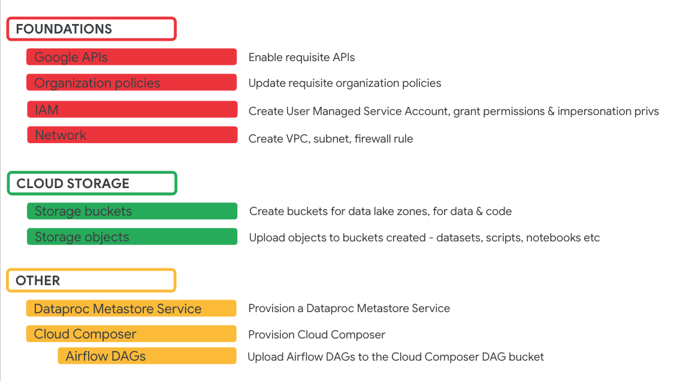
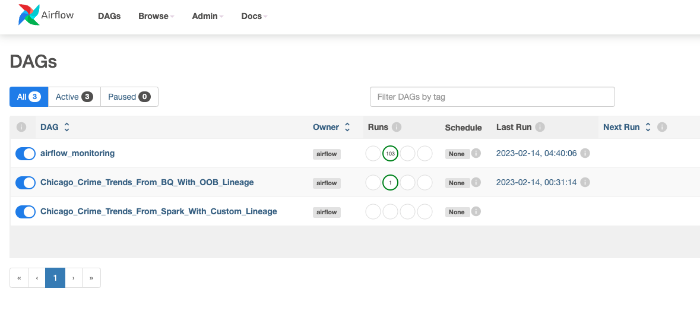

# M1: About the lab environment setup

In the next module, we will provision a few Google Cloud services and upload artifacts to Cloud Storage buckets using Terraform. This module gives you an overview of what is automatically created and available when you start the actual Dataplex Lab series from Module 3.

## 1. Prerequisites

Please read the narrative of the lab in the landing page for the quickstart lab series to understand what to expect, what we will work on in the lab modules.

<hr>

## 2. Pictorial overview of what gets provisioned via Terraform

   
<br><br>

## 3. APIs enabled

compute.googleapis.com<br>
dataproc.googleapis.com<br>
bigqueryconnection.googleapis.com<br>
bigquerydatapolicy.googleapis.com<br>
storage-component.googleapis.com<br>
bigquerystorage.googleapis.com<br>
datacatalog.googleapis.com<br>
dataplex.googleapis.com<br>
bigquery.googleapis.com<br>
cloudresourcemanager.googleapis.com<br>
cloudidentity.googleapis.com<br>
storage.googleapis.com<br>
composer.googleapis.com<br>
metastore.googleapis.com<br>
orgpolicy.googleapis.com<br>
dlp.googleapis.com<br>
logging.googleapis.com<br>
monitoring.googleapis.com<br>
dataplex.googleapis.com<br>
datacatalog.googleapis.com<br>
cloudresourcemanager.googleapis.com<br>
datapipelines.googleapis.com<br>
cloudscheduler.googleapis.com<br>
datalineage.googleapis.com

<hr>

## 4. Services provisioned

VPC<br>
Subnet<br>
Firewall Rule<br>
Cloud Storage<br>
BigQuery<br>
Dataproc Metastore Service<br>
Cloud Composer

## 5. Security setup

1. A user managed service account with requisite permissions
2. Permissions for you to impersonate the user managed service account
3. Requisite permissions for Google Managed Service Accounts as required by the GCP services


<hr>

## 6. Cloud Storage

A number of buckets will be automatically created by the Terraform, and content copied into them. The following is a listing.

### 6.1. Cloud Storage Buckets created

```
(the author's project number is 705495340985, and therefore appears as suffix, your listing will reflect your project number)

gs://curated-data-705495340985/
gs://lab-spark-bucket-705495340985/
gs://product-data-705495340985/
gs://raw-code-705495340985/
gs://raw-data-705495340985/
gs://raw-data-sensitive-705495340985/
gs://raw-model-705495340985/
gs://raw-model-metrics-705495340985/
gs://raw-model-mleap-bundle-705495340985/
gs://raw-notebook-705495340985/
gs://us-central1-oda-70549534098-275215ea-bucket/ <-- this is created by Cloud Composer
```

### 6.2. Raw Datasets

```

-CELL TOWER DATA SAMPLE-
------------------------
├── cell-tower-anomaly-detection
│   ├── reference_data
│   │   └── ctad_service_threshold_ref.csv
│   └── transactions_data
│       └── ctad_transactions.csv


-CRIMES DATA SAMPLE-
--------------------
├── chicago-crimes
│   └── reference_data
│       └── crimes_chicago_iucr_ref.csv

-ICECREAM SALES DATA SAMPLE-
----------------------------
├── icecream-sales-forecasting
│   └── isf_icecream_sales_transactions.csv

-TELCO CUSTOMER CHURN DATA SAMPLE-
----------------------------------
└── telco-customer-churn-prediction
    ├── machine_learning_scoring
    │   └── tccp_customer_churn_score_candidates.csv
    └── machine_learning_training
        └── tccp_customer_churn_train_candidates.csv

```

### 6.3. Raw Sensitive Datasets

```

-BANKING DATA SAMPLE-
---------------------
├── banking
│   ├── customers_raw
│   │   ├── credit_card_customers
│   │   │   └── date=2022-05-01
│   │   │       └── credit_card_customers.csv
│   │   └── customers
│   │       └── date=2022-05-01
│   │           └── customers.csv


```

### 6.4. Curated Datasets


```
-CELL TOWER DATA SAMPLE-
------------------------
├── cell-tower-anomaly-detection
│   ├── master_data
│   │   ├── ctad_part-00000-fc7d6e20-dbda-4143-91b5-d9414310dfd1-c000.snappy.parquet
│   │   ├── ctad_part-00001-fc7d6e20-dbda-4143-91b5-d9414310dfd1-c000.snappy.parquet
│   │   ├── ctad_part-00002-fc7d6e20-dbda-4143-91b5-d9414310dfd1-c000.snappy.parquet
│   │   └── ctad_part-00003-fc7d6e20-dbda-4143-91b5-d9414310dfd1-c000.snappy.parquet

-RETAIL TRANSACTIONS DATA SAMPLE-
---------------------------------
├── retail-transactions-anomaly-detection
│   └── rtad_sales.parquet


```

### 6.5. Notebooks


```

-CHICAGO CRIMES ANALYSIS STARTER NOTEBOOK-
------------------------------------------

├── chicago-crimes-analysis
│   └── chicago-crimes-analytics.ipynb
├── icecream-sales-forecasting
│   └── icecream-sales-forecasting.ipynb

-RETAIL TRANSACTIONS STARTER NOTEBOOK-
--------------------------------------

├── retail-transactions-anomaly-detection
│   └── retail-transactions-anomaly-detection.ipynb

-TELCO CUSTOMER CHURN PREDICTION STARTER NOTEBOOK-
--------------------------------------------------

└── telco-customer-churn-prediction
    ├── batch_scoring.ipynb
    ├── hyperparameter_tuning.ipynb
    ├── model_training.ipynb
    └── preprocessing.ipynb


```

### 6.6. Scripts


```

-AIRFLOW DAG STARTER SCRIPTS-
------------------------------------------

├── airflow
│   └── chicago-crimes-analytics
│       ├── bq_lineage_pipeline.py
│       └── spark_custom_lineage_pipeline.py

-PYSPARK STARTER SCRIPTS-
--------------------------------------

├── pyspark
│   └── chicago-crimes-analytics
│       ├── crimes_report.py
│       └── curate_crimes.py

-SPARK SQL STARTER SCRIPTS-
--------------------------------------------------

└── spark-sql
    └── retail-transactions-anomaly-detection
        └── retail-transactions-anomaly-detection.sql


```

### 6.7. The rest of the buckets
```
- THIS IS INFORMATIONAL -

gs://lab-spark-bucket-705495340985/ --> For use by Dataproc Serverless Spark

gs://raw-model-705495340985/ --> For use in the Teco Customer Churn Prediction exercise with Dataplex Explore notebooks
gs://raw-model-metrics-705495340985/ --> For use in the Telco Customer Churn Prediction exercise with Dataplex Explore notebooks
gs://raw-model-mleap-bundle-705495340985/ --> For use in the Telco Customer Churn Prediction exercise with Dataplex Explore notebooks

gs://us-central1-oda-70549534098-275215ea-bucket/ --> Automatically created bucket by Cloud Composer service
```

<hr>


## 7. BigQuery

Nothing is provisioned at the onset of the lab.

<hr>


## 8. Cloud Composer

1. A Cloud Composer environment is created
2. Two DAGs are placed in the cloud composer DAG directory

Here is the author's listing-
```
- THIS IS INFORMATIONAL -

└── chicago-crimes-analytics
    ├── bq_lineage_pipeline.py
    └── spark_custom_lineage_pipeline.py
```

And here are the DAGs in the Airflow UI-

   
<br><br>

<hr>

## 9. Dataproc Metastore Service

Its empty at the onset and does not have any precreated databases.


<hr>

This concludes the module. Please proceed to the [next module](module-02-terraform-provisioning.md)

<hr>
