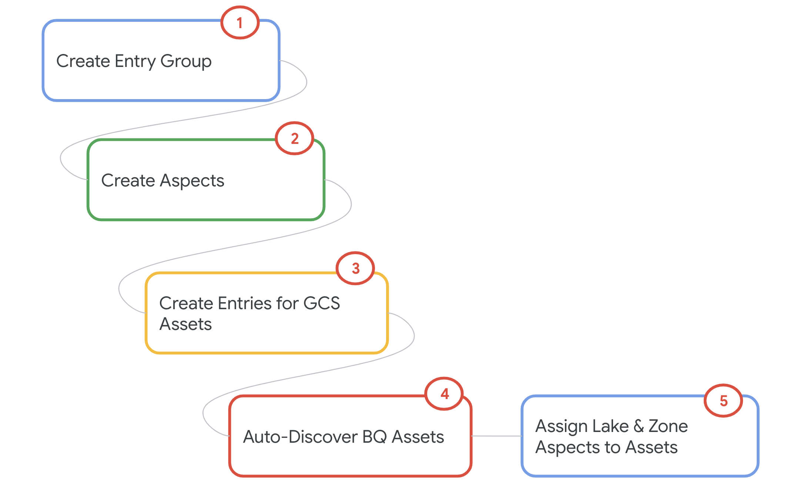
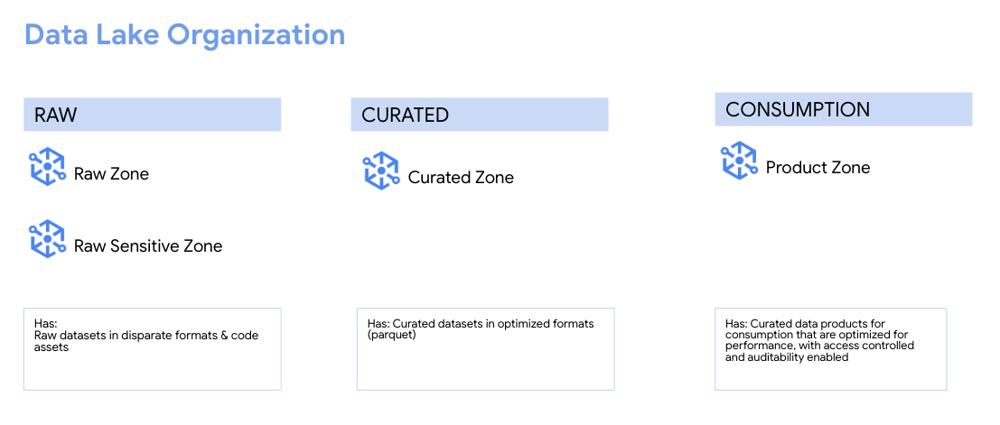
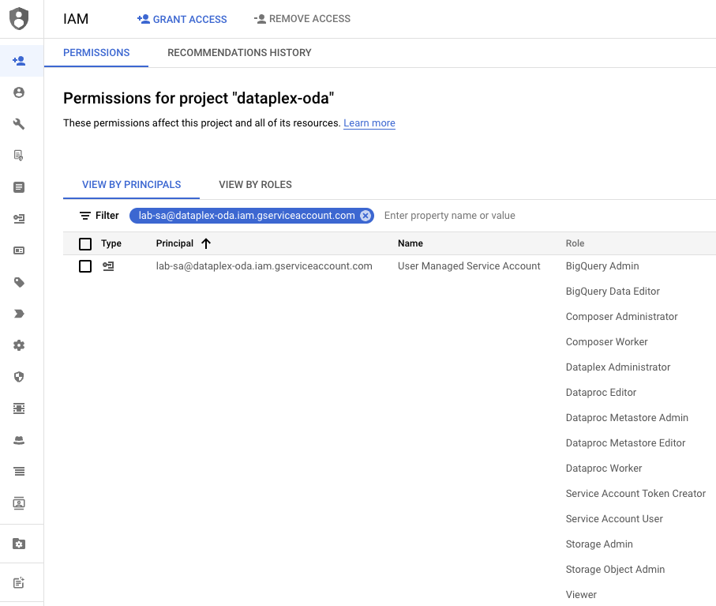
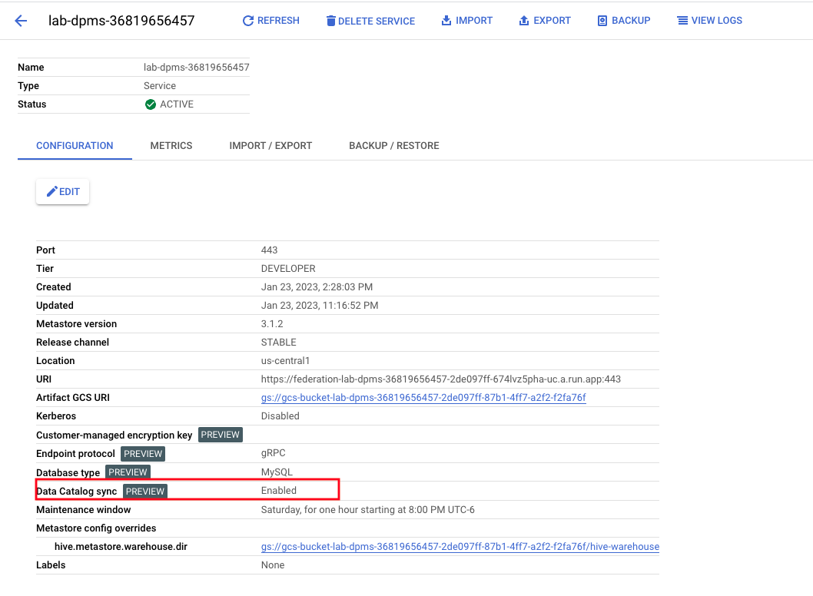
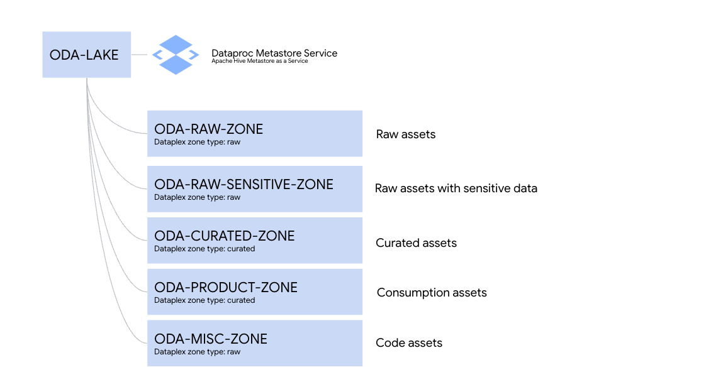
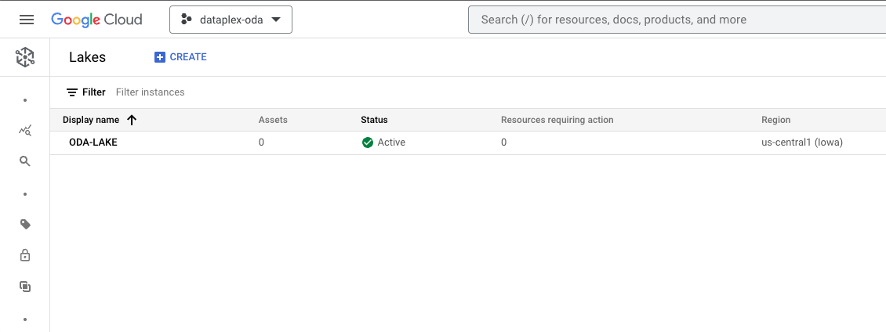
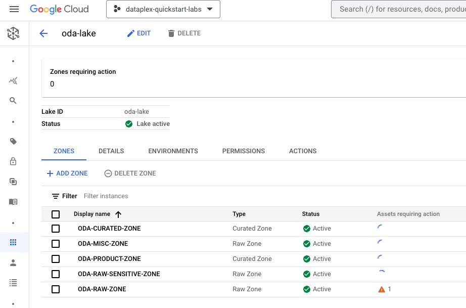

# M3: Organize your enterprise assets into Lakes and Zones

In this lab module, we will first go over concepts and then into the lab, and try out the concepts.

### Prerequisites
Completion of prior modules

### Approximate duration
20 minutes or less

### Pictorial overview of work to be completed in the lab module

   
<br><br>

### Targeted Data Lake Layout

We will create a Dataplex Lake and Zones as shown below-

   
<br><br>

<hr>

## 1. Concepts

### 1.1. Data Mesh
Data Mesh is one of the most trending words in the data space currently. A data mesh is an organizational and technical approach that decentralizes data ownership among domain data owners. These owners provide the "data as a product" in a standard way and facilitate communication among different parts of the organization to distribute datasets across different locations. Learn more about [data mesh architectures](https://services.google.com/fh/files/misc/build-a-modern-distributed-datamesh-with-google-cloud-whitepaper.pdf).

Dataplex is Google Cloud Platform's solution to architect a Data Mesh architecture. At the foundation of Dataplex is a Lake.


### 1.2. Dataplex Lake
A Dataplex Lake is a logical metadata abstraction on top of your assets (structured and unstructured). There are various capabiltiies offered in Dataplex over a Data Lake that we will cover in subsequent labs. It is analogous to a "domain". And is also analogous to a "Data Lake" - a cordoned off repository of your assets.

A Dataplex Lake, although provisioned in a GCP project, can span multiple projects. [Documentation](https://cloud.google.com/dataplex/docs/create-lake)

To create a Dataplex Lake, one must have the pre-defined roles  ```roles/dataplex.admin``` or ```roles/dataplex.editor```.

### 1.3. Dataplex Zone
Data zones are named entities within a Dataplex lake. They are logical groupings of unstructured, semi-structured, and structured data, consisting of multiple assets, such as Cloud Storage buckets, BigQuery datasets, and BigQuery tables.

A lake can include one or more zones. While a zone can only be part of one lake, it may contain assets that point to resources that are part of projects outside of its parent project.

You can select configurations for a zone in Dataplex. There are two types of zones that you can choose from: raw and curated zones.

#### 1.3.1. Raw zone
Raw zones store structured, semi-structured, and unstructured data in any format from external sources. This is useful for staging raw data before performing any transformations. Data can be stored in Cloud Storage buckets or BigQuery datasets.

Raw zones support bucket-level or dataset-level granularity for read and write permissions. For more information, see IAM and access control.

There are **no restrictions** on the type of data that can be stored in raw zones.

#### 1.3.2. Curated zone
Curated zones store structured data. Data can be stored in Cloud Storage buckets or BigQuery datasets.

Supported formats for Cloud Storage buckets include Parquet, Avro, and ORC. This is useful for staging data that requires processing before it's used for analysis, or for serving data that is ready for analysis.

For BigQuery tables, you must have a well-defined schema and Hive-style partitions. When you provide a schema for a given table in a curated zone, the data should conform to the schema defined for the table without schema drift.

This means that the data should be compatible with the schema defined for the table, and new partitions should not have a schema that conflicts with the table schema.

Curated zones support Cloud Storage bucket-level or BigQuery dataset-level granularity for read and write permissions. For more information, see Access control with IAM.

#### 1.3.3. IAM permisions for Dataplex Zone creation

To add a zone, you must be granted IAM roles containing the dataplex.lakes.create IAM permission. The Dataplex specific role roles/dataplex.admin can be used to grant add permissions. [Documentation](https://cloud.google.com/dataplex/docs/iam-and-access-control)


<hr>

<hr>

## 2. Lab - Foundations

In this lab module, we will organize all the lab assets into a Dataplex Lake and into Zones.

### 2.1. Declare variables

In Cloud Shell, while in the lab's project scope, paste the following-
```
PROJECT_ID=`gcloud config list --format "value(core.project)" 2>/dev/null`
PROJECT_NBR=`gcloud projects describe $PROJECT_ID | grep projectNumber | cut -d':' -f2 |  tr -d "'" | xargs`
UMSA_FQN="lab-sa@${PROJECT_ID}.iam.gserviceaccount.com"
LOCATION="us-central1"
LOCATION_MULTI="US"
METASTORE_NM="lab-dpms-$PROJECT_NBR"
LAKE_NM="oda-lake"
DATA_RAW_ZONE_NM="oda-raw-zone"
DATA_RAW_SENSITIVE_ZONE_NM="oda-raw-sensitive-zone"
DATA_CURATED_ZONE_NM="oda-curated-zone"
DATA_PRODUCT_ZONE_NM="oda-product-zone"
MISC_RAW_ZONE_NM="oda-misc-zone"
```

<hr>

### 2.2. IAM permissions

As part of the Terraform provisioned, we created a user managed service account (UMSA) to which we granted ourselves impersonation privileges. We will use this UMSA as the creator of the Dataplex constructs in this lab.

In Cloud Shell, paste the below to grant the UMSA, Dataplex admin privileges-

```
gcloud projects add-iam-policy-binding $PROJECT_ID --member=serviceAccount:$UMSA_FQN \
--role="roles/dataplex.admin"
```

   
<br><br>

<hr>

### 2.3. Enable Data Catalog Sync in the Dataproc Metastore Service if its not already enabled

We created a Dataproc Metastore Service with GRPC endpoint via Terraform. We enabled the Data Catalog sync so that databases and tables metadata in Dataproc Metastore are automatically hydrated in Data Catalog. 

   
<br><br>

Documentation: https://cloud.google.com/dataproc-metastore/docs/data-catalog-sync

## 3. Lab

### 3.1. Lake layout from the lab module

   
<br><br>

### 3.2. Create a Lake

We will create a Dataplex Lake with the metastore attached to it.

In Cloud Shell, paste the below-
```
gcloud dataplex lakes create $LAKE_NM --location=$LOCATION \
--metastore-service=projects/${PROJECT_ID}/locations/$LOCATION/services/${METASTORE_NM}
```

This takes about 2 minutes.

   
<br><br>

<hr>

### 3.3. Create zones with the lake

#### 3.3.1. Create zones for the structured data assets

We will create a zone each for raw, curated and data product, for the structured data assets, with discovery enabled.

##### Raw Zone
```
gcloud dataplex zones create ${DATA_RAW_ZONE_NM} \
--lake=$LAKE_NM \
--resource-location-type=MULTI_REGION \
--location=$LOCATION \
--type=RAW \
--discovery-enabled \
--discovery-schedule="0 * * * *"
```

##### Raw Sensitive Zone
```
gcloud dataplex zones create ${DATA_RAW_SENSITIVE_ZONE_NM} \
--lake=$LAKE_NM \
--resource-location-type=MULTI_REGION \
--location=$LOCATION \
--type=RAW \
--discovery-enabled \
--discovery-schedule="0 * * * *"
```

##### Curated Zone
```
gcloud dataplex zones create ${DATA_CURATED_ZONE_NM} \
--lake=$LAKE_NM \
--resource-location-type=MULTI_REGION \
--location=$LOCATION \
--type=CURATED \
--discovery-enabled \
--discovery-schedule="0 * * * *"
```

##### Product Zone
```
gcloud dataplex zones create ${DATA_PRODUCT_ZONE_NM} \
--lake=$LAKE_NM \
--resource-location-type=MULTI_REGION \
--location=$LOCATION \
--type=CURATED \
--discovery-enabled \
--discovery-schedule="0 * * * *"
```

<hr>

#### 3.3.2. Create a zone for the non-data assets 

We will create a raw zone for the non-data assets, without discovery, as they are mostly code, and therefore unstructured.
```
gcloud dataplex zones create ${MISC_RAW_ZONE_NM} --location=$LOCATION --lake=$LAKE_NM \
--resource-location-type=SINGLE_REGION --type=RAW 
```

#### 3.3.3. Pictorial of zones created


   
<br><br>

<hr>

This concludes the lab module. Proceed to the [next module](module-04-register-assets-into-zones.md).

<hr>


