# M8-3: Create a tag template in Dataplex Catalog & associate with a Dataplex Catalog Entry

A Dataplex tag template is a metadata template for attributes you want to attach to an entry. You can use available tag templates or create a custom tag template based on your unique requirements and persist to Dataplex Catalog. You can then associate the same template with a Catalog entry - with values populated for the attributed you defined.

In this lab module, we will learn how to create create a tag tenplate and attach to the Chicago Crimes custom entry from the prior module.

### Prerequisites

Successful completion of prior modules

### Approximate duration

15 minutes or less to complete

### Pictorial overview of the lab module

   
  

## 1. Lab

### 1.1. Create a Tag Template
Follow the steps below to create a Tag Template-

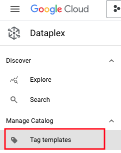   
  

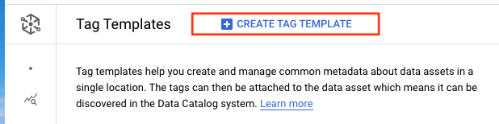   
  

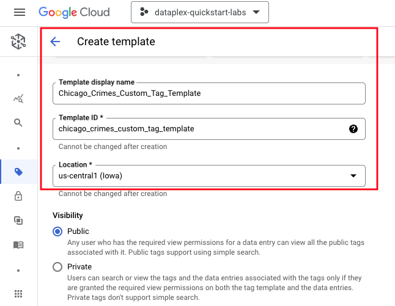   
  

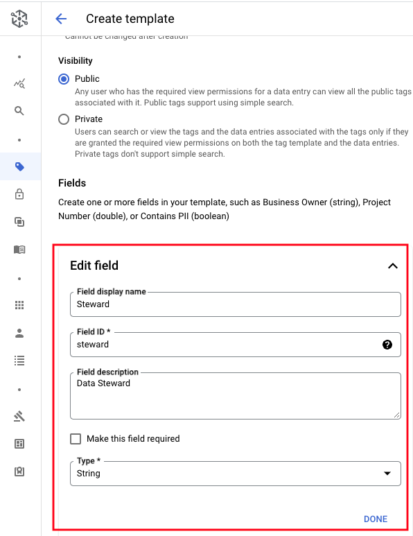   
  

   
  

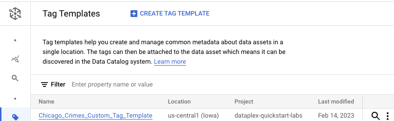   
  

### 1.2. Associate the Tag Template to the custom Catalog entry

Associate the tag to the custom entry as shown below, and populate. Follow the steps in the screenshots in the exact order.

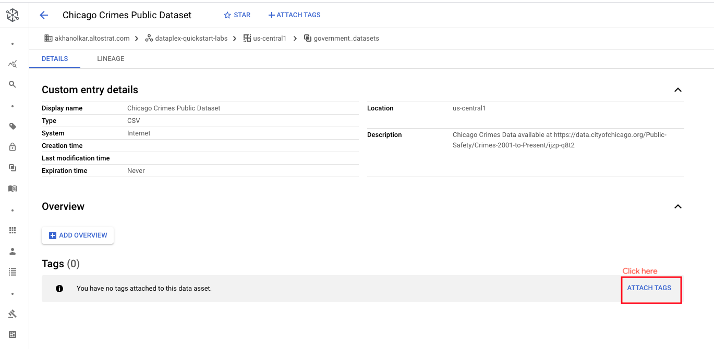   
  

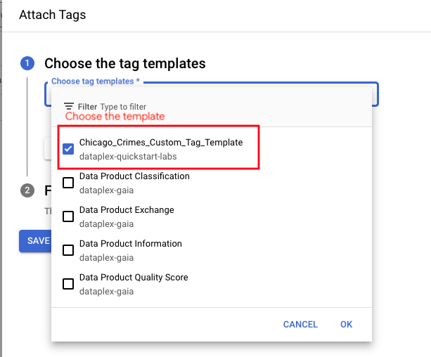   
  

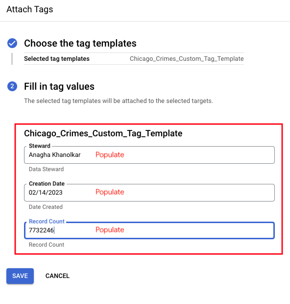   
  

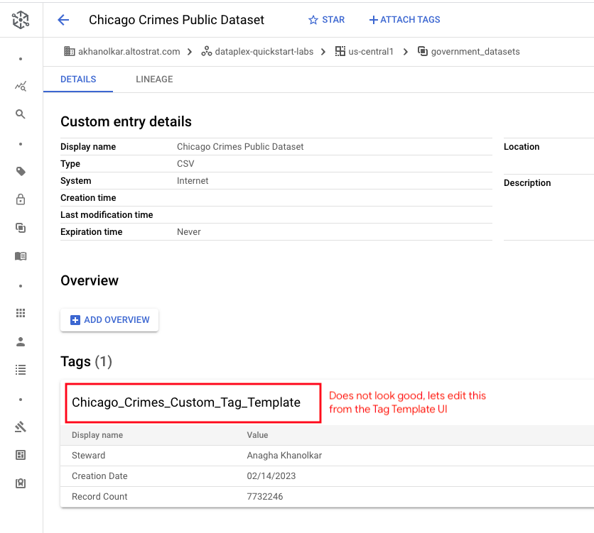   
  

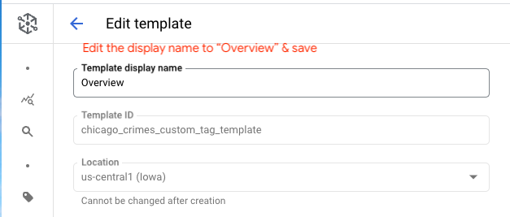   
  

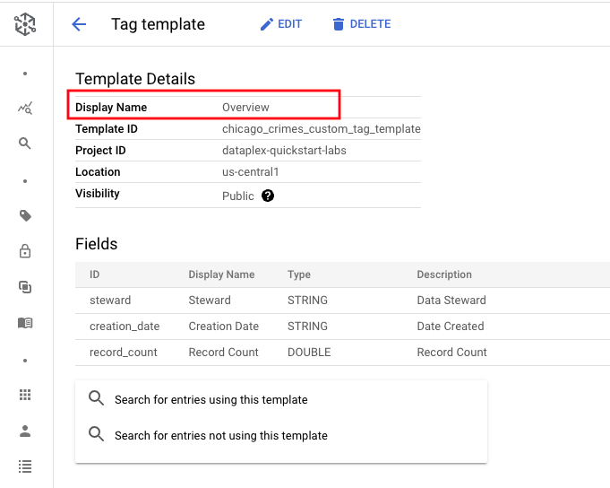   
  

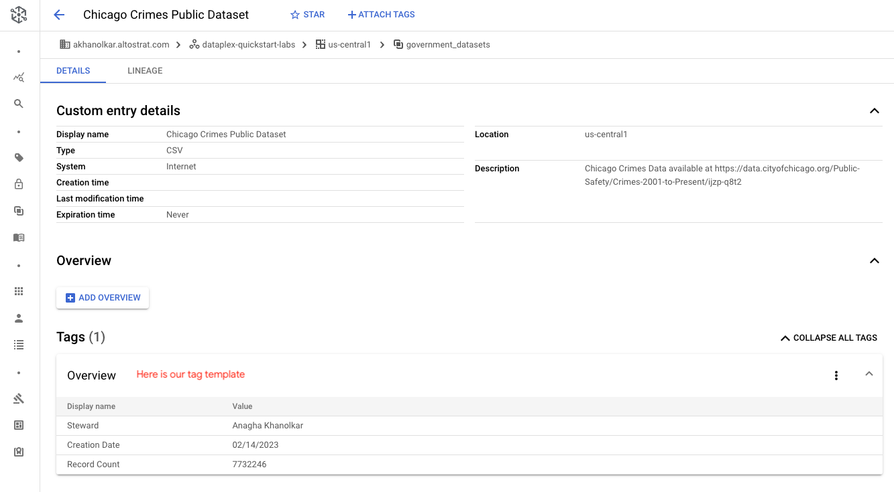   
  

This concludes the lab module. You can proceed to the [next module](module-08-4-create-overview-for-catalog-entry.md).

