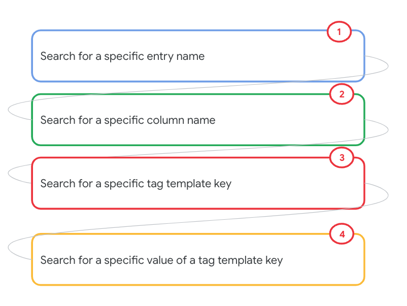
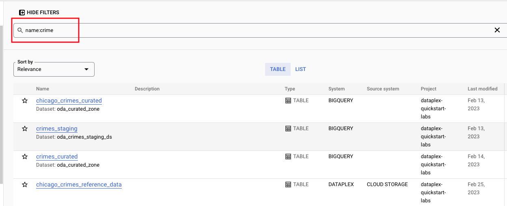
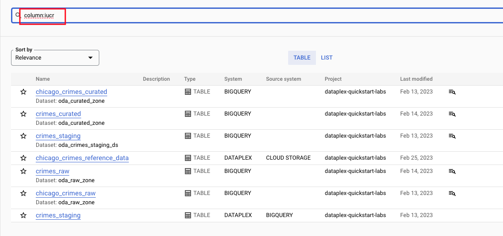
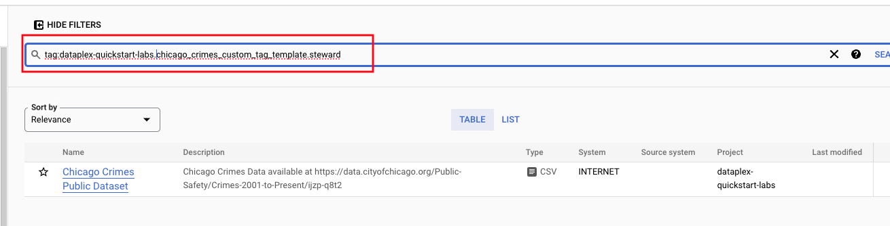
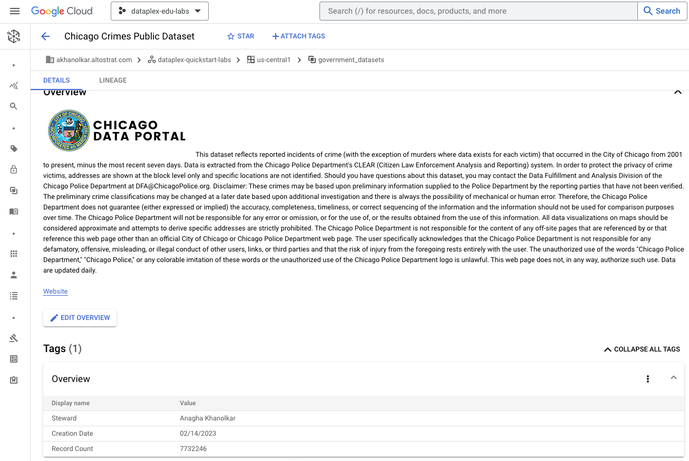
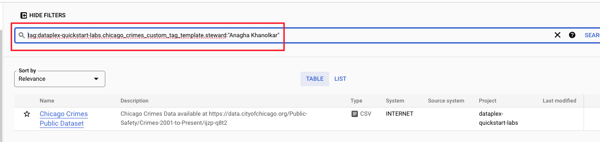

# M8-5: Search the Dataplex Catalog for a Catalog Entry

In the previous lab modules, we learned to search for keywords, for systems, and using operators. In this lab module, we will learn to search for an entry name, a column name, and a tag template key.

### Prerequisites

Successful completion of prior modules

### Approximate duration

5 minutes or less to complete

### Pictorial overview

   
  

## 1. Lab

### 1.1. Search for a name
Lets search for an entity name as shown below-

   
  

### 1.2. Search for a column
Lets search for the column 'iucr' as shown below-

   
  

### 1.3. Search for a tag template key
Lets search for all those entries that have a steward tagged in the "overview" tag template we created in a prior module.

   
  

   
  

### 1.4. Search for a specific value of a tag template key
Lets search for all those entries that have you as the steward.

   
  

This concludes the lab module. You can proceed to the [next module](module-09-1-data-lineage-with-bigquery.md).

