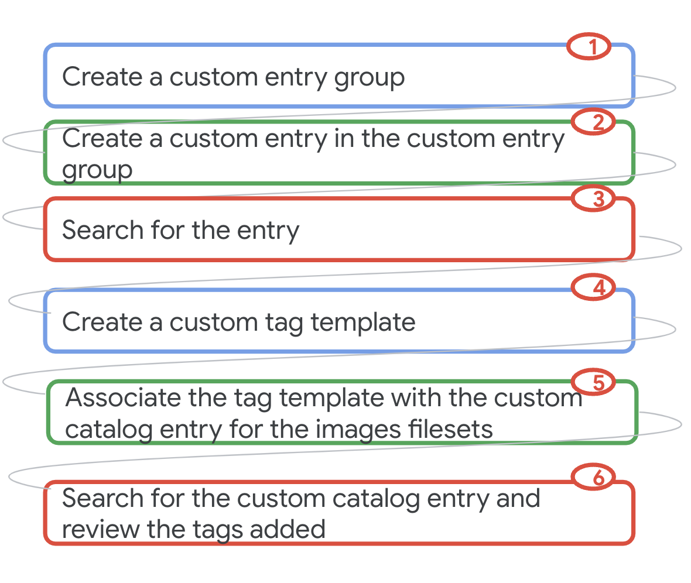
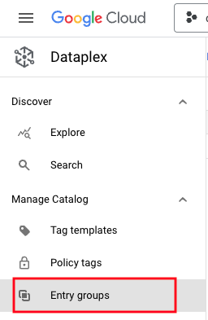
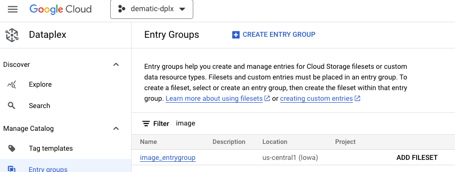
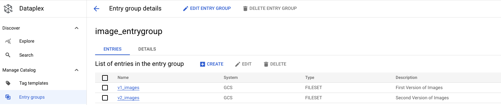
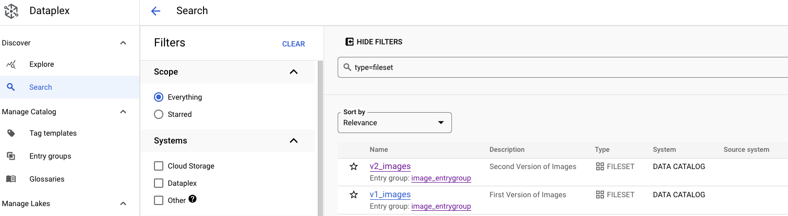
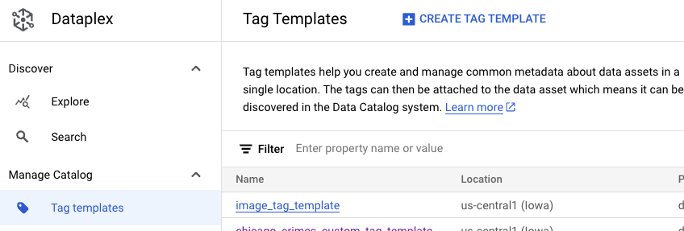
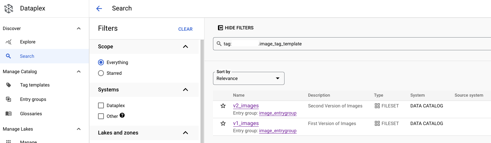
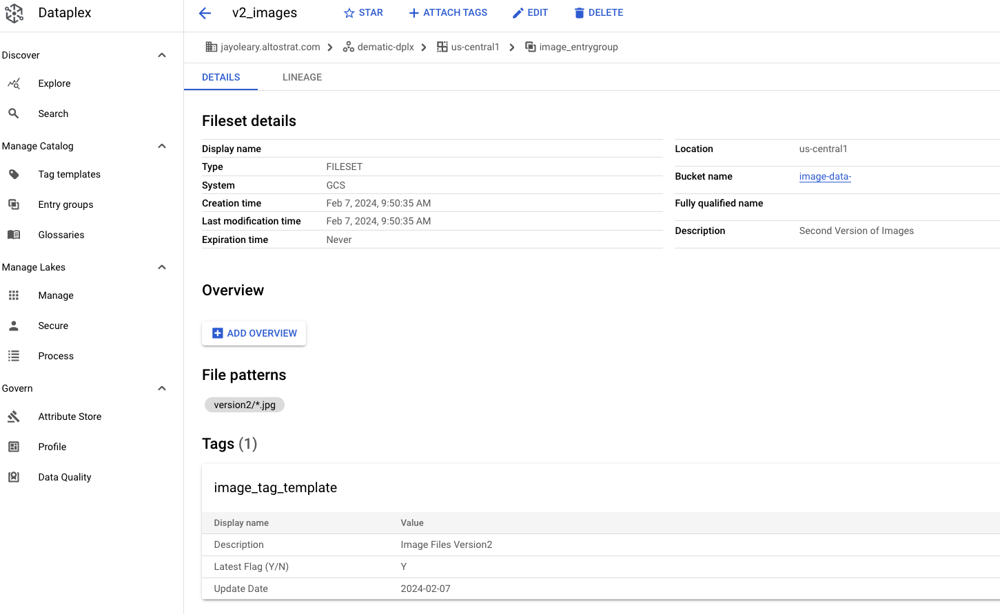

# M8-7: Create a custom entry in Dataplex Catalog for a fileset & assign a tag template

In this lab module, we will learn how to create entries in Cloud Catalog, manually, using gcloud commands. We will first create an entry group and then an entry belonging to the group. We will also show applying a tag template to the filesets.

### Prerequisites
Successful completion of prior modules

### Approximate duration
15 minutes or less to complete

### Pictorial overview of lab

   
<br><br>

<hr>

## LAB

## 1. Create custom entry group

In this section, we will create an entry group called "Government Datasets". Paste the below in Cloud Shell.

```
PROJECT_ID=`gcloud config list --format "value(core.project)" 2>/dev/null`
PROJECT_NBR=`gcloud projects describe $PROJECT_ID | grep projectNumber | cut -d':' -f2 |  tr -d "'" | xargs`
LOCATION="us-central1"

ENTRY_GROUP_ID="image_entrygroup"

gcloud data-catalog entry-groups create $ENTRY_GROUP_ID \
    --location=$LOCATION

```

Navigate to Dataplex in the Cloud Console and to "Entry Groups" on the left navigation menu.


   
<br><br>


   
<br><br>


<hr>

## 2. Create custom entries

In this section, we will create two custom entries, as shown in the commands below as part of the entry group "image_entrygroup", above. 

Paste the below in Cloud Shell.

```
PROJECT_ID=`gcloud config list --format "value(core.project)" 2>/dev/null`
PROJECT_NBR=`gcloud projects describe $PROJECT_ID | grep projectNumber | cut -d':' -f2 |  tr -d "'" | xargs`
LOCATION="us-central1"
IMAGE_BUCKET="image-data-${PROJECT_ID}"
ENTRY_GROUP_ID="image_entrygroup"

gcloud data-catalog entries create v1_images \
    --location=us-central1 \
    --entry-group=$ENTRY_GROUP_ID \
    --type=FILESET \
    --gcs-file-patterns=gs://$IMAGE_BUCKET/version1/*.jpg \
    --description="First Version of Images"

gcloud data-catalog entries create v2_images \
    --location=us-central1 \
    --entry-group=$ENTRY_GROUP_ID \
    --type=FILESET \
    --gcs-file-patterns=gs://$IMAGE_BUCKET/version2/*.jpg \
    --description="Second Version of Images"
    
```

Navigate to Dataplex in the Cloud Console and to "Entry Groups" on the left navigation menu. <BR>
Then click on 'image_entrygroup' and you should now see the custom entries for 2 FILESETs

   
<br><br>

<hr>

## 3. Catalog Search UI walkthrough 

Navigate to Dataplex in the Cloud Console and to "Search" on the left navigation menu. <BR>
Enter the following into the search filter as shown below: type=fileset <BR>
You will see the filesets for the images as shown below:<BR>

   
<br><br>


<hr>

## 4. Create a tag template  
Let's say you want to tag the filesets with a description, an update date, and a latest version status.  <BR>
You could do that by creating a tag template as shown below:<BR>
<BR>
Paste the below in Cloud Shell.

```
PROJECT_ID=`gcloud config list --format "value(core.project)" 2>/dev/null`
PROJECT_NBR=`gcloud projects describe $PROJECT_ID | grep projectNumber | cut -d':' -f2 |  tr -d "'" | xargs`
LOCATION="us-central1"
TAG_TEMPLATE_ID="image_tag_template"

gcloud data-catalog tag-templates create $TAG_TEMPLATE_ID \
    --location=$LOCATION \
    --field=id=description,display-name=Description,type=string \
    --field=id=update_date,display-name='Update Date',type=string \
    --field=id=latest,display-name='Latest Flag (Y/N)',type='enum(Y|N)',required=TRUE

```
<br>

   

<hr>
## 5. Assign the tag template  
Let's say you want to tag the filesets with a description, an update date, and a latest version status.  <BR>
You could do that by creating a tag template as shown below:<BR>
<BR>
### Create the tag for Version 1 of the images

Paste the below in Cloud Shell.

```
PROJECT_ID=`gcloud config list --format "value(core.project)" 2>/dev/null`
PROJECT_NBR=`gcloud projects describe $PROJECT_ID | grep projectNumber | cut -d':' -f2 |  tr -d "'" | xargs`
LOCATION="us-central1"
TAG_TEMPLATE_ID="image_tag_template"
TAG_FILE_NAME=tagfile.yaml
ENTRY_GROUP_ID="image_entrygroup"

cat <<"EOF" > $TAG_FILE_NAME
{
  "description": "Image Files Version1",
  "update_date": "2024-02-07",
  "latest": "N"
}
EOF

gcloud data-catalog tags create \
    --tag-file=$TAG_FILE_NAME \
    --location=$LOCATION \
    --tag-template=$TAG_TEMPLATE_ID \
    --entry=projects/$PROJECT_ID/locations/$LOCATION/entryGroups/$ENTRY_GROUP_ID/entries/v1_images

```

### Create the tag for Version 2 of the images

Paste the below in Cloud Shell.

```
cat <<"EOF" > $TAG_FILE_NAME
{
  "description": "Image Files Version2",
  "update_date": "2024-02-07",
  "latest": "Y"
}
EOF

gcloud data-catalog tags create \
    --tag-file=$TAG_FILE_NAME \
    --location=$LOCATION \
    --tag-template=$TAG_TEMPLATE_ID \
    --entry=projects/$PROJECT_ID/locations/$LOCATION/entryGroups/$ENTRY_GROUP_ID/entries/v2_images

```

### View the tags in the console
Navigate to Dataplex in the Cloud Console and to "Tag Templates" on the left navigation menu. <BR>
Click on 'image_tag_template'...<BR>
Click on 'Search for entries using this template'...<BR>
<br>
   
<br>
Click on 'v2_images' and you will see the tag and values as shown below:<BR>
<br>
   

<hr>

This concludes the lab module. You can proceed to the [next module](module-08-3-create-tag-template-for-catalog-entry.md).

<hr>
