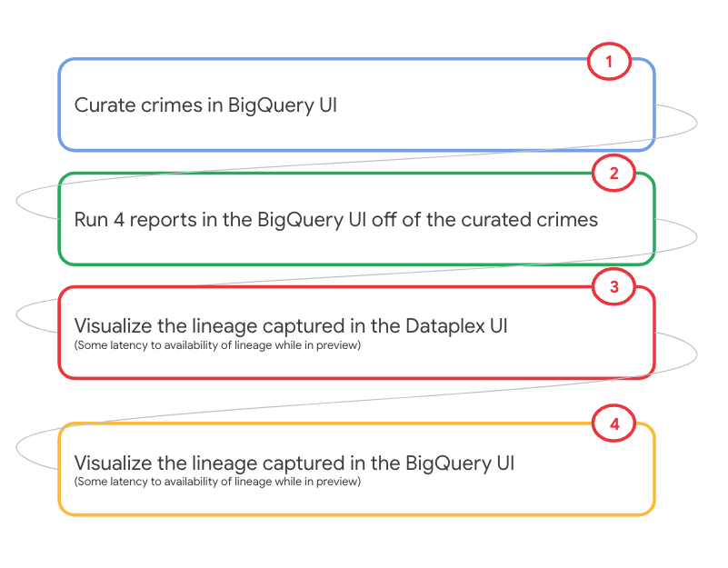
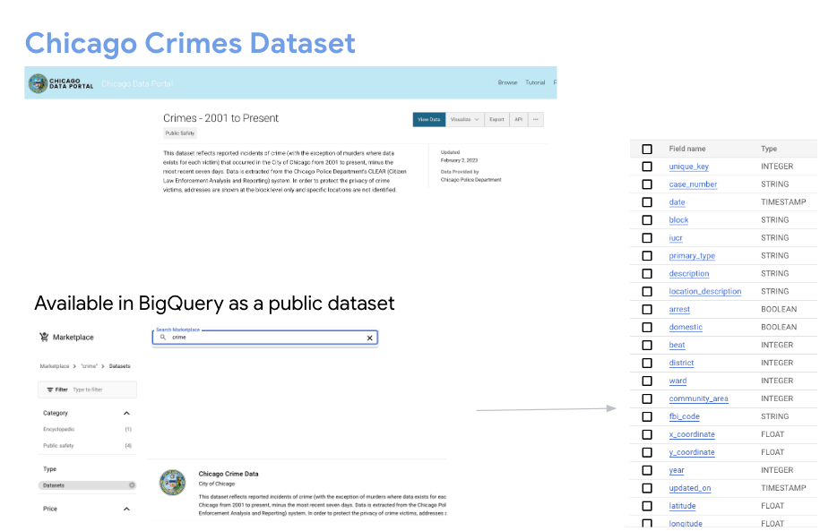
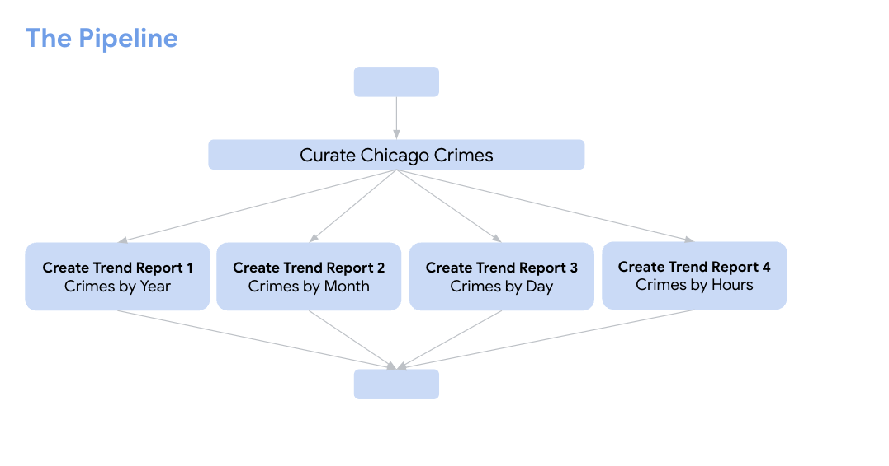
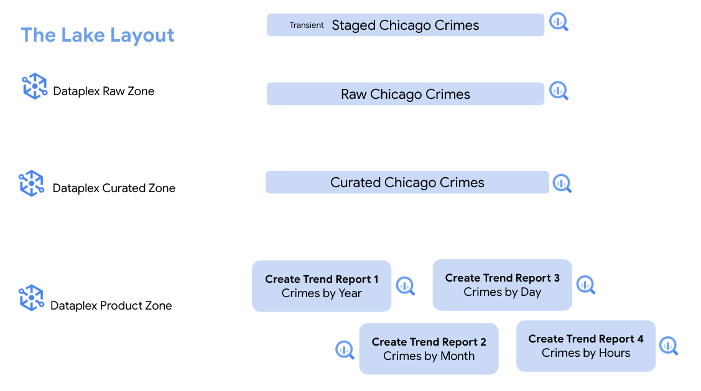
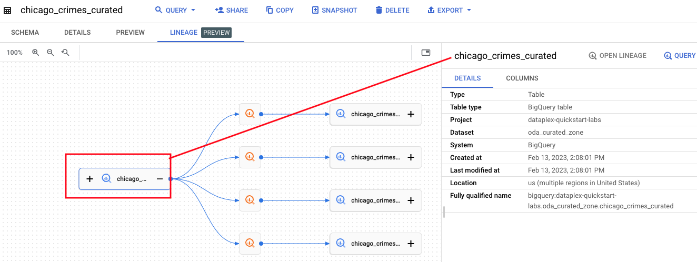
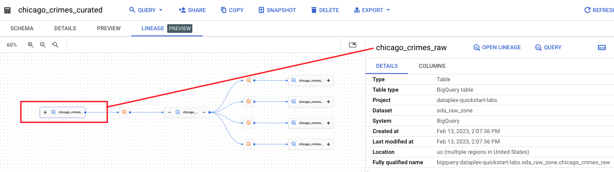
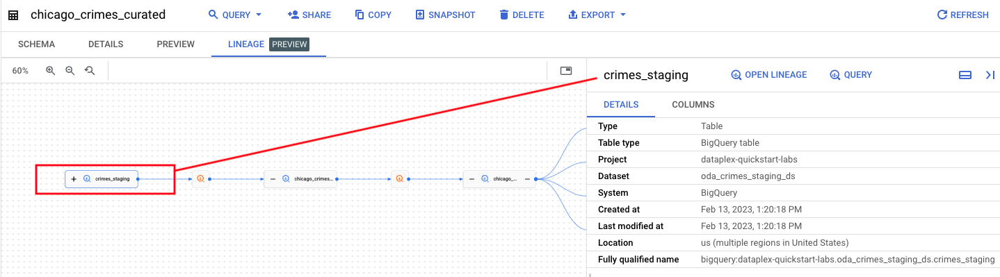

# M9-1: Dataplex Lineage for BigQuery Managed Tables

Data lineage is a Dataplex feature that lets you track how data moves through your systems: where it comes from, where it is passed to, and what transformations are applied to it. BigQuery lineage is captured automatically and this lab module covers the same.

<hr>

### Prerequisites
Successful completion of prior lab modules

### Duration
~15 minutes

### Learning Units

[1. Concepts](module-08-data-lineage-with-bigquery.md#concepts-data-lineage-information-model) <br>
[2. Lab](module-08-data-lineage-with-bigquery.md#lab-automated-lineage-capture-for-bigquery-jobs)

### Pictorial overview of the lab module

   
<br><br>

<hr>

## Concepts: Data Lineage Information Model

### Lineage
In its basic form, lineage is a record of data being transformed from sources to targets. Data Lineage API collects that information and organizes it into a hierarchical data model using the concepts of processes, runs, and events.

### Process
A process is the definition of a data transformation operation supported for a specific system. In the context of BigQuery lineage, that would be one of the supported job types.

### Run
A run is an execution of a process. Processes can have multiple runs. Runs contain details such as start and end times, state, or additional attributes. For more information, see the run resource reference.

### Event
An event represents a point in time when a data transformation operation took place and resulted in data moving between a source and a target entity.

Events contain a list of links that define which entry was the source and which was the target in a particular event. While events are used to compute lineage visualization graphs, they are not directly exposed on the Cloud Console. You can create, read, and delete (but not update) them via Data Lineage API.

<hr>

## Lab: Automated lineage capture for BigQuery jobs

The documentation link below shows the kind of BigQuery jobs that support the automated lineage capture. Review the same before starting on the lab<br>
https://cloud.google.com/data-catalog/docs/concepts/about-data-lineage#lineage-supported-systems

### 1. What's involved in this lab

In lab module 4, we created a BigQuery table in our raw zone based off of the BigQuery public dataset hosting Chicago Crimes. The rest of this lab will be using the same table as a basis to demonstrate lineage, with a bunch of SQL statements.


   
<br><br>

   
<br><br>


   
<br><br>


### 2. Source raw Chicago crimes into the raw zone

Paste the below in the BigQuery UI, SQL editor scoped to the oda_raw_zone dataset-

```
CREATE OR REPLACE TABLE
  oda_raw_zone.chicago_crimes_raw AS
SELECT
  *
FROM
  oda_crimes_staging_ds.crimes_staging;
```

<hr>


### 3. Curate Chicago Crimes data

Lets add some temporal attributes to the raw Chicago Crimes for subsequent crime trends analysis. The SQL for this is below, notice that we persist the results as a table in the curated zone. Lets run the query in the BigQuery UI:

```
CREATE OR REPLACE TABLE
  oda_curated_zone.chicago_crimes_curated AS
SELECT
  *,
  CAST(year AS Integer) AS case_year,
  FORMAT_DATE('%B',date) AS case_month,
  FORMAT_DATE('%d',date) AS case_day_of_month,
  FORMAT_DATE('%k',date) AS case_hour,
  EXTRACT(DAYOFWEEK
  FROM
    date) AS case_day_of_week_nbr,
  FORMAT_DATE('%A',date) AS case_day_of_week_name
FROM
  oda_raw_zone.chicago_crimes_raw;
```

<hr>

### 4. Analyze crime trends by year

The SQL for this is below, lets run it in the BigQuery UI:

```
CREATE OR REPLACE TABLE
  oda_product_zone.chicago_crimes_by_year AS
SELECT
  case_year,
  COUNT(*) AS crime_count
FROM
  oda_curated_zone.chicago_crimes_curated
GROUP BY
  case_year;
```

Note that we persist the results in the consumption zone. From an access perspective, think of this zone as the reporting mart that you would give access to without granting access to the curated data.

<hr>

### 5. Analyze crime trends by month

The SQL for this is below, lets run it in the BigQuery UI:

```
CREATE OR REPLACE TABLE
  oda_product_zone.chicago_crimes_by_month AS
SELECT
  case_month AS month,
  COUNT(*) AS crime_count
FROM
  oda_curated_zone.chicago_crimes_curated
GROUP BY
  case_month;
```

Note that we persist the results in the consumption zone. From an access perspective, think of this zone as the reporting mart that you would give access to without granting access to the curated data.

<hr>

### 6. Analyze crime trends by day of the week

The SQL for this is below, lets run it in the BigQuery UI:

```
CREATE OR REPLACE TABLE
  oda_product_zone.chicago_crimes_by_day AS
SELECT
  case_day_of_week_name AS day,
  COUNT(*) AS crime_count
FROM
  oda_curated_zone.chicago_crimes_curated
GROUP BY
  case_day_of_week_name;
```

Note that we persist the results in the consumption zone. From an access perspective, think of this zone as the reporting mart that you would give access to without granting access to the curated data.

<hr>

### 7. Analyze crime trends by hour of the day

The SQL for this is below, lets run it in the BigQuery UI:

```
CREATE OR REPLACE TABLE
  oda_product_zone.chicago_crimes_by_hour AS
SELECT
  case_hour AS hour_of_day,
  COUNT(*) AS crime_count
FROM
  oda_curated_zone.chicago_crimes_curated
GROUP BY
  case_hour;
```

Note that we persist the results in the consumption zone. From an access perspective, think of this zone as the reporting mart that you would give access to without granting access to the curated data.

<hr>

### 2.8. The lineage graph

BigQuery lineage is captured by default, without the need for any orhcetsration tool. However, it is not instantaneous. <br>
Here is the author's lineage graph from clicking on the curated crimes table.


   
<br><br>

   
<br><br>

   
<br><br>

   
<br><br>

<hr>

This concludes the lab module, proceed to the [next module](module-09-2-data-lineage-with-cloud-composer-bq.md) where you will learn how lineage works with Cloud Composer, tofr this exact same pipeline.

<hr>
