# M9-4: Custom Lineage with Custom Catalog Entry

In this lab module, we will use the Dataplex Lineage API and learn how to create custom lineage processes, process runs, lineage events and add them to an existing lineage graph.

<hr>

### Prerequisite
1. [Lab module on creating custom entries in Dataplex Catalog](module-07-1-custom-entry-in-catalog.md)<br>
2. [Lab module on native support for lineage with BQ SQL](module-09-1-data-lineage-with-bigquery.md)

### Duration

30 minutes or less

### Lab flow

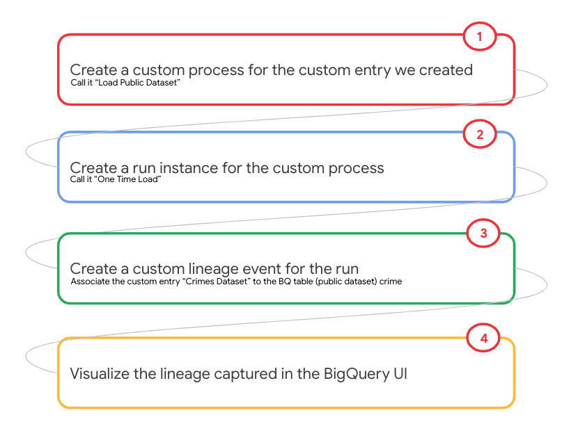   
<br><br>


## Learning Goal: Custom lineage creation with Dataplex Lineage API
| # | Unit | 
| -- | :--- | 
| 1 | Create custom process |
| 2 | Create custom run for the custom process |
| 3 | Create custom lineage event for the custom run |


## Lineage at onset of the lab

Lets review the lineage at the onset of this lab, from the BigQuery UI in the Cloud Console.<br>
The first entity in the graph is a BQ native table called crime (BQ public dataset)- a table not indexed in Dataplex.

   
<br><br>

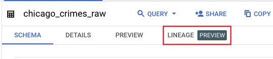   
<br><br>

The lineage-

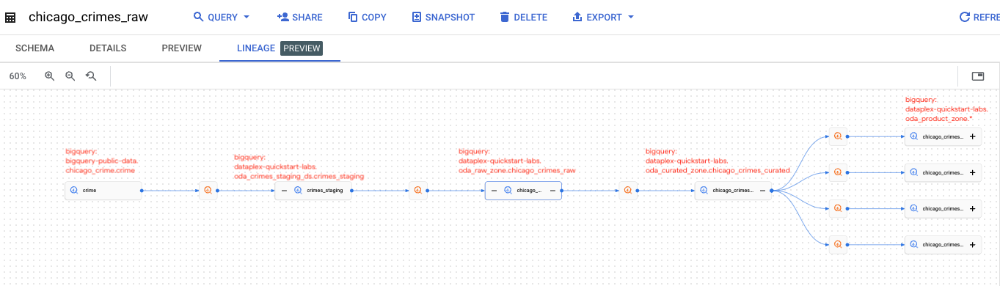   
<br><br>

<hr>

## Lineage at end of the lab

The first entry, of the graph above should be the custom Catalog entry we created in a prior module "Chicago Crimes Dataset", that is linked upstream to the crime table - first node in the diagram above via a custom process (Load Government Dataset).

<hr>

............................................................................
# LAB
............................................................................

<hr>

## 1. Variables

Paste the below in cloud shell-
```
PROJECT_ID=`gcloud config list --format "value(core.project)" 2>/dev/null`
PROJECT_NBR=`gcloud projects describe $PROJECT_ID | grep projectNumber | cut -d':' -f2 |  tr -d "'" | xargs`
LOCATION_MULTI="us"
LOCATION="us-central1"
```

<hr>

## 2. Lineage Process Management

We will learn to create a process and list the same using the Lineage API.

### 2.1. Create a process

We first need to create a process. Lets create a fictitious process called "Load Public Dataset". Paste the below in cloud shell-

```
curl -X POST -H "Authorization: Bearer $(gcloud auth print-access-token)" \
-H "Content-Type: application.json" \
https://us-datalineage.googleapis.com/v1/projects/$PROJECT_ID/locations/$LOCATION_MULTI/processes \
-d "{\
  \"displayName\": \"Load Public Dataset\" \
}"
```

### 2.2. List processes

Paste the below in cloud shell, to list the processes-
```
mkdir -p ~/temp-lineage

rm -rf ~/temp-lineage/lineage_processes_listing.json

curl -H "Authorization: Bearer $(gcloud auth print-access-token)" \
-H "Content-Type: application.json" \
https://us-datalineage.googleapis.com/v1/projects/$PROJECT_ID/locations/$LOCATION_MULTI/processes >> ~/temp-lineage/lineage_processes_listing.json
```

The process we created has the keyword "Public", lets zone in:
```
cd ~/temp-lineage
cat lineage_processes_listing.json | grep -C 1 Public
```

Author's output:
```
THIS IS INFORMATIONAL
  {
      "name": "projects/36819656457/locations/us/processes/5b873430-5ebf-40e6-b116-4662fd3e9244",
      "displayName": "Load Public Dataset"
    },
 ```
 
### 2.3. Capture the process ID
We will need in subsequent steps:
```
CUSTOM_LINEAGE_PROCESS_ID=`cat lineage_processes_listing.json | grep -C 1 Public | grep name | cut -d'/' -f6 | tr -d \" | tr -d ,`
echo $CUSTOM_LINEAGE_PROCESS_ID
```

Author's process sample:
```
67bb9f5a-88cd-49d4-8d68-a1f82cde7d5a
```
<hr>

## 3. Lineage Process Run Management

We will create an execution instance of the "Load Public Dataset" process we created, and refer to it as a "run". 

### 3.1. Create a run for the custom lineage process 

Paste the below in cloud shell-
```
curl -X POST -H "Authorization: Bearer $(gcloud auth print-access-token)" \
-H "Content-Type: application.json" \
https://us-datalineage.googleapis.com/v1/projects/$PROJECT_ID/locations/$LOCATION_MULTI/processes/$CUSTOM_LINEAGE_PROCESS_ID/runs -d "{\
  \"displayName\": \"One time load\", \
  \"startTime\": \"2022-01-23T14:14:11.238Z\", \
  \"endTime\": \"2022-01-23T14:16:11.238Z\", \
  \"state\": \"COMPLETED\" \
}"

```

### 3.2. List the custom lineage process run

Paste the below in cloud shell-
```
cd ~/temp-lineage
rm -rf custom_lineage_run.json

curl -H "Authorization: Bearer $(gcloud auth print-access-token)" \
-H "Content-Type: application.json" \
https://us-datalineage.googleapis.com/v1/projects/$PROJECT_ID/locations/$LOCATION_MULTI/processes/$CUSTOM_LINEAGE_PROCESS_ID/runs >> custom_lineage_run.json
```

Author's output:
```
THIS IS INFORMATIONAL if you run the below-

cat custom_lineage_run.json

Output:
{
  "runs": [
    {
      "name": "projects/36819656457/locations/us/processes/5b873430-5ebf-40e6-b116-4662fd3e9244/runs/12e846d1-e7de-4767-a6a3-dc124b02acbe",
      "displayName": "One time load",
      "startTime": "2022-01-23T14:14:11.238Z",
      "endTime": "2022-01-23T14:16:11.238Z",
      "state": "COMPLETED"
    }
  ]
}
```

### 3.3. Capture the run ID of the custom lineage process run we created

Paste the below in cloud shell-
```
CUSTOM_LINEAGE_PROCESS_RUN_ID=`cat custom_lineage_run.json | grep name | grep / | cut -d'/' -f8 | tr -d \" | tr -d ,`
echo $CUSTOM_LINEAGE_PROCESS_RUN_ID
```

<hr>

## 4. Lineage Event Management

In this section, we will create a lineage event.

### 4.1. Create a custom lineage event for the process run we created

Paste the below in cloud shell-

```
curl -X POST -H "Authorization: Bearer $(gcloud auth print-access-token)" \
-H "Content-Type: application.json" \
https://us-datalineage.googleapis.com/v1/projects/$PROJECT_ID/locations/$LOCATION_MULTI/processes/$CUSTOM_LINEAGE_PROCESS_ID/runs/$CUSTOM_LINEAGE_PROCESS_RUN_ID/lineageEvents -d "{\
  \"links\": [ \
    { \
      \"source\": { \
        \"fullyQualifiedName\":\"internet:$PROJECT_ID.government_datasets.chicago_crimes_dataset\" \
      }, \
      \"target\": { \
        \"fullyQualifiedName\":\"bigquery:bigquery-public-data.chicago_crime.crime\" \
      }, \
    } \
  ], \
  \"startTime\": \"2022-01-01T14:14:11.238Z\", \
}"

```

Author's output:
```
This is informational-
{     
  "name": "projects/36819656457/locations/us/processes/5b873430-5ebf-40e6-b116-4662fd3e9244/runs/12e846d1-e7de-4767-a6a3-dc124b02acbe/lineageEvents/c0ee925a-b1ad-408f-8820-0842e1c1f79f",
  "startTime": "2022-01-01T14:14:11.238Z",
  "links":i[e\": \"2022-01-01T14:14:11.238Z\", \
}"  {
      "source": {
        "fullyQualifiedName": "internet:dataplex-oda.government_datasets.chicago_crimes_dataset"
      },
      "target": {
        "fullyQualifiedName": "bigquery:dataplex-oda.oda_raw_zone.crimes_raw"
      }
    }
  ]
}
```

<hr>

### 4.2. List the lineage events


Paste the below in cloud shell-
```
cd ~/temp-lineage
rm -rf custom_lineage_events.json

curl -H "Authorization: Bearer $(gcloud auth print-access-token)" \
-H "Content-Type: application.json" \
https://us-datalineage.googleapis.com/v1/projects/$PROJECT_ID/locations/$LOCATION_MULTI/processes/$CUSTOM_LINEAGE_PROCESS_ID/runs/$CUSTOM_LINEAGE_PROCESS_RUN_ID/lineageEvents >> custom_lineage_events.json

```

Author's output:
```
This is informational output of reading custom_lineage_events.json-
{
  "name": "projects/36819656457/locations/us/processes/5b873430-5ebf-40e6-b116-4662fd3e9244/runs/12e846d1-e7de-4767-a6a3-dc124b02acbe/lineageEvents/7f30433e-e004-4a9f-b5b0-22f6e7bdfbc6",
  "startTime": "2022-01-01T14:14:11.238Z",
  "links": [
    {
      "source": {
        "fullyQualifiedName": "internet:dataplex-oda.government_datasets.chicago_crimes_dataset"
      },
      "target": {
        "fullyQualifiedName": "bigquery:dataplex-oda.oda_raw_zone.crimes_raw"
      }
    }
  ]
}

```

Capture the lineage event ID:

```
CUSTOM_LINEAGE_EVENT_ID=`cat custom_lineage_events.json | grep name | cut -d':' -f2 | cut -d '/' -f10 | tr -d \" | tr -d , `
echo $CUSTOM_LINEAGE_EVENT_ID
```

<hr>

## 5. Lineage UI walkthrough

Lets navigate to the entity oda_curated_zone.chicago_crimes_curated in the Dataplex Search UI and click through to see the lineage as shown below. At the very upstream of the graph is the custom lineage entry. 


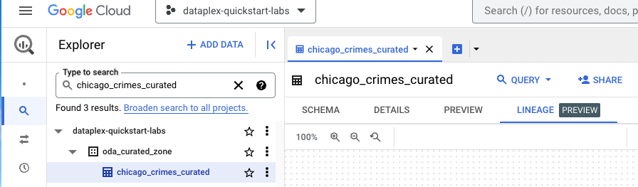   
<br><br>

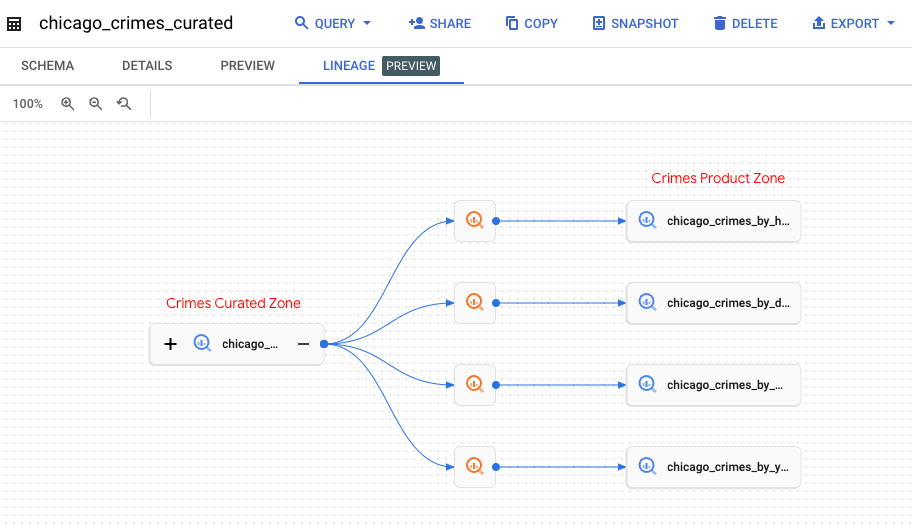   
<br><br>

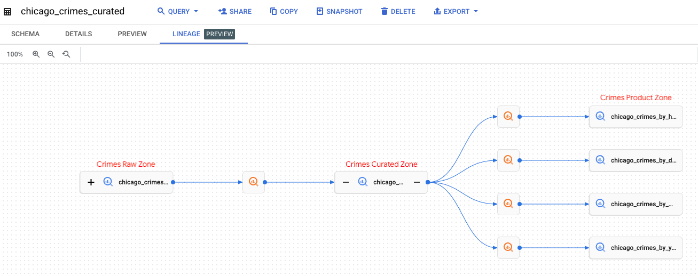   
<br><br>

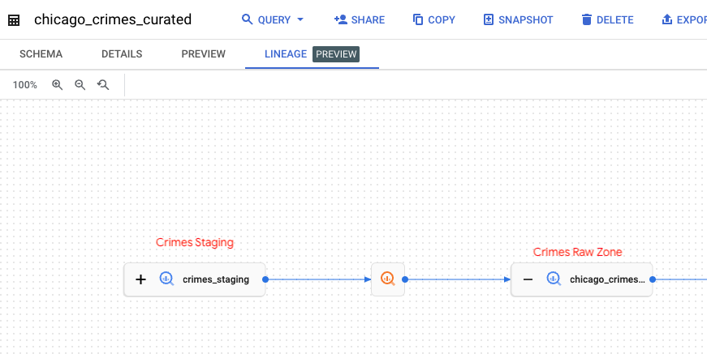   
<br><br>

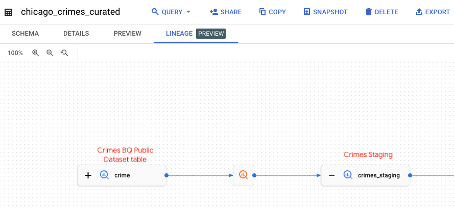   
<br><br>

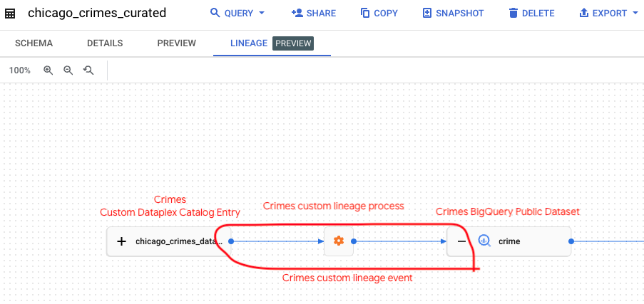   
<br><br>

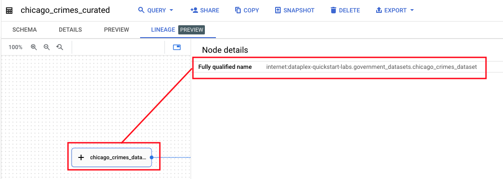   
<br><br>

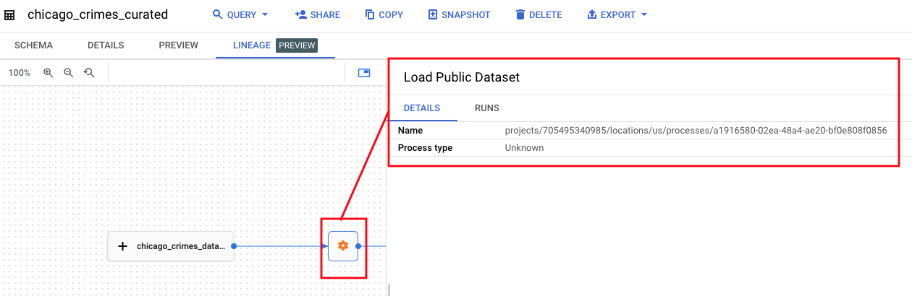   
<br><br>

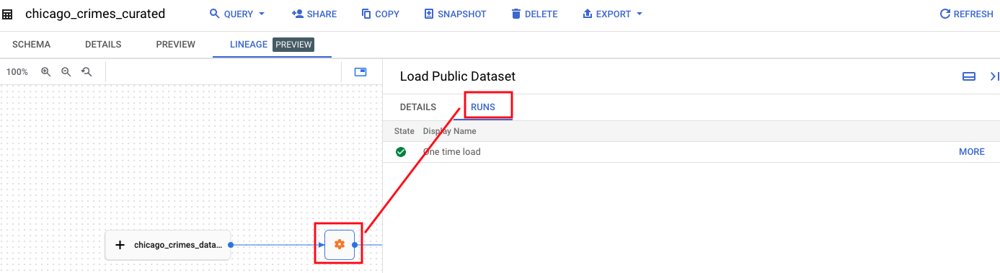   
<br><br>

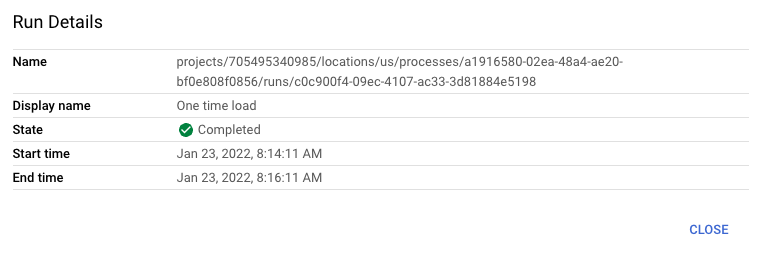   
<br><br>


<hr>

This concludes the lab module. Proceed to the [next module](module-09-5-manage-lineage.md).

<hr>
