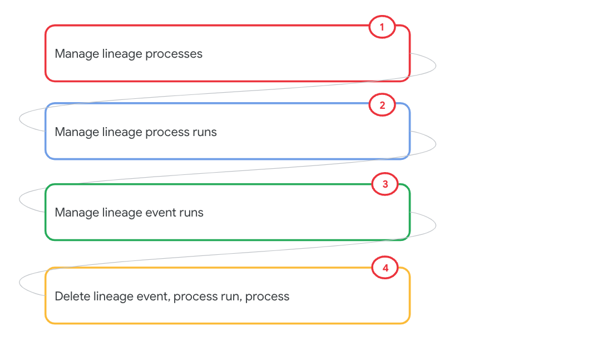

# M9-5: Manage lineage with the Dataplex Lineage API

In this lab module, we will use the Dataplex Lineage API and manage lineage captured in the previous modules.

<hr>

### Prerequisite
Completion of prior modules

### Duration

15 minutes or less

### Lab flow

   
<br><br>

### Lineage REST API Reference

https://cloud.google.com/data-catalog/docs/reference/data-lineage/rest


<hr>
<hr>


............................................................................
# LAB
............................................................................

<hr>

## 1. Variables

Paste the below in cloud shell-
```
PROJECT_ID=`gcloud config list --format "value(core.project)" 2>/dev/null`
PROJECT_NBR=`gcloud projects describe $PROJECT_ID | grep projectNumber | cut -d':' -f2 |  tr -d "'" | xargs`
LOCATION_MULTI="us"
LOCATION="us-central1"
```

<hr>

## 2. Managing Lineage with the Lineage REST API


### 2.1. Managing Lineage Processes

Lineage API supports the following when it comes to lineage processes:<br>
1. Create a process
2. List processes
3. Get specific process
4. Update a process name
5. Delete a process

You need to provide the process ID for lineage management.<br>


#### 2.1.1. List Lineage Processes

Lets write all the processes to a file
```
cd ~/temp-lineage
rm -rf *

curl -H "Authorization: Bearer $(gcloud auth print-access-token)" -H "Content-Type: application.json" https://us-datalineage.googleapis.com/v1/projects/$PROJECT_ID/locations/$LOCATION_MULTI/processes >> my_lineage_processes.json
```


#### 2.1.2. Find the specific process you created

Lets find the custom process we created
```
cat my_lineage_processes.json  | grep -C 1 "Load Public Dataset"
```


Author's output:
```
THIS IS INFORMATIONAL
      "name": "projects/36819656457/locations/us/processes/67bb9f5a-88cd-49d4-8d68-a1f82cde7d5a",
      "displayName": "Load Public Dataset"
    },
```

#### 2.1.3 Capture the custom process's ID

First lets try to display the process ID:
```
cat my_lineage_processes.json  | grep -C 1 "Load Public Dataset" | grep name | cut -d':' -f2 | cut -d '/' -f6
```

Lets assign it to a variable-
```
MY_CUSTOM_PROCESS_ID=`cat my_lineage_processes.json  | grep -C 1 "Load Public Dataset" | grep name | cut -d':' -f2 | cut -d '/' -f6 | tr -d \" | tr -d , `
echo $MY_CUSTOM_PROCESS_ID
```

You should see a GUID.

#### 2.1.4. Update the custom process name

The current process name is "Load Public Dataset". Lets update it to - "Load Chicago Crimes Public Dataset".

```
curl -X PATCH -H "Authorization: Bearer $(gcloud auth print-access-token)" -H "Content-Type: application.json" https://us-datalineage.googleapis.com/v1/projects/$PROJECT_ID/locations/$LOCATION_MULTI/processes/$MY_CUSTOM_PROCESS_ID -d "{ \
    \"displayName\": \"Load Chicago Crimes Public Dataset\" \
}"

```

   
<br><br>

<hr>

### 2.2. Managing Lineage Process Runs

Lineage API supports the following when it comes to lineage process runs:<br>
1. Create a process run
2. List process runs
3. Get specific process run
4. Update a process run name
5. Delete a process run

You need to provide the process run ID for lineage event association.

#### 2.2.1. List runs

Lets write all the lineage events for the process above to a file
```
cd ~/temp-lineage
rm -rf my_lineage_process_runs.json

curl -H "Authorization: Bearer $(gcloud auth print-access-token)" -H "Content-Type: application.json" https://us-datalineage.googleapis.com/v1/projects/$PROJECT_ID/locations/$LOCATION_MULTI/processes/$MY_CUSTOM_PROCESS_ID/runs >> my_lineage_process_runs.json
```


#### 2.2.2. Review the process run listing

Lets find the custom process run we created with grep; In our case, the process has only one run, so, we just have one item listed.
```
cat my_lineage_process_runs.json  
```


Author's output:
```
THIS IS INFORMATIONAL
  "runs": [
    {
      "name": "projects/36819656457/locations/us/processes/67bb9f5a-88cd-49d4-8d68-a1f82cde7d5a/runs/483fa91e-35dc-4e1a-8782-5c1302778e09",
      "displayName": "One time load",
      "startTime": "2022-01-23T14:14:11.238Z",
      "endTime": "2022-01-23T14:16:11.238Z",
      "state": "COMPLETED"
    }
  ]
}
```

#### 2.2.3 Capture the custom process's run ID

First lets try to display the process run ID:
```
cat my_lineage_process_runs.json  |  grep name | cut -d':' -f2 | cut -d '/' -f8 |  tr -d \" | tr -d ,
```

Lets assign it to a variable-
```
MY_CUSTOM_PROCESS_RUN_ID=`cat my_lineage_process_runs.json  |  grep name | cut -d':' -f2 | cut -d '/' -f8 |  tr -d \" | tr -d ,`
echo $MY_CUSTOM_PROCESS_RUN_ID
```

You should see a GUID. We will later delete this run.

<hr>

### 2.3. Managing Lineage Events 

Lineage API supports the following when it comes to lineage events:<br>
1. Create a lineage event
2. List lineage events
3. Get specific lineage event
4. Delete a lineage event

You need to provide the process run ID for lineage event management.

#### 2.3.1. List lineage event runs

```
cd ~/temp-lineage
rm -rf my_lineage_event_runs.json

curl -H "Authorization: Bearer $(gcloud auth print-access-token)" -H "Content-Type: application.json" https://us-datalineage.googleapis.com/v1/projects/$PROJECT_ID/locations/$LOCATION_MULTI/processes/$MY_CUSTOM_PROCESS_ID/runs/$MY_CUSTOM_PROCESS_RUN_ID/lineageEvents/ >> my_lineage_event_runs.json
```

Author's output:
```
THIS IS INFORMATIONAL

cat my_lineage_event_runs.json
{
  "lineageEvents": [
    {
      "name": "projects/36819656457/locations/us/processes/67bb9f5a-88cd-49d4-8d68-a1f82cde7d5a/runs/483fa91e-35dc-4e1a-8782-5c1302778e09/lineageEvents/d88ca91e-32f2-4433-acc4-bbf22c0c6715",
      "startTime": "2022-01-01T14:14:11.238Z",
      "links": [
        {
          "source": {
            "fullyQualifiedName": "internet:dataplex-oda.government_datasets.chicago_crimes_dataset"
          },
          "target": {
            "fullyQualifiedName": "bigquery:bigquery-public-data.chicago_crime.crime"
          }
        }
      ]
    }
  ]
}

```


#### 2.3.2. Capture a lineage event run ID

```
MY_CUSTOM_LINEAGE_RUN_ID=`cat my_lineage_event_runs.json | grep name | cut -d':' -f2 | cut -d'/' -f10 | tr -d \" | tr -d ,`
echo $MY_CUSTOM_LINEAGE_RUN_ID
```

You should see a GUID.

<hr>


### 3. Deleting custom lineage

#### 3.1. Delete a lineage event 

a) List the candidate for deletion-

```
curl -H "Authorization: Bearer $(gcloud auth print-access-token)" -H "Content-Type: application.json" https://us-datalineage.googleapis.com/v1/projects/$PROJECT_ID/locations/$LOCATION_MULTI/processes/$MY_CUSTOM_PROCESS_ID/runs/$MY_CUSTOM_PROCESS_RUN_ID/lineageEvents/

```

b) Delete the candidate for deletion-
```
curl -X DELETE -H "Authorization: Bearer $(gcloud auth print-access-token)" -H "Content-Type: application.json" https://us-datalineage.googleapis.com/v1/projects/$PROJECT_ID/locations/$LOCATION_MULTI/processes/$MY_CUSTOM_PROCESS_ID/runs/$MY_CUSTOM_PROCESS_RUN_ID/lineageEvents/$MY_CUSTOM_LINEAGE_RUN_ID

```

c) Validate deletion with a list command-
```
curl -H "Authorization: Bearer $(gcloud auth print-access-token)" -H "Content-Type: application.json" https://us-datalineage.googleapis.com/v1/projects/$PROJECT_ID/locations/$LOCATION_MULTI/processes/$MY_CUSTOM_PROCESS_ID/runs/$MY_CUSTOM_PROCESS_RUN_ID/lineageEvents/

```

You should see empty curly braces.

<hr>

#### 3.2. Delete a lineage process run

a) List the candidate for deletion-
```
curl -H "Authorization: Bearer $(gcloud auth print-access-token)" -H "Content-Type: application.json" https://us-datalineage.googleapis.com/v1/projects/$PROJECT_ID/locations/$LOCATION_MULTI/processes/$MY_CUSTOM_PROCESS_ID/runs/
```

b) Delete the candidate for deletion-
```
curl -X DELETE -H "Authorization: Bearer $(gcloud auth print-access-token)" -H "Content-Type: application.json" https://us-datalineage.googleapis.com/v1/projects/$PROJECT_ID/locations/$LOCATION_MULTI/processes/$MY_CUSTOM_PROCESS_ID/runs/$MY_CUSTOM_PROCESS_RUN_ID

```

c) Validate deletion with a list command-
```
curl -H "Authorization: Bearer $(gcloud auth print-access-token)" -H "Content-Type: application.json" https://us-datalineage.googleapis.com/v1/projects/$PROJECT_ID/locations/$LOCATION_MULTI/processes/$MY_CUSTOM_PROCESS_ID/runs/
```
You should see empty curly braces.

<hr>

#### 3.3. Delete a lineage process 

a) List the processes-
```
curl -H "Authorization: Bearer $(gcloud auth print-access-token)" -H "Content-Type: application.json" https://us-datalineage.googleapis.com/v1/projects/$PROJECT_ID/locations/$LOCATION_MULTI/processes/
```

b) Delete the candidate for deletion-
```
curl -X DELETE -H "Authorization: Bearer $(gcloud auth print-access-token)" -H "Content-Type: application.json" https://us-datalineage.googleapis.com/v1/projects/$PROJECT_ID/locations/$LOCATION_MULTI/processes/$MY_CUSTOM_PROCESS_ID

```

c) Validate deletion with a list command-
```
curl -H "Authorization: Bearer $(gcloud auth print-access-token)" -H "Content-Type: application.json" https://us-datalineage.googleapis.com/v1/projects/$PROJECT_ID/locations/$LOCATION_MULTI/processes/
```
You should NOT see the deletion targeted process.


<hr>

This concludes the lab module. Proceed to the [next module.](module-10-1-data-profiling.md)

<hr>
