# M9-6: Out of the box lineage for Spark jobs on Dataproc

In this lab module, we will repeat what we did with lineage of BigQuery based Airflow DAG, except, we will use Apache Spark on Dataproc on GCE instead. Dataproc on GCE reports lineage to Dataplex if lineage is enabled at cluster or Spark job level.


### Prerequisites

Successful completion of prior lab modules


### Duration
~60 minutes

### Learning Units

[1. Concepts](module-08-data-lineage-with-bigquery.md#concepts-data-lineage-information-model) <br>
[2. Lab](module-08-data-lineage-with-bigquery.md#lab-automated-lineage-capture-for-bigquery-jobs)

### Solution Architecture


### Pictorial overview of the lab module


### Lake layout


### Learning goals

1. We will create a Dataproc on GCE cluster with lineage enabled
2. We will run pre-created PySpark scripts that curate Chicago crimes, and then generate Crime trend reports
3. Next, we will run a DAG to orchestrate the above leveraging dataproc out of the box lineage support

<hr>

## LAB

## 1. Lab - Create a Dataproc cluster

### 1.1. Variables
Paste the below in Cloud Shell-
```
PROJECT_ID=`gcloud config list --format "value(core.project)" 2>/dev/null`
PROJECT_NBR=`gcloud projects describe $PROJECT_ID | grep projectNumber | cut -d':' -f2 |  tr -d "'" | xargs`
LOCATION="us-central1"
SUBNET=lab-snet
SUBNET_URI="projects/$PROJECT_ID/regions/$LOCATION/subnetworks/$SUBNET"
UMSA_FQN="lab-sa@$PROJECT_ID.iam.gserviceaccount.com"
DPGCE_CLUSTER_NM=lineage-enabled-spark-cluster-$PROJECT_NBR
SPARK_BUCKET=dataproc-lineage-spark-bucket-$PROJECT_NBR
SPARK_BUCKET_FQN=gs://$SPARK_BUCKET
DPMS_NM=lab-dpms-$PROJECT_NBR
```

### 1.2. Grant the User Managed Service Account "Lineage Admin" role

Paste the below in Cloud Shell-
```
gcloud projects add-iam-policy-binding ${PROJECT_ID} \
    --member=serviceAccount:${UMSA_FQN} \
    --role=roles/datalineage.admin
```


### 1.3. Create a Dataproc log bucket

Paste the below in Cloud Shell-
```
gsutil mb -p $PROJECT_ID -c STANDARD -l $LOCATION -b on $SPARK_BUCKET_FQN
```

<hr>

### 1.4. Create a Dataproc on GCE cluster with lineage enabled

Paste the below in Cloud Shell-
```

gcloud dataproc clusters create $DPGCE_CLUSTER_NM \
   --project $PROJECT_ID \
   --subnet $SUBNET \
   --region $LOCATION \
   --enable-component-gateway \
   --bucket $SPARK_BUCKET \
   --scopes=cloud-platform \
   --master-machine-type n1-standard-4 \
   --master-boot-disk-size 500 \
   --num-workers 2 \
   --worker-machine-type n1-standard-4 \
   --worker-boot-disk-size 500 \
   --image-version 2.1.22-debian11 \
   --optional-components JUPYTER \
   --dataproc-metastore projects/$PROJECT_ID/locations/$LOCATION/services/$DPMS_NM \
   --properties 'dataproc:dataproc.lineage.enabled=true' \
   --impersonate-service-account $UMSA_FQN \
   --scopes https://www.googleapis.com/auth/cloud-platform
  
```
This should take 1-2 minutes (or less) to complete.

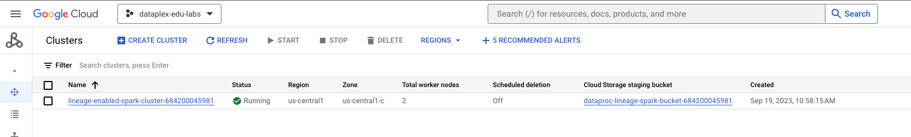   
<br><br>

<hr>

## 2. Lab - Run the PySpark scripts manually from CLI

### 2.1. Review the PySpark code and copy it to the raw code bucket

1. Review the code at the location below-
```
cd ~/dataplex-quickstart-labs/00-resources/scripts/pyspark/chicago-crimes-analytics/
```
Review the two PySpark scripts

<hr>

2. Copy the PySpark scripts from local to the code bucket (in case you modified anything) -
```
cd ~/dataplex-quickstart-labs/00-resources/scripts/pyspark/
gsutil cp chicago-crimes-analytics/* gs://raw-code-${PROJECT_NBR}/pyspark/chicago-crimes-analytics/
```

<hr>

### 2.2. Test each of the Spark jobs individually

#### 2.2.1. Curate Chicago Crimes 

In this section we will curate Chicago crimes with PySpark on Dataproc Serverless - we will dedupe, and augment the crimes data with some temporal attributes for trending.<br>

Run the command below to curate crimes with PySpark-
```
JOB_NM=curate-crimes-spark-dataproc
JOB_ID=$JOB_NM-$RANDOM
PROJECT_ID=`gcloud config list --format "value(core.project)" 2>/dev/null`
PROJECT_NBR=`gcloud projects describe $PROJECT_ID | grep projectNumber | cut -d':' -f2 |  tr -d "'" | xargs`
LOCATION="us-central1"
SUBNET=lab-snet
SUBNET_URI="projects/$PROJECT_ID/regions/$LOCATION/subnetworks/$SUBNET"
UMSA_FQN="lab-sa@$PROJECT_ID.iam.gserviceaccount.com"
DPGCE_CLUSTER_NM=lineage-enabled-spark-cluster-$PROJECT_NBR
SPARK_BUCKET=dataproc-lineage-spark-bucket-$PROJECT_NBR
SPARK_BUCKET_FQN=gs://$SPARK_BUCKET
DPMS_NM=lab-dpms-$PROJECT_NBR


gcloud dataproc jobs submit pyspark gs://raw-code-${PROJECT_NBR}/pyspark/chicago-crimes-analytics/curate_crimes.py \
--cluster=$DPGCE_CLUSTER_NM \
--project $PROJECT_ID \
--region $LOCATION  \
--id $JOB_ID  \
--impersonate-service-account $UMSA_FQN \
--jars=gs://spark-lib/bigquery/spark-bigquery-with-dependencies_2.12-0.29.0.jar \
--properties=spark.openlineage.namespace=$PROJECT_ID,spark.openlineage.appName=$JOB_NM \
-- --projectID=$PROJECT_ID --tableFQN="oda_curated_zone.crimes_curated_spark_dataproc" --peristencePath="gs://curated-data-$PROJECT_NBR/crimes-curated-spark-dataproc/" 
```

Visualize the execution in the Dataproc->Jobs UI-


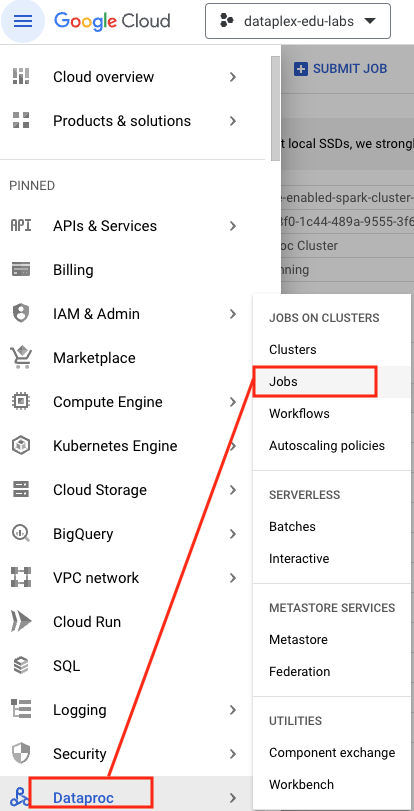   
<br><br>

   
<br><br>

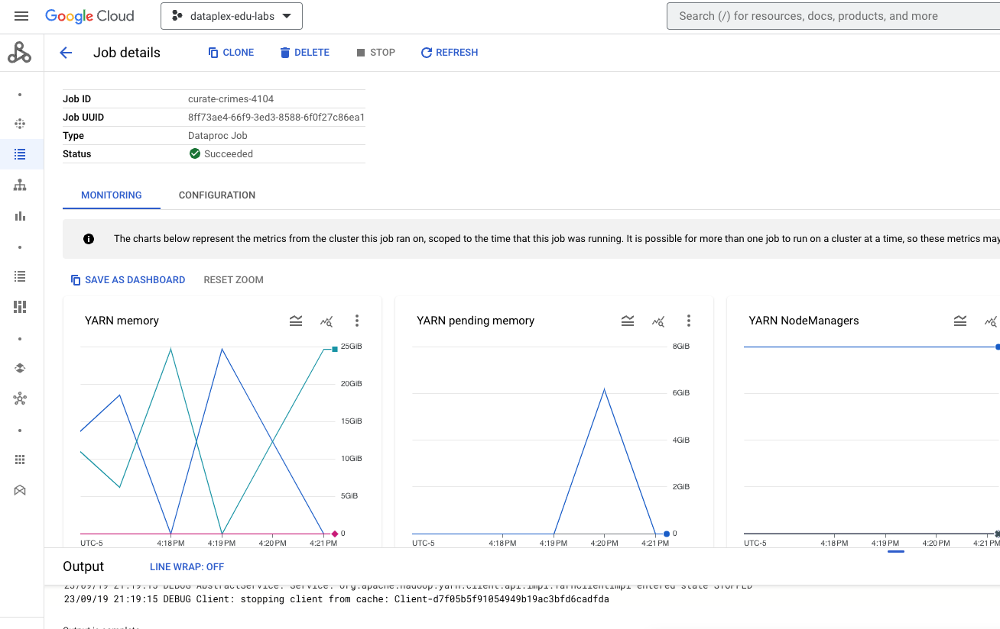   
<br><br>

<hr>

Navigate to the Cloud Storage to check for output files-

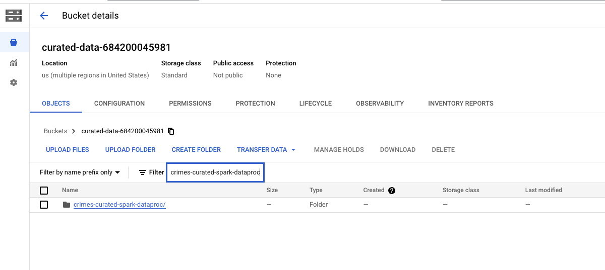   
<br><br>

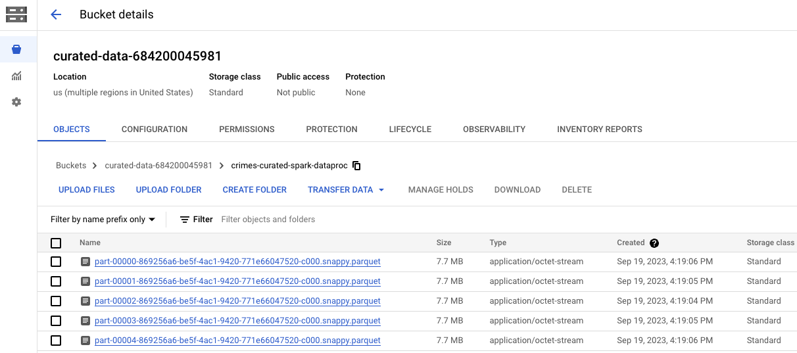   
<br><br>

Navigate to the Dataplex UI and you should see discovery job capture and create an entity-

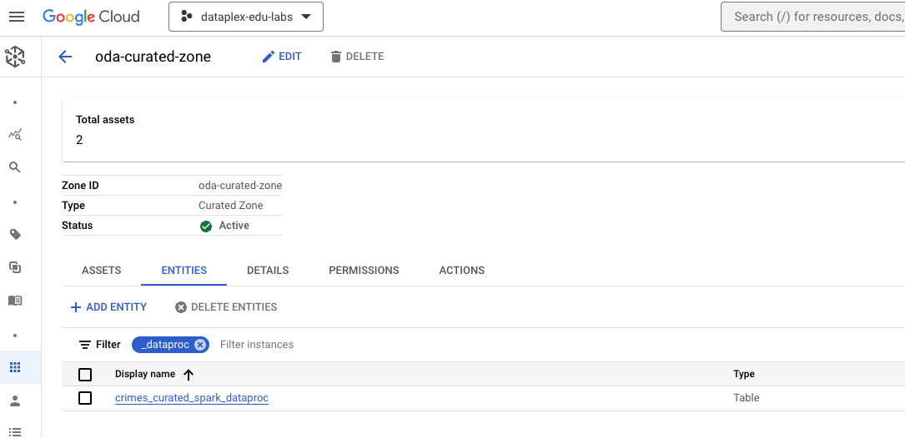   
<br><br>


Navigate to BigQuery and you should see a BQ external table-

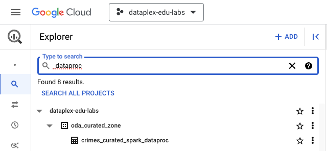   
<br><br>

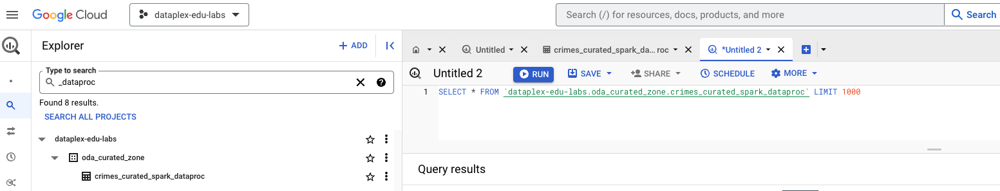   
<br><br>


<hr>

#### 1.3.2. Chicago Crimes by Year Report

Run the crimes_report.py script to generate the "Crimes by Year" report-
```
baseName="crimes-by-year-spark-dataproc"
JOB_ID="$baseName-$RANDOM"
reportName='Chicago Crime Trend by Year'
reportDirGcsURI="gs://product-data-${PROJECT_NBR}/$baseName"
reportSQL='SELECT cast(case_year as int) case_year,count(*) AS crime_count FROM oda_curated_zone.crimes_curated_spark_dataproc GROUP BY case_year;'
reportPartitionCount=1
reportTableFQN="oda_product_zone.crimes_by_year_spark_dataproc"
reportTableDDL="CREATE TABLE IF NOT EXISTS ${reportTableFQN}(case_year int, crime_count long) STORED AS PARQUET LOCATION \"$reportDirGcsURI\""

gcloud dataproc jobs submit pyspark gs://raw-code-${PROJECT_NBR}/pyspark/chicago-crimes-analytics/crimes_report.py \
--cluster=$DPGCE_CLUSTER_NM \
--project $PROJECT_ID \
--region $LOCATION  \
--id $JOB_ID  \
--impersonate-service-account $UMSA_FQN \
--jars=gs://spark-lib/bigquery/spark-bigquery-with-dependencies_2.12-0.29.0.jar \
--properties=spark.openlineage.namespace=$PROJECT_ID,spark.openlineage.appName=$baseName \
-- --projectNbr=$PROJECT_NBR --projectID=$PROJECT_ID --reportDirGcsURI="$reportDirGcsURI" --reportName="$reportName" --reportSQL="$reportSQL" --reportPartitionCount=$reportPartitionCount --reportTableFQN="$reportTableFQN" --reportTableDDL="$reportTableDDL"
```

Should take ~2-3 minutes to complete.

1. Visualize the execution in the Dataproc->Batches UI
2. Navigate to GCS and look for the dataset in the bucket - gs://product-data-YOUR_PROJECT_NUMBER/crimes-by-year-spark-dataproc/
3. Then check for entity creation in Dataplex->Product Zone
4. Finally check for the external table in BigQuery dataset oda_product_zone.crimes_by_year_spark_dataproc and run a simple query - this is import for BQ external table lineage


<hr>


#### 1.3.3. Chicago Crimes by Month Report

Run the crimes_report.py script to generate the "Crimes by Month" report-
```

baseName="crimes-by-month-spark-dataproc"
JOB_ID="$baseName-$RANDOM"
reportName='Chicago Crime Trend by Month'
reportDirGcsURI="gs://product-data-${PROJECT_NBR}/$baseName"
reportSQL='SELECT case_month,count(*) AS crime_count FROM oda_curated_zone.crimes_curated_spark_dataproc GROUP BY case_month;'
reportPartitionCount=1
reportTableFQN="oda_product_zone.crimes_by_month_spark_dataproc"
reportTableDDL="CREATE TABLE IF NOT EXISTS ${reportTableFQN}(case_month string, crime_count long) STORED AS PARQUET LOCATION \"$reportDirGcsURI\""

gcloud dataproc jobs submit pyspark gs://raw-code-${PROJECT_NBR}/pyspark/chicago-crimes-analytics/crimes_report.py \
--cluster=$DPGCE_CLUSTER_NM \
--project $PROJECT_ID \
--region $LOCATION  \
--id $JOB_ID  \
--impersonate-service-account $UMSA_FQN \
--jars=gs://spark-lib/bigquery/spark-bigquery-with-dependencies_2.12-0.29.0.jar \
--properties=spark.openlineage.namespace=$PROJECT_ID,spark.openlineage.appName=$baseName \
-- --projectNbr=$PROJECT_NBR --projectID=$PROJECT_ID --reportDirGcsURI="$reportDirGcsURI" --reportName="$reportName" --reportSQL="$reportSQL" --reportPartitionCount=$reportPartitionCount --reportTableFQN="$reportTableFQN" --reportTableDDL="$reportTableDDL"


```

Should take ~2-3 minutes to complete.

1. Visualize the execution in the Dataproc->Batches UI
2. Navigate to GCS and look for the dataset in the bucket - gs://product-data-YOUR_PROJECT_NUMBER/crimes-by-month-spark-dataproc/
3. Then check for entity creation in Dataplex->Product Zone
4. Finally check for the external table in BigQuery dataset oda_product_zone.crimes_by_month_spark_dataproc and run a simple query - this is import for BQ external table lineage


<hr>

#### 1.3.4. Chicago Crimes by Day of Week Report

Run the crimes_report.py script to generate the "Crimes by Day" report-
```
baseName="crimes-by-day-spark-dataproc"
JOB_ID="$baseName-$RANDOM"
reportName='Chicago Crime Trend by Day'
reportDirGcsURI="gs://product-data-${PROJECT_NBR}/$baseName"
reportSQL='SELECT case_day_of_week,count(*) AS crime_count FROM oda_curated_zone.crimes_curated_spark_dataproc GROUP BY case_day_of_week;'
reportPartitionCount=1
reportTableFQN="oda_product_zone.crimes_by_day_spark_dataproc"
reportTableDDL="CREATE TABLE IF NOT EXISTS ${reportTableFQN}(case_day_of_week string, crime_count long) STORED AS PARQUET LOCATION \"$reportDirGcsURI\""

gcloud dataproc jobs submit pyspark gs://raw-code-${PROJECT_NBR}/pyspark/chicago-crimes-analytics/crimes_report.py \
--cluster=$DPGCE_CLUSTER_NM \
--project $PROJECT_ID \
--region $LOCATION  \
--id $JOB_ID  \
--impersonate-service-account $UMSA_FQN \
--jars=gs://spark-lib/bigquery/spark-bigquery-with-dependencies_2.12-0.29.0.jar \
--properties=spark.openlineage.namespace=$PROJECT_ID,spark.openlineage.appName=$baseName \
-- --projectNbr=$PROJECT_NBR --projectID=$PROJECT_ID --reportDirGcsURI="$reportDirGcsURI" --reportName="$reportName" --reportSQL="$reportSQL" --reportPartitionCount=$reportPartitionCount --reportTableFQN="$reportTableFQN" --reportTableDDL="$reportTableDDL"


```

Should take ~2-3 minutes to complete.

1. Visualize the execution in the Dataproc->Batches UI
2. Navigate to GCS and look for the dataset in the bucket - gs://product-data-YOUR_PROJECT_NUMBER/crimes-by-day-spark-dataproc/
3. Then check for entity creation in Dataplex->Product Zone
4. Finally check for the external table in BigQuery dataset oda_product_zone.crimes_by_day_spark_dataproc and run a simple query - this is import for BQ external table lineage


<hr>

#### 1.3.5. Chicago Crimes by Hour of Day Report

```
baseName="crimes-by-hour-spark-dataproc"
JOB_ID="$baseName-$RANDOM"
reportName='Chicago Crime Trend by Hour'
reportDirGcsURI="gs://product-data-${PROJECT_NBR}/$baseName"
reportSQL='SELECT CAST(case_hour_of_day AS int) case_hour_of_day,count(*) AS crime_count FROM oda_curated_zone.crimes_curated_spark_dataproc GROUP BY case_hour_of_day;'
reportPartitionCount=1
reportTableFQN="oda_product_zone.crimes_by_hour_spark_dataproc"
reportTableDDL="CREATE TABLE IF NOT EXISTS ${reportTableFQN}(case_hour_of_day int, crime_count long) STORED AS PARQUET LOCATION \"$reportDirGcsURI\""

gcloud dataproc jobs submit pyspark gs://raw-code-${PROJECT_NBR}/pyspark/chicago-crimes-analytics/crimes_report.py \
--cluster=$DPGCE_CLUSTER_NM \
--project $PROJECT_ID \
--region $LOCATION  \
--id $JOB_ID  \
--impersonate-service-account $UMSA_FQN \
--jars=gs://spark-lib/bigquery/spark-bigquery-with-dependencies_2.12-0.29.0.jar \
--properties=spark.openlineage.namespace=$PROJECT_ID,spark.openlineage.appName=$baseName \
-- --projectNbr=$PROJECT_NBR --projectID=$PROJECT_ID --reportDirGcsURI="$reportDirGcsURI" --reportName="$reportName" --reportSQL="$reportSQL" --reportPartitionCount=$reportPartitionCount --reportTableFQN="$reportTableFQN" --reportTableDDL="$reportTableDDL"

```

Should take ~2-3 minutes to complete.

1. Visualize the execution in the Dataproc->Batches UI
2. Navigate to GCS and look for the dataset in the bucket - gs://product-data-YOUR_PROJECT_NUMBER/crimes-by-hour-spark-dataproc/
3. Then check for entity creation in Dataplex->Product Zone
4. Finally check for the external table in BigQuery dataset oda_product_zone.crimes_by_hour_spark_dataproc and run a simple query - this is import for BQ external table lineage


<hr>
<hr>


## 2. Dataplex Discovery in Action - summary of entities and BQ external tables created

### 2.1. Data created in GCS by the Spark jobs

#### 2.1.1. Curated data


   
<br><br>

#### 2.1.2. Product data

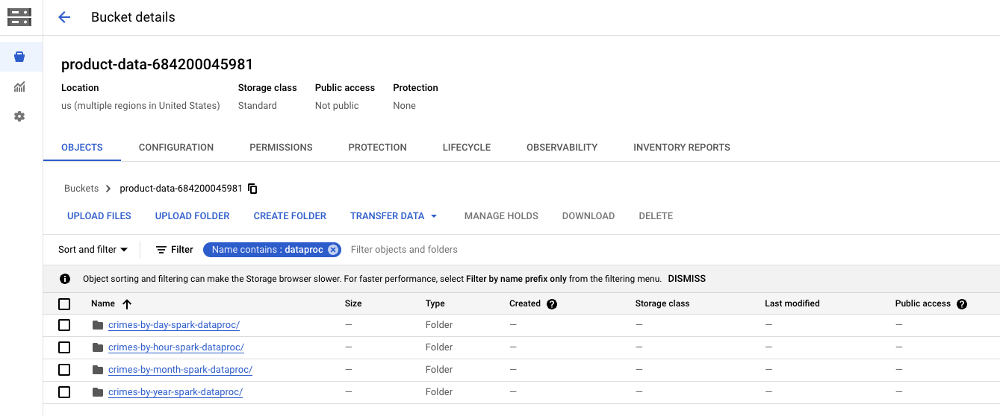   
<br><br>

### 2.2. Entities created in Dataplex by Dataplex Discovery

#### 2.2.1. Curated data

   
<br><br>

#### 2.2.2. Product data

   
<br><br>

<hr>
<hr>

## 3. Out of the box Dataproc Linege capture from basic Dataproc Spark job execution

### 3.1. Where to look?

1. Lineage is captured when there is data processing. And the supported sources are BigQuery external tables and BigQuery native tables. 
2. In our case, we used a BigQuery native table (oda_raw_zone.crimes_raw) as our source and created 4 external Hive tables (in Dataproc Metastore/Hive Metatsore) on it.
3. We persisted data in Cloud Storage.

Therefore, to find our lineage graph in BigQuery UI, we need to navigate to oda_raw_zone.crimes_raw to see the lineage.

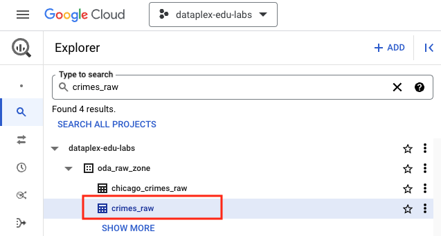   
<br><br>

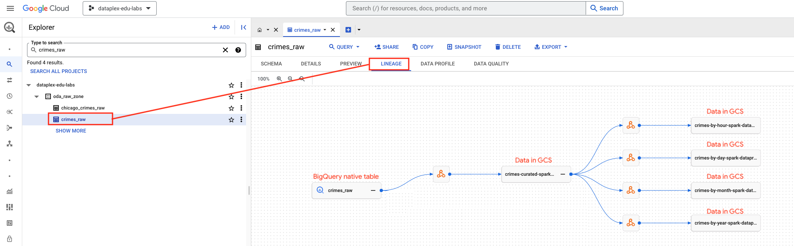   
<br><br>

### 3.2. What about the BQ external tables?

Once you run a query on each BigQuery external table created, if you click on the BQ external table in the BigQuery UI and then on the lineage tab, you should see lineage as follows-

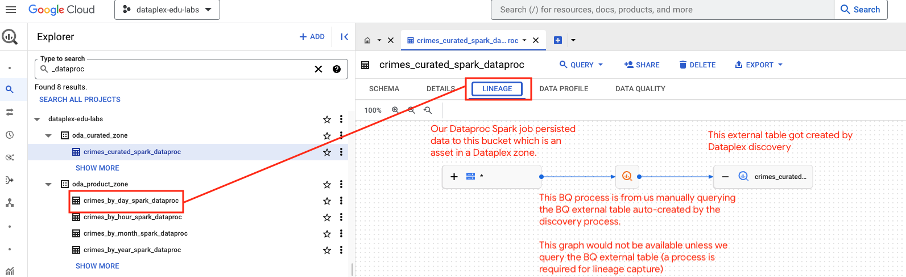   
<br><br>


<hr>
<hr>

## 4. Orchestrating the above jobs with Apache Airflow on Cloud Composer - and associated lineage graph 

### 4.1. Review the Airflow DAG 

Review the DAG specification at dataplex-quickstart-labs/00-resources/scripts/airflow/chicago-crimes-analytics/spark_dataproc_lineage_pipeline.py.

### 4.2. Upload it to the Airflow DAG bucket

Run the below in Cloud Shell-
```
PROJECT_ID=`gcloud config list --format "value(core.project)" 2>/dev/null`
PROJECT_NBR=`gcloud projects describe $PROJECT_ID | grep projectNumber | cut -d':' -f2 |  tr -d "'" | xargs`
LOCATION="us-central1"
COMPOSER_ENVIRONMENT_NAME=`gcloud composer environments list --locations $LOCATION | grep NAME | cut -d':' -f2`
DAG_DIR=`gcloud composer environments describe $COMPOSER_ENVIRONMENT_NAME --location $LOCATION | grep dagGcsPrefix | cut -d' ' -f4`/chicago-crimes-analytics

cd ~/dataplex-quickstart-labs/00-resources/scripts/airflow/chicago-crimes-analytics
gsutil cp spark_dataproc_lineage_pipeline.py $DAG_DIR/
```

### 4.3. Run the DAG

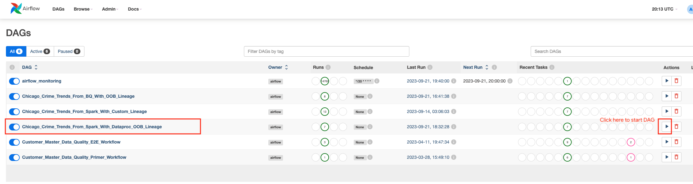   
<br><br>

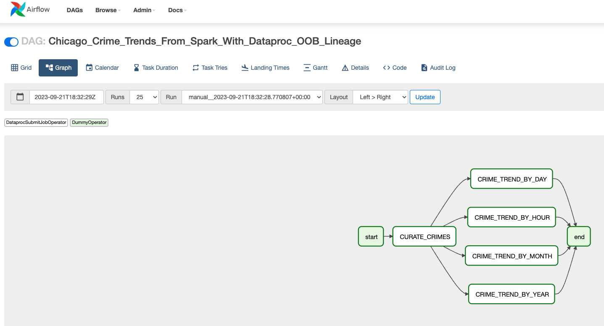   
<br><br>

### 4.4. Visualize the lineage in the BigQuery UI

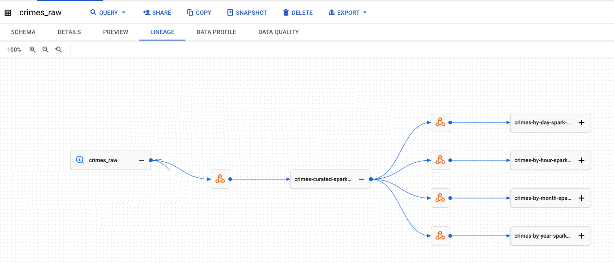   
<br><br>

### 4.5. The Lineage Process

- Is denoted by a Dataproc icon
- Click on the icon to see the lineage process ID

### 4.6. The Lineage Process Runs

For each execution of a Dataproc Spark job reporting lineage, you should see a "RUN"

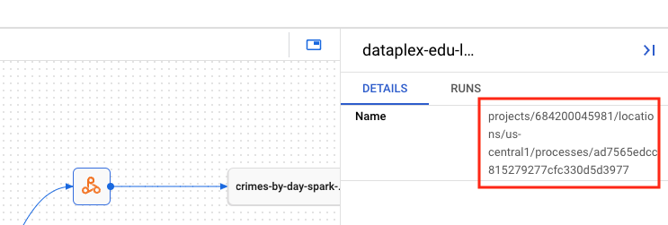   
<br><br>


Click on a "RUN" (where it says "MORE") to see specifc details of the Dataproc Spark job

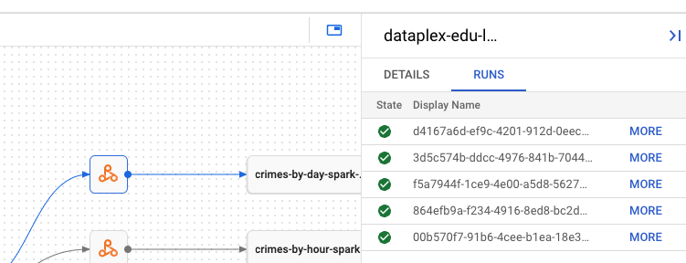   
<br><br>

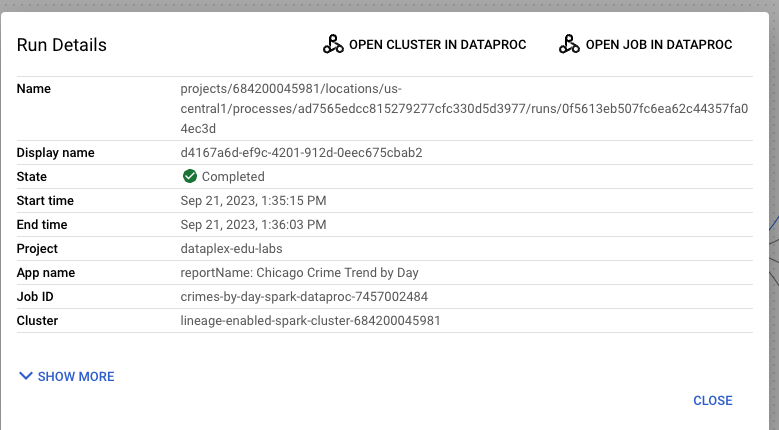   
<br><br>

View the job execution details in the Dataproc GUI

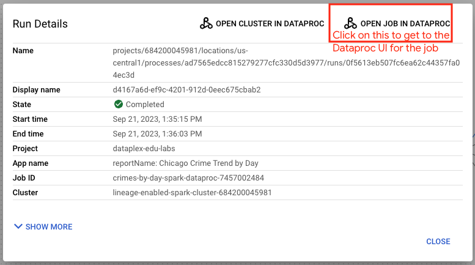   
<br><br>

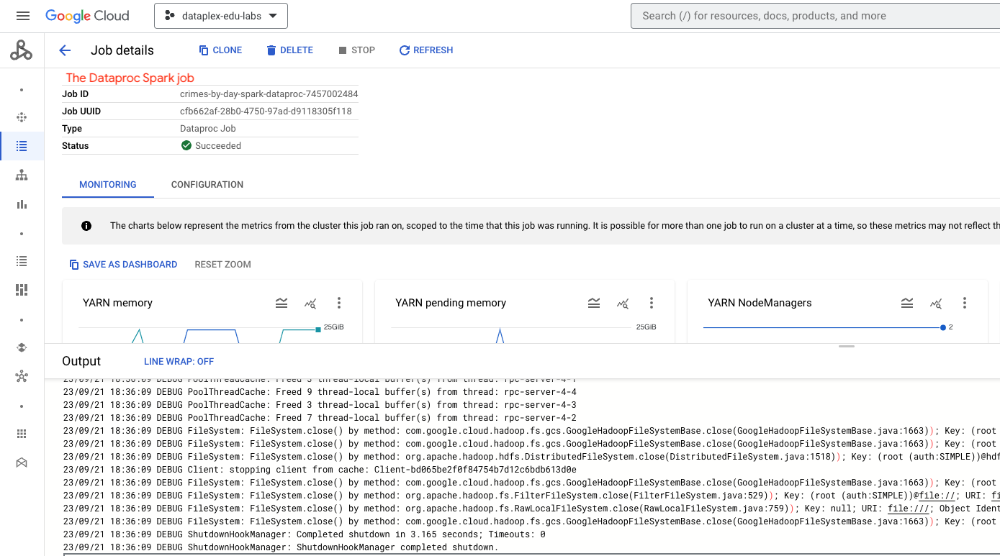   
<br><br>

### 4.7. The Lineage Namespace

In the Spark job command below, we added properties for lineage-

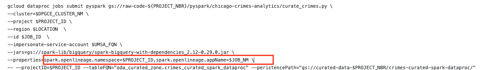   
<br><br>

Here is what it manifests-

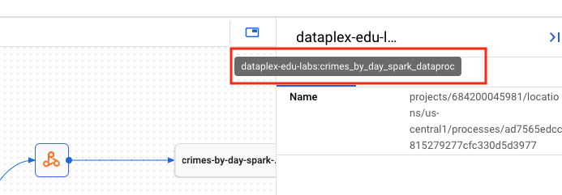   
<br><br>

### 4.8. Considerations

Its important to have a unique ```spark.openlineage.appName``` value for a Dataproc Spark process, but not for Dataproc Spark process runs. If you have unique values per run, there will be an explosion of Dataproc process icons, one for each run.

<hr>
<hr>

## 5. Nuances

1. Running the Spark jobs via Airflow on Cloud Composer did not enrich the lineage graph with Airflow task metadata. <br>
This is because Cloud Composer currently, only reports lineage for Dataproc GCE - SparkSQL and HiveQL jobs  at the moment. <br>

2. Its important to have a unique ```spark.openlineage.appName``` value for a Dataproc Spark process, but not for Dataproc Spark process runs. If you have unique values per run, there will be an explosion of Dataproc process icons, one for each run.

## 6. Remove unwanted lineage

Cleaning up lineage can be done by removing process runs, and then lienage process using the Lineage API.

E.g.
```
# Delete process run ac9682e0-3934-409e-866b-45c3799d766c
curl  -X DELETE -H "Authorization: Bearer $(gcloud auth print-access-token)" -H "Content-Type: application.json" https://datalineage.googleapis.com/v1/projects/YOUR_PROJECT_ID/locations/YOUR_PROJECT_LOCATION/processes/cf61a4a1-89f8-0da2-2ba9-846ad44f2bfe/runs/ac9682e0-3934-409e-866b-45c3799d766c

# Delete process cf61a4a1-89f8-0da2-2ba9-846ad44f2bfe
curl  -X DELETE -H "Authorization: Bearer $(gcloud auth print-access-token)" -H "Content-Type: application.json" https://datalineage.googleapis.com/v1/projects/YOUR_PROJECT_ID/locations/YOUR_PROJECT_LOCATION/processes/cf61a4a1-89f8-0da2-2ba9-846ad44f2bfe
```

<hr>
<hr>

This concludes the lab module. Proceed to the next module.

<hr>
