# M10-1: Data Profiling

Dataplex offers a data profiling and this lab showcases the same.

### Terminilogy Levelset

Data profiling is the analytical process of capturing useful statistics of data. The results can provide actionable insights into data quality, trends and risks, for proactive remediation to eliminate any adverse impact.


There are several types of profiling. Dataplex does column-level profiling.

### Prerequisites

Successful completion of prior modules

### Lab module flow

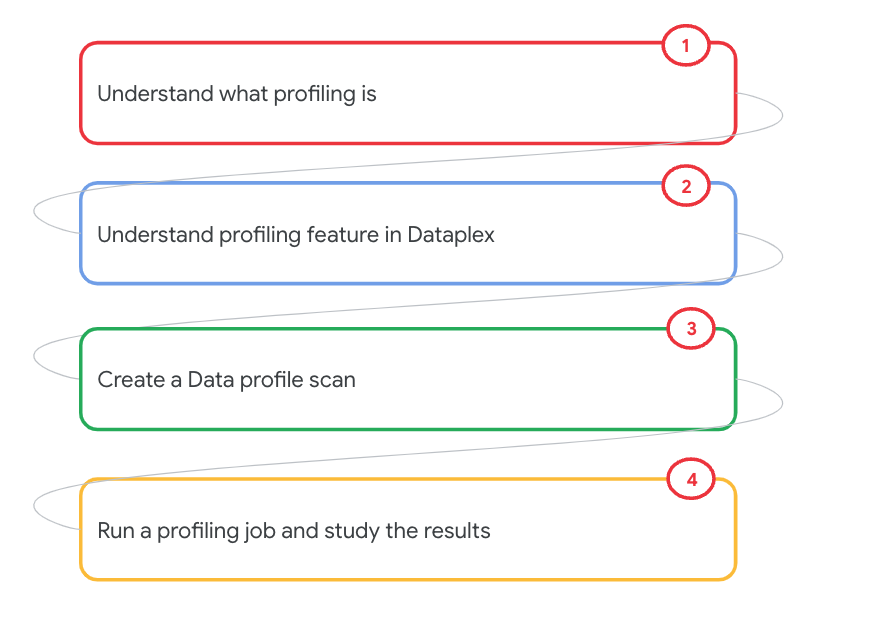   
<br><br>

### Duration

30 minutes

### Documentation 

[About Data Profiling](https://cloud.google.com/dataplex/docs/data-profiling-overview)<br>
[Use Data Profiling](https://cloud.google.com/dataplex/docs/use-data-profiling)<br>

<hr>


### Learning goals

1. Understand the data profiling feature - options, considerations, positioning
2. Practical knowledge of how to use data profiling in Dataplex

<hr>

<hr>

# PRODUCT FEATURE HIGHLIGHTS

<hr>

## 1. Product Feature Overview: About Data Profiling in Dataplex

Dataplex data profiling lets you identify common statistical characteristics of the columns of your BigQuery tables. This information helps data consumers understand their data better, which makes it possible to analyze data more effectively. Dataplex also uses this information to recommend rules for data quality.

### 1.1. Options for Data Profiling in Dataplex
1. Auto Data Profiling
2. User Configured Data Profiling

### 1.2. Scope of this lab
User Configured Data Profiling

### 1.3. Note
1. This feature is currently supported only for BigQuery tables.
2. Data profiling compute used is Google managed, so you don't need to plan for/or handle any infrastructure complexity.

### 1.4. Documentation
[About](https://cloud.google.com/dataplex/docs/data-profiling-overview#limitations_in_public_preview) | 
[Practitioner's Guide](https://cloud.google.com/dataplex/docs/use-data-profiling)

### 1.5. User Configured Dataplex Profiling - what's involved

At the time of authoring this lab -

| # | Step | 
| -- | :--- |
| 1 | A User Managed Service Account is needed with ```roles/dataplex.dataScanAdmin``` to run the profiling job|
| 2 | A scan profile needs to be created against a table|
| 3 | In the scan profile creation step, you can select a full scan or incremental|
| 4 | In the scan profile creation step, you can configure profiling to run on schedule or on demand|
| 5 | Profiling results are visually displayed|
| 6 | [Configure RBAC](https://cloud.google.com/dataplex/docs/use-data-profiling#datascan_permissions_and_roles) for running scan versus viewing results |

Note: <br>
If you choose incremental scan, in the Timestamp column field, you need to provide a column of type DATE or TIMESTAMP from your BigQuery table that increases monotonically and can be used to identify new records. It can be a column on which the table is partitioned, given that the table doesn't require a partition filter.

<hr>

### 1.6. User Configured Dataplex Profiling - what's supported

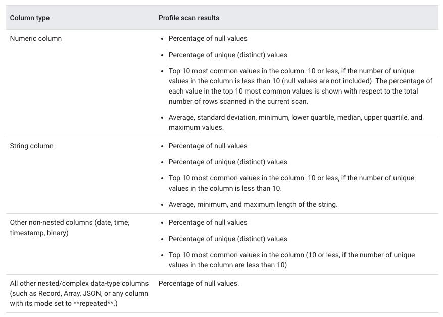   
<br><br>

### 1.7. Roles for Data Profiling - what's available

```
role/dataplex.dataScanAdmin: Full access to DataScan resources.
role/dataplex.dataScanEditor: Write access to DataScan resources.
role/dataplex.dataScanViewer: Read access to DataScan resources, excluding the results.
role/dataplex.dataScanDataViewer: Read access to DataScan resources, including the results.
```
[Documentation on RBAC](https://cloud.google.com/dataplex/docs/use-data-profiling#datascan_permissions_and_roles)


### 1.8. Provisioning Data Profiling tasks - what's supported

At the time of authoring of this lab, Console and REST API only

<hr>
<hr>

# LAB

<hr>

## 2. Create a BigQuery dataset for Data Profiling and Data Quality results

- Dataplex Profiling works with BigQuery managed tables only.
- Lets create a BQ dataset for Data Profiling and Data Quality results.


### 2.1. Declare variables

Paste in Cloud Shell-
```
PROJECT_ID=`gcloud config list --format "value(core.project)" 2>/dev/null`
PROJECT_NBR=`gcloud projects describe $PROJECT_ID | grep projectNumber | cut -d':' -f2 |  tr -d "'" | xargs`
LOCATION="us-central1"
LOCATION_MULTI="us"
BQ_DATASET_ID="oda_dq_scratch_ds"
LAKE_NM="oda-lake"
DATA_QUALITY_ZONE_NM="oda-dq-zone"
DATA_QUALITY_ASSET_NM="dq-scratch"

UMSA_FQN="lab-sa@$PROJECT_ID.iam.gserviceaccount.com"

```

### 1.2. Create a BigQuery dataset

Run this in Cloud shell-
```
bq --location=$LOCATION_MULTI mk \
    $PROJECT_ID:$BQ_DATASET_ID
```

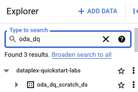   
<br><br>


<hr>

## 2. Create Dataplex Zone for Data Quality & add the BQ dataset as an asset

Dataplex profiling works only on assets in the Dataplex zones.

### 2.1. Create a Dataplex Zone

Run this in Cloud shell-
```
gcloud dataplex zones create ${DATA_QUALITY_ZONE_NM} \
--lake=$LAKE_NM \
--resource-location-type=MULTI_REGION \
--location=$LOCATION \
--type=RAW \
--discovery-enabled \
--discovery-schedule="0 * * * *"
```

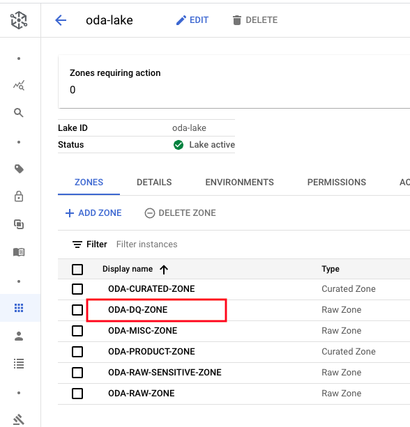   
<br><br>

### 2.2. Add the BigQuery dataset created into the zone

Run this in Cloud Shell-
```
gcloud dataplex assets create $DATA_QUALITY_ASSET_NM \
--location=$LOCATION \
--lake=$LAKE_NM \
--zone=$DATA_QUALITY_ZONE_NM \
--resource-type=BIGQUERY_DATASET \
--resource-name=projects/$PROJECT_ID/datasets/$BQ_DATASET_ID \
--discovery-enabled \
--discovery-schedule="0 * * * *" \
--display-name 'Data Quality Scratch'

```

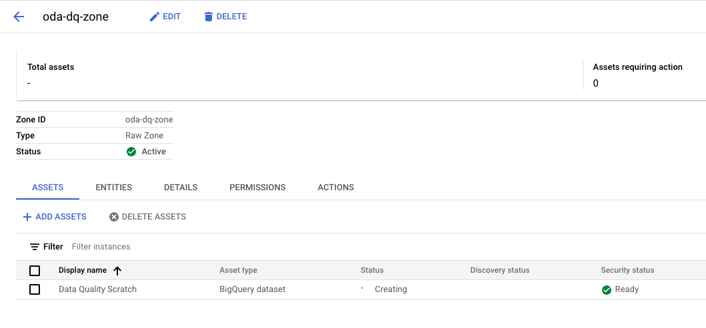   
<br><br>

<hr>

## 3. Data to be profiled

### 3.1. External table with Customer Master Data

We will choose this as it has email addresses, phone nubers etc that are great for checking for quality.

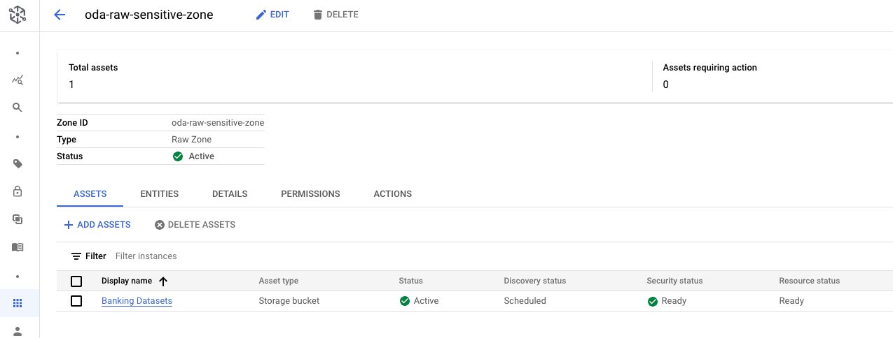   
<br><br>

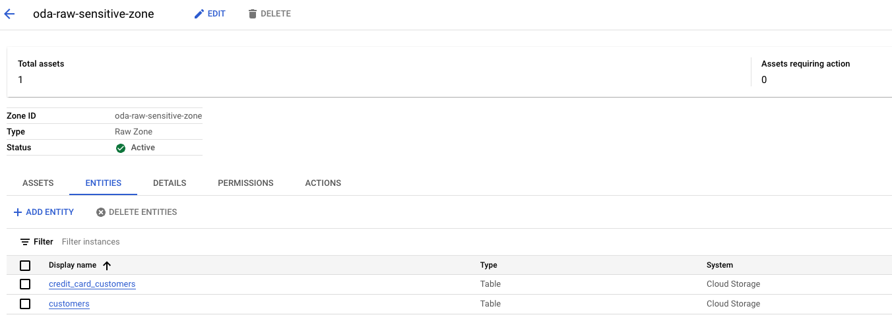   
<br><br>

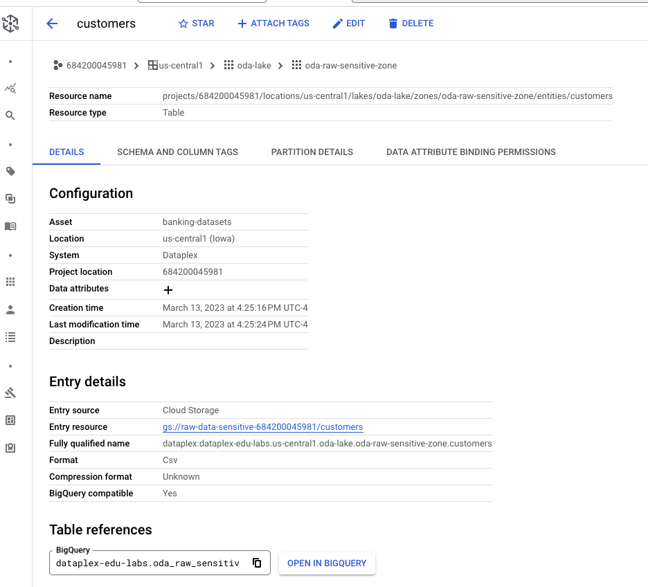   
<br><br>


Familiarize yourself with the data in the BQ UI via this SQL-
```
SELECT * FROM oda_raw_sensitive_zone.banking_customers_raw_customers WHERE date='2022-05-01' LIMIT 5
```

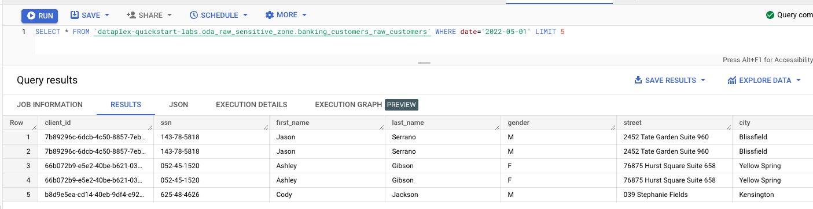   
<br><br>

<hr>


### 3.2. Create BigQuery managed table with Customer Master Data

In the BQ UI, run the SQL below-
```
CREATE OR REPLACE TABLE oda_dq_scratch_ds.customer_master AS
SELECT * FROM oda_raw_sensitive_zone.banking_customers_raw_customers WHERE date='2022-05-01'

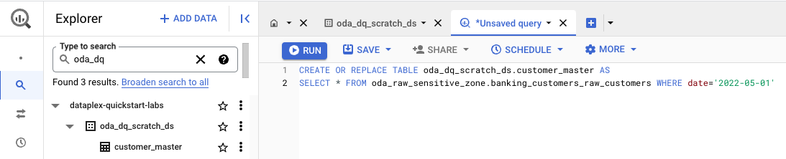   
<br><br>
```

Run a quick query to test if the table is created and also review the columns-
```
SELECT * FROM oda_dq_scratch_ds.customer_master LIMIT 20
```

   
<br><br>

Understand the schema-

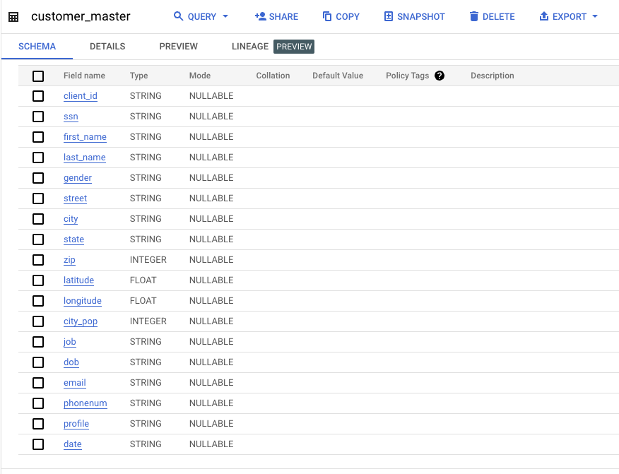   
<br><br>

<hr>

### 3.3. Post discovery run, you should see an asset registered in Dataplex ODA-DQ-ZONE

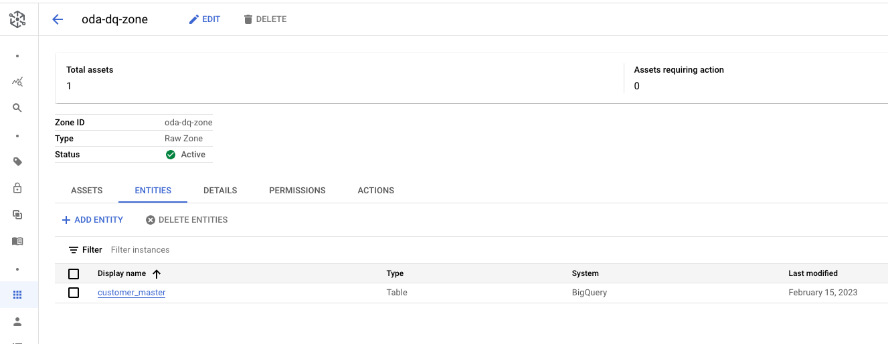   
<br><br>

<hr>


## 4. IAM permissions

### 4.1. Permissions to create a Data Profile Scan

Lets grant our user managed service account admin role for Data profiling-

```
PROJECT_ID=`gcloud config list --format "value(core.project)" 2>/dev/null`
UMSA_FQN="lab-sa@${PROJECT_ID}.iam.gserviceaccount.com"

gcloud projects add-iam-policy-binding $PROJECT_ID --member=serviceAccount:$UMSA_FQN \
--role="roles/dataplex.dataScanAdmin"

```

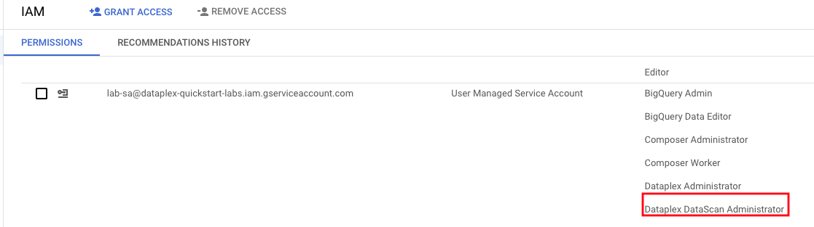   
<br><br>

### 4.2. Permissions for Dataplex Google Managed Service Account

Dataplex has a service account it auto-creates when you enable the Dataplex API. This API needs BigQuery read permissions. Lets grant it the same.

```
DATAPLEX_GMSA_FQN = "service-$PROJECT_NBR@gcp-sa-dataplex.iam.gserviceaccount.com"

gcloud projects add-iam-policy-binding $PROJECT_ID --member=serviceAccount:$DATAPLEX_GMSA_FQN \
--role="roles/roles/bigquery.dataViewer"

```

<hr>


## 5. Create a Data Profile Scan

Follow the steps as shown in the screenshots to create a profile scan-

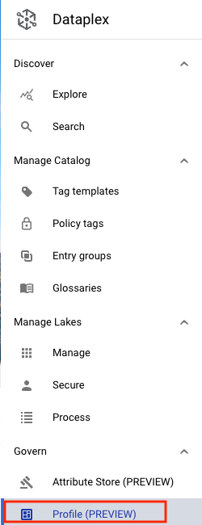   
<br><br>

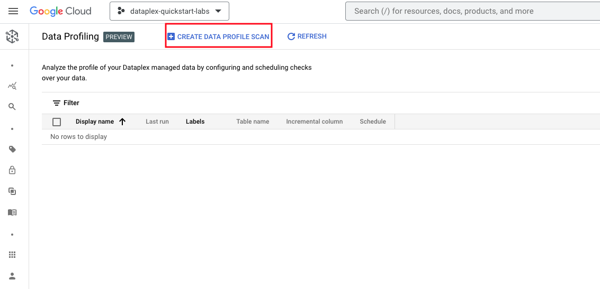   
<br><br>

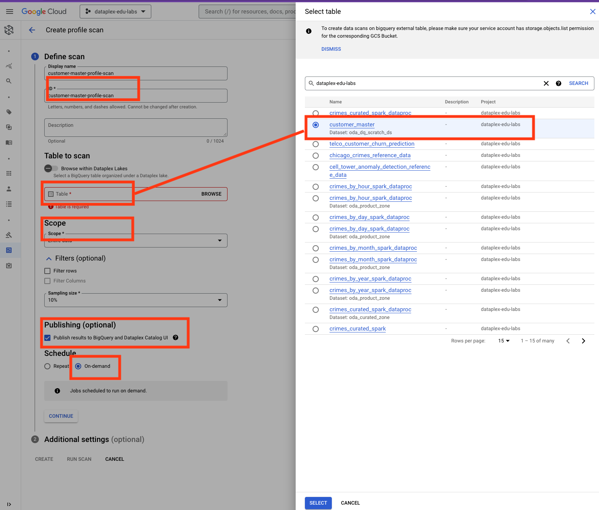   
<br><br>

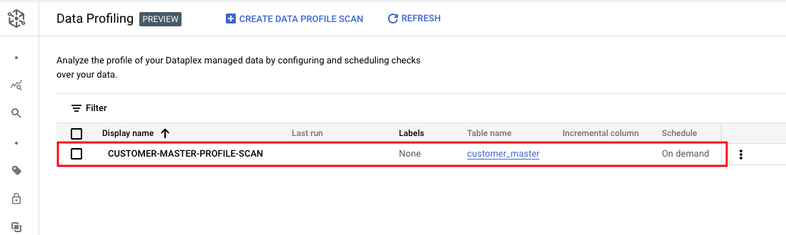   
<br><br>

<hr>

## 6. Run a Data Profiling scan

Follow the step as shown in the screenshot to run a profile scan-

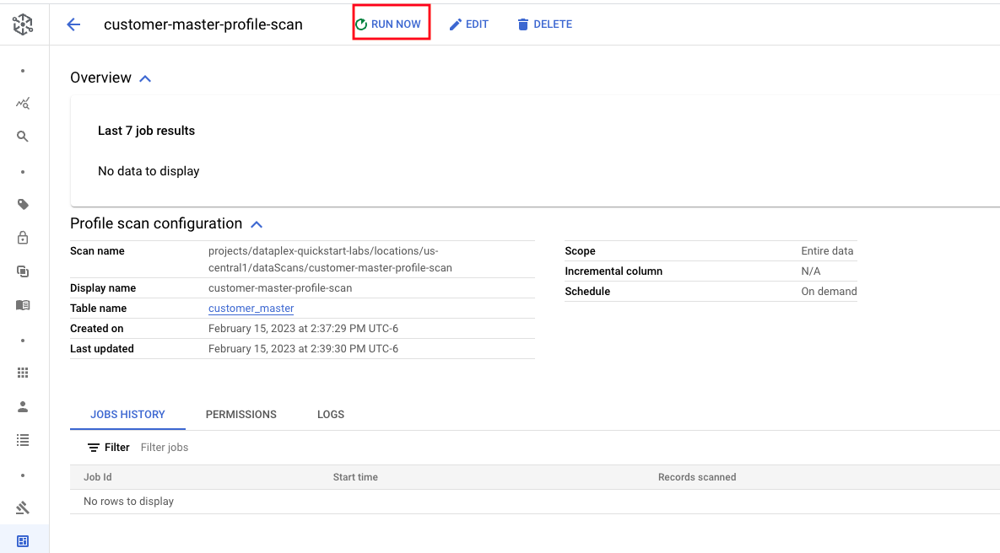   
<br><br>

<hr>

## 7. Visualize the Profiling job results

At the time of the authoring of this lab, the results were only available visually. From the Dataplex Profiling UI, visualize the scan results-

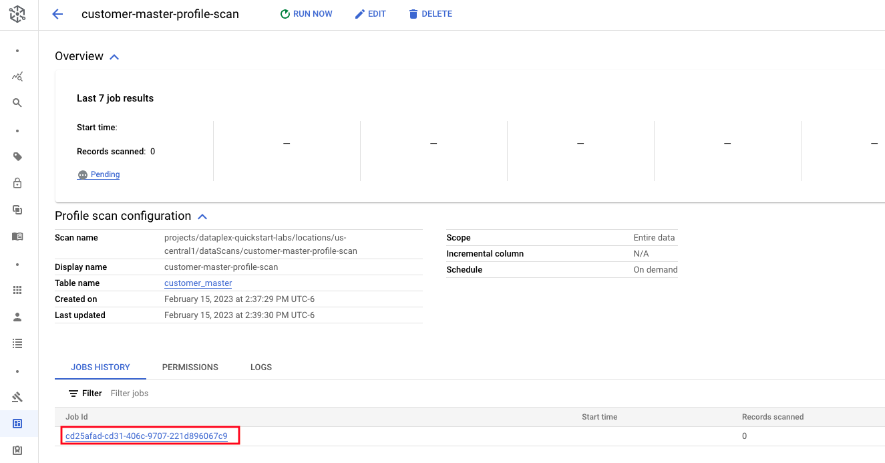   
<br><br>

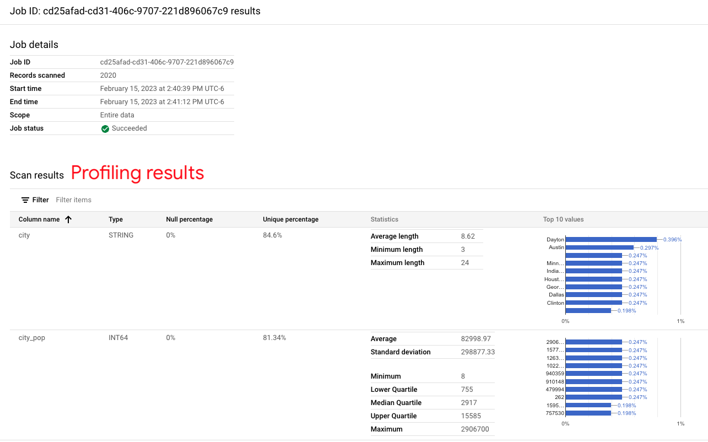   
<br><br>

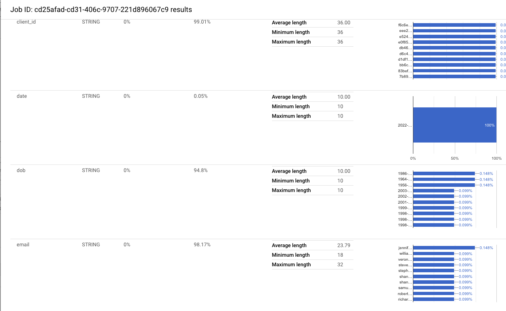   
<br><br>

   
<br><br>

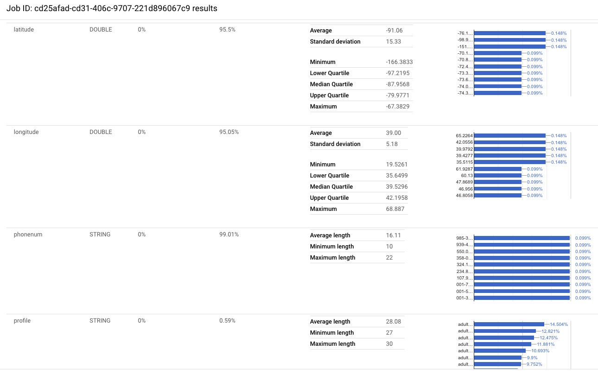   
<br><br>

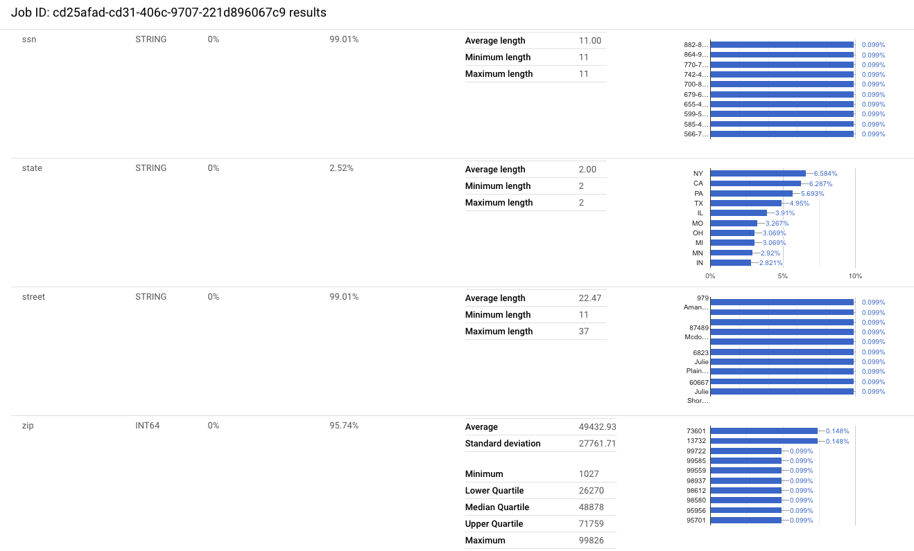   
<br><br>

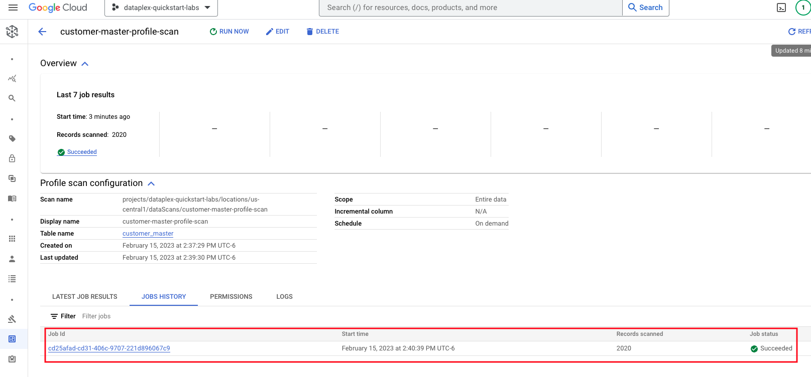   
<br><br>

<hr>

## 8. Statistics captured by column datatype

Two data types are shown below to demonstrate the types of profile characteristics returned. The first is of string data type -

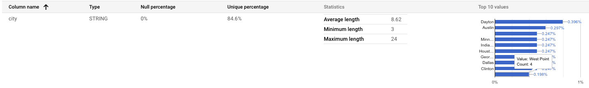   
<br><br>

The one below is of integer data type-

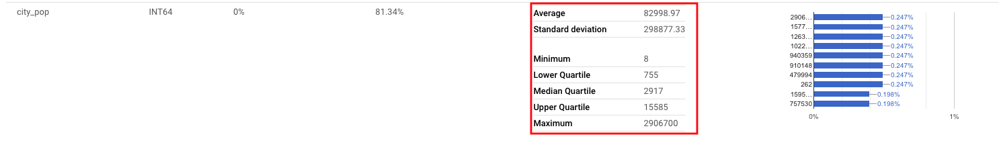   
<br><br>


<hr>
This concludes the lab module.
<hr>
