# M11-1: Auto Data Quality - COMPLETENESS checks

Dataplex provides the following two options to validate data quality:

**Auto data quality** (Public Preview) provides an automated experience for getting quality insights about your data. Auto data quality automates and simplifies quality definition with recommendations and UI-driven workflows. It standardizes on insights with built-in reports and drives actions through alerting and troubleshooting.

**Dataplex data quality task** (Generally Available) offers a highly customizable experience to manage your own rule repository and customize execution and results, using Dataplex for managed / serverless execution. Dataplex data quality task uses an open source component, CloudDQ, that can also open up choices for customers who want to enhance the code to their needs.

The focus of this lab module is Auto data quality - completeness checks.

### Prerequisites

Successful completion of prior modules

### Duration

15 minutes or less

### Documentation 

[Data Quality Overview](https://cloud.google.com/dataplex/docs/data-quality-overview)<br>
[About Auto Data Quality](https://cloud.google.com/dataplex/docs/auto-data-quality-overview)<br>
[Use Auto Data Quality](https://cloud.google.com/dataplex/docs/use-auto-data-quality)<br>


### Learning goals

1. Understand options for data quality in Dataplex
2. Practical knowledge of running Auto Data Quality - completeness checks feature

<hr>
<hr>

# LAB

<hr>
<hr>

## 1. Target data for Data Quality checks

We will use the same table as in the Data Profiling lab module.

   
<br><br>

Familiarize yourself with the table, from the BigQuery UI by running the SQL below-

```
SELECT * FROM oda_dq_scratch_ds.customer_master LIMIT 20

```

<hr>

## 2. Create a Data Quality scan with completeness (null value) checks on important columns

### 2.1. Navigate to Auto Data Quality in Dataplex UI

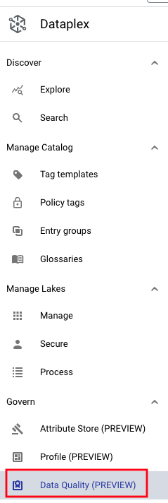   
<br><br>

### 2.2. Click on Create Data Quality Scan

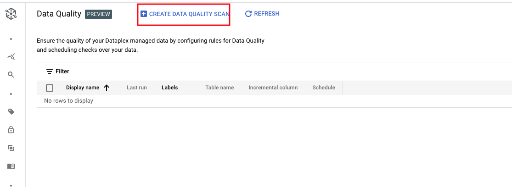   
<br><br>

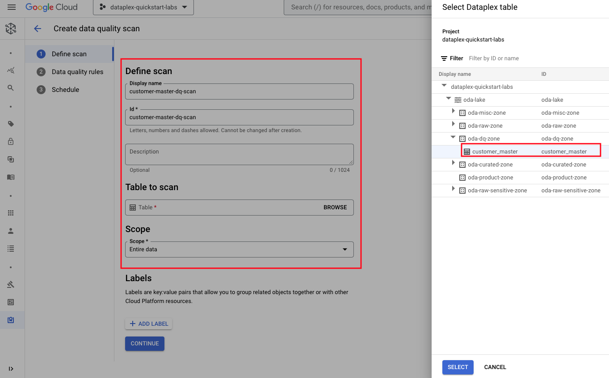   
<br><br>

### 2.3. Define Data Quality Rules - COMPLETENESS checks

Click on the scan and define rules. Lets start with recommendations from Data profiling results.

   
<br><br>

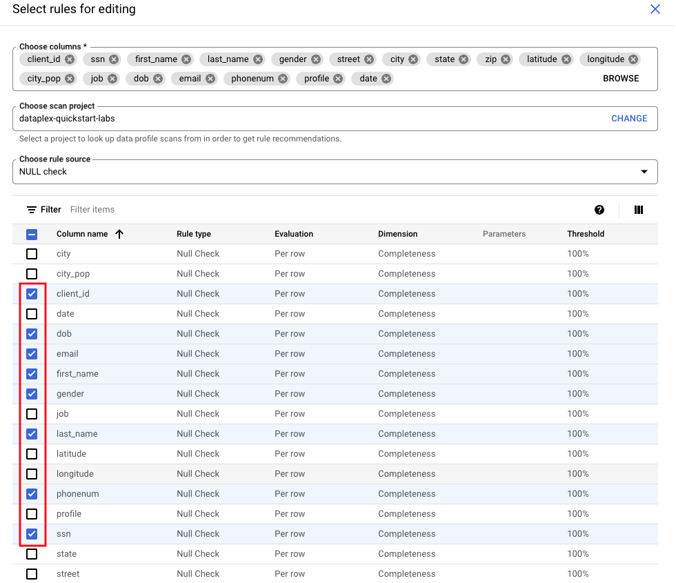   
<br><br>

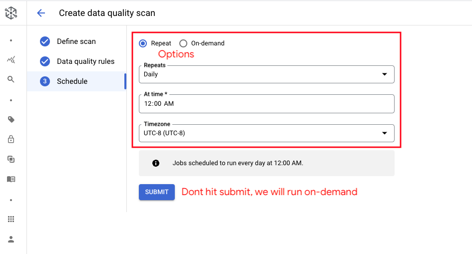   
<br><br>

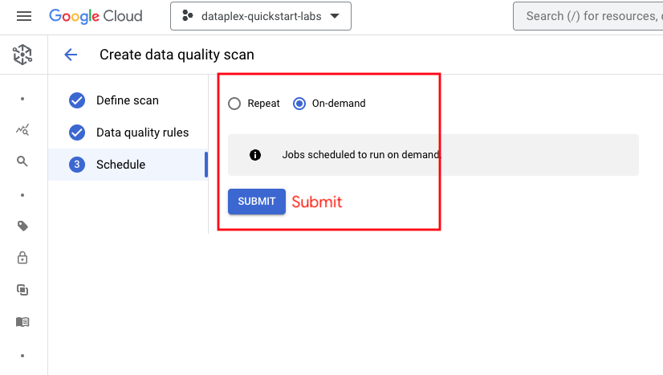   
<br><br>

   
<br><br>


### 2.4. Run Data Quality Rules - COMPLETENESS checks

Lets check all the fields for quality scan and click on "run now".

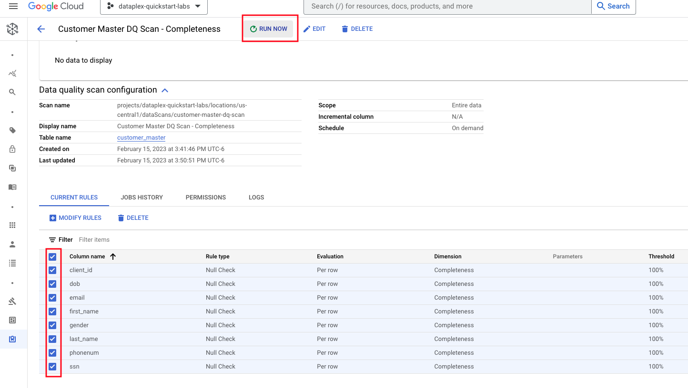   
<br><br>

### 2.5. Job for Data Quality Rules - COMPLETENESS checks gets submitted

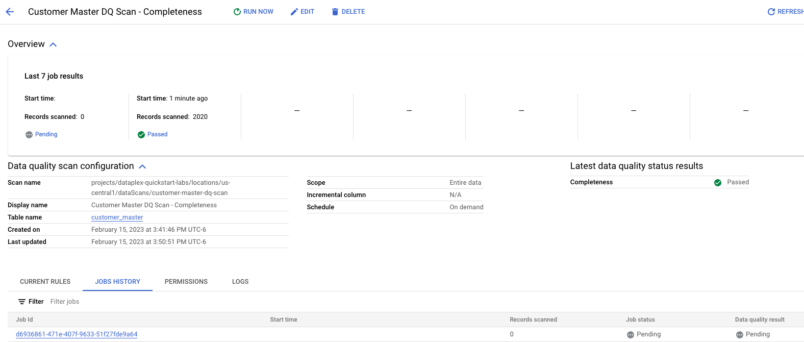   
<br><br>

### 2.6. Click on the DQ - COMPLETENESS job that completed

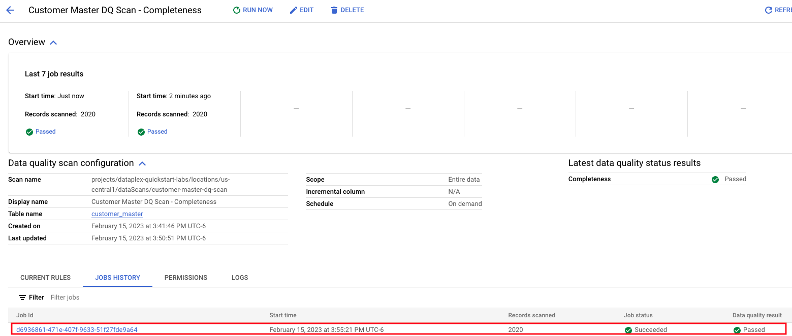   
<br><br>

### 2.7. Review the results for the DQ - COMPLETENESS job that completed

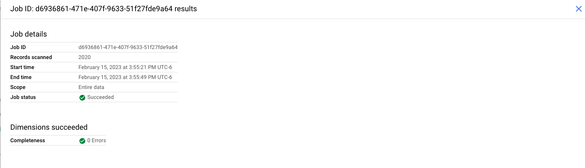   
<br><br>

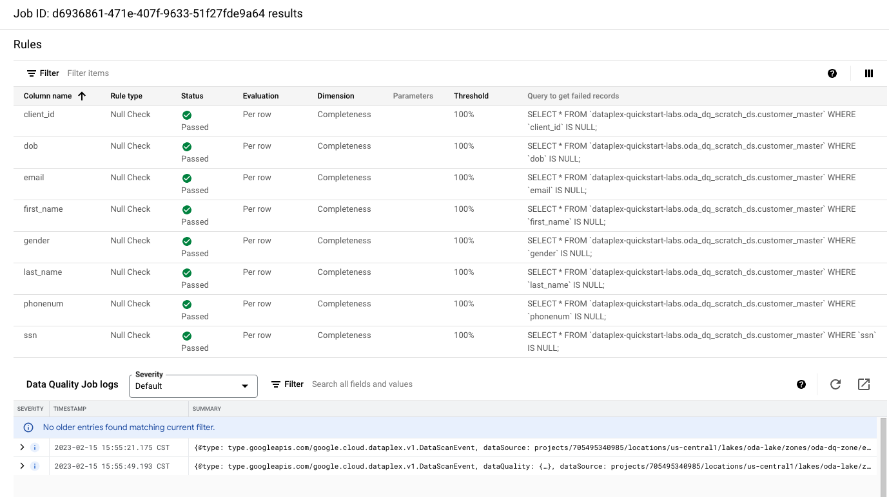   
<br><br>

<hr>

<hr>

This concludes the module. Proceed to the next module.

<hr>


