# M11-1b: Auto Data Quality - VALIDITY checks

This lab builds on top of the prior module and introduces validity checks. We will check validity of SSN and EMAIL with out of the box rules.

### Prerequisites

Successful completion of prior modules

### Duration

10 minutes

### Learning goals

Practical knowledge of running Auto Data Quality - validity checks

# LAB

## 1. Target data for Data Quality checks

Same as prior module. We will use the same table as in the Data Profiling lab module.

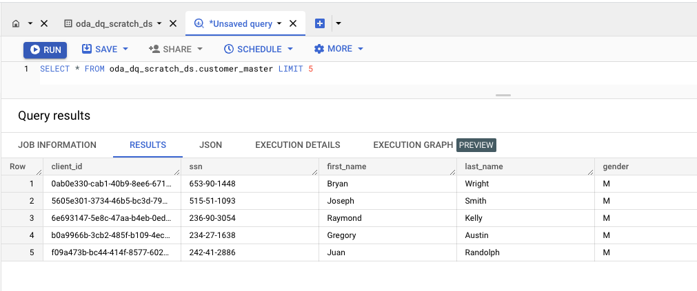   
  

## 2. Create a Data Quality scan with validity checks on SSN and Email columns

### 2.1. Create a new scan called Customer Master DQ Scan - VALIDITY on the same table

Follow the step by step instructions detailed in the screenshots below. 

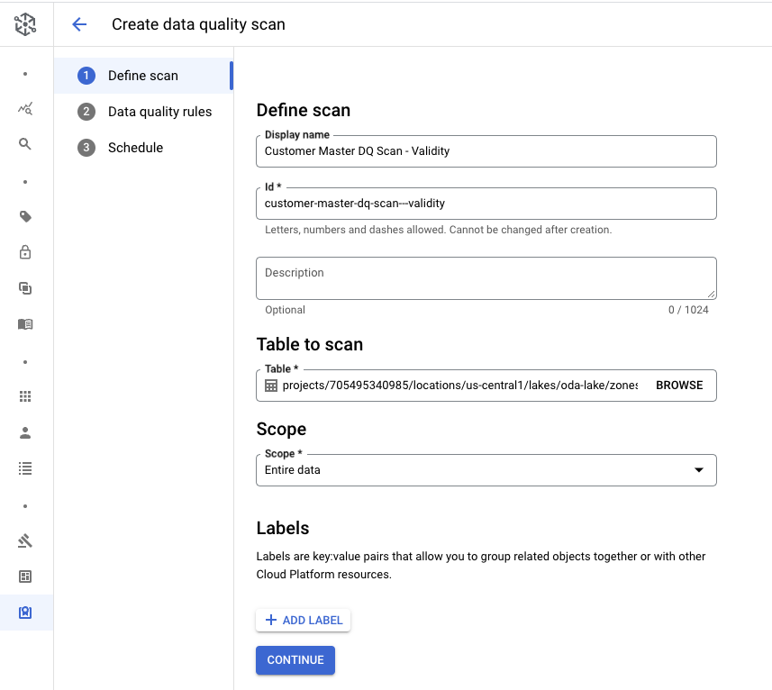   
  

### 2.2. Add the recommended (out of the box) regex based VALIDITY checks for SSN and Email

Follow the step by step instructions detailed in the screenshots below. 

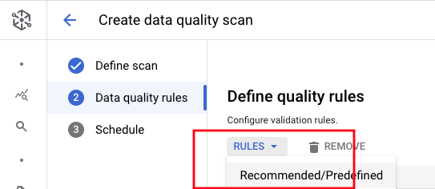   
  

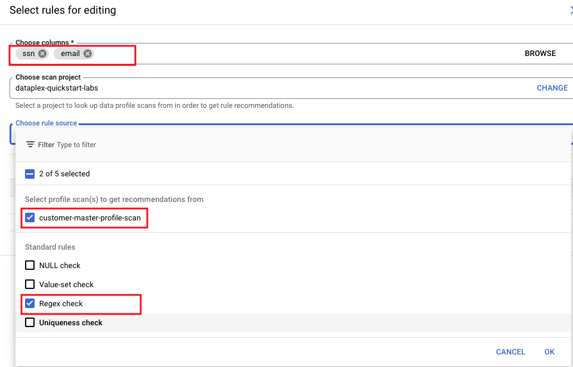   
  

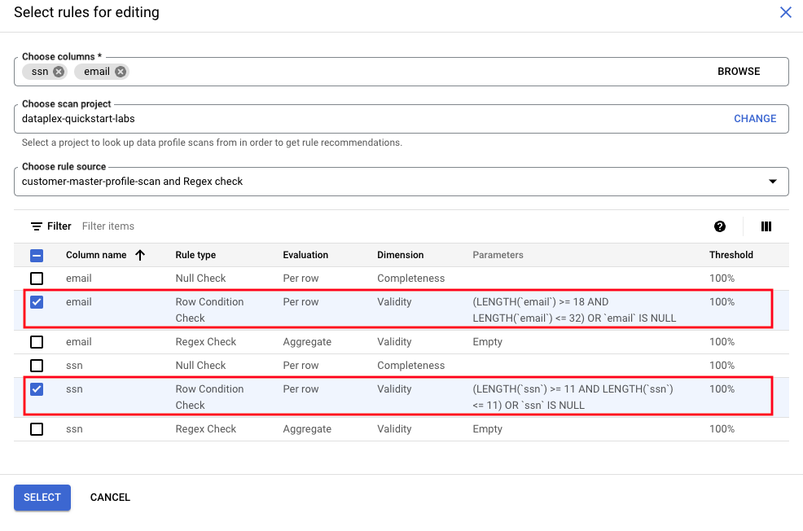   
  

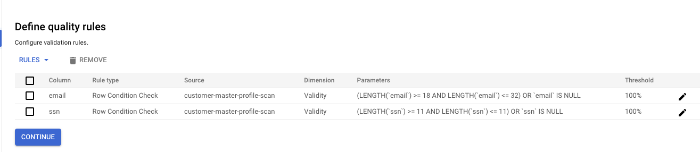   
  

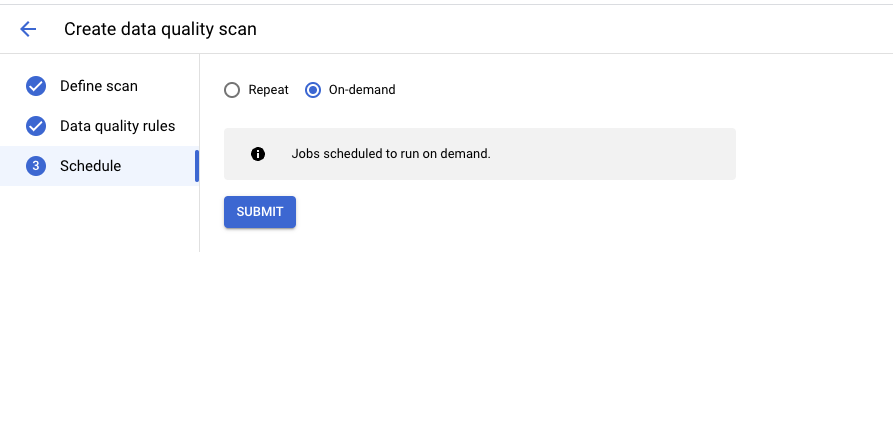   
  

### 2.3. Run Data Quality Rules - VALIDITY checks

Follow the step by step instructions detailed in the screenshots below. 

   
  

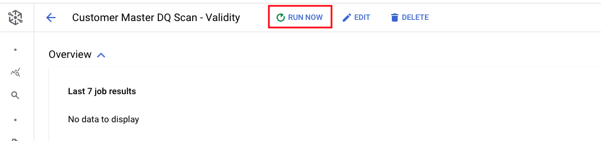   
  

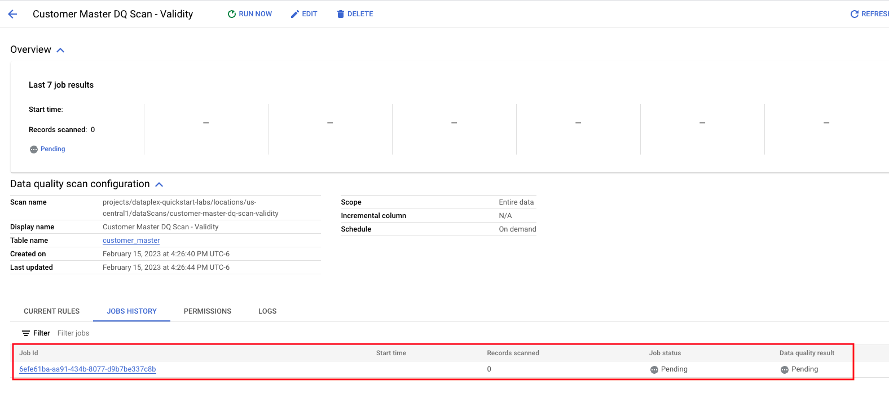   
  

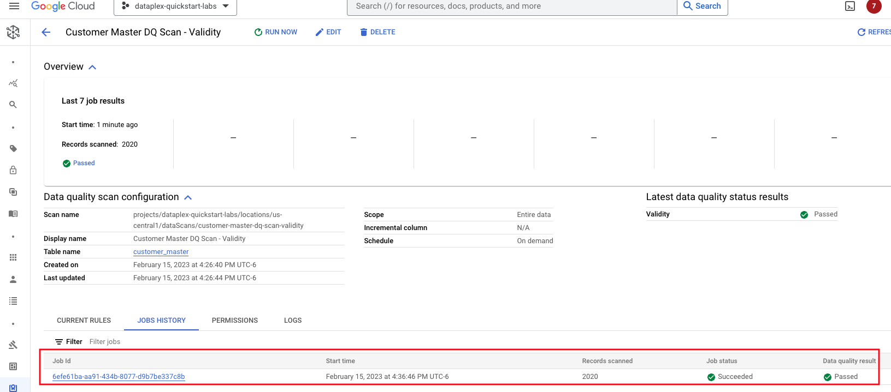   
  

### 2.4. Review Data Quality Rules - VALIDITY checks - results

Follow the step by step instructions detailed in the screenshots below. 

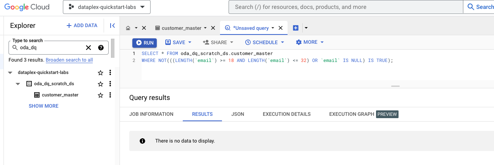   
  

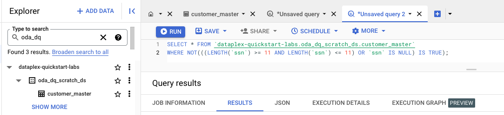   
  

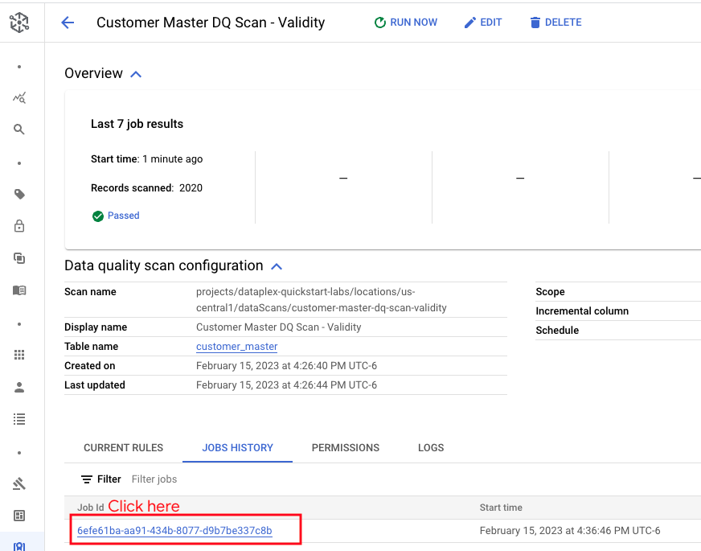   
  

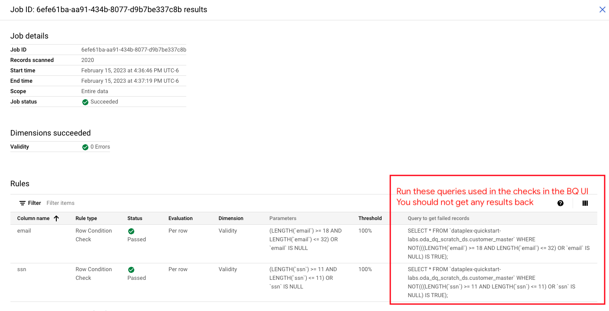   
  

This concludes the module. Proceed to the next module.

