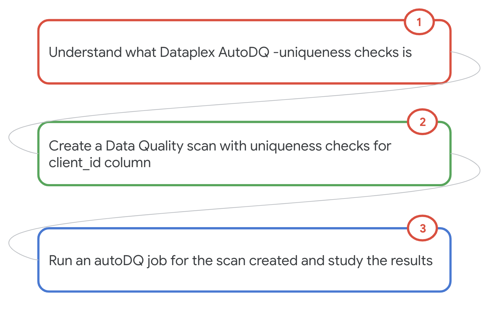
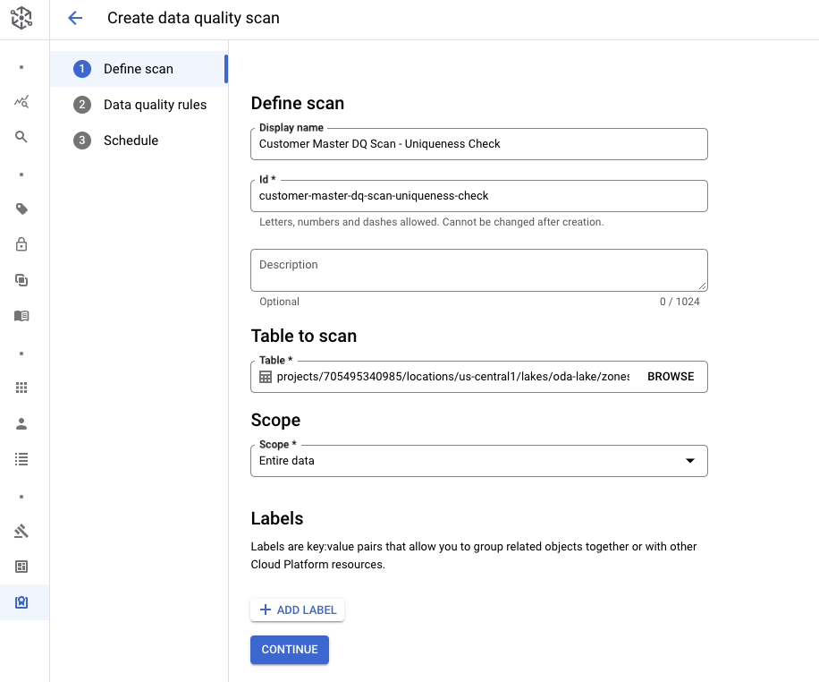
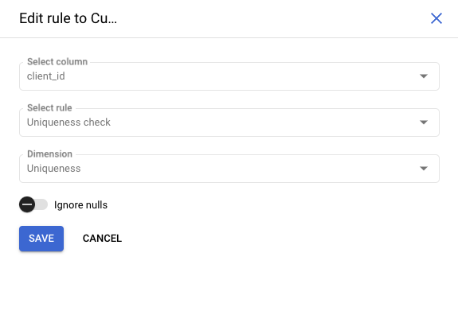
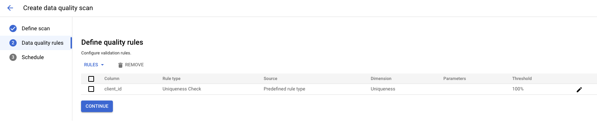
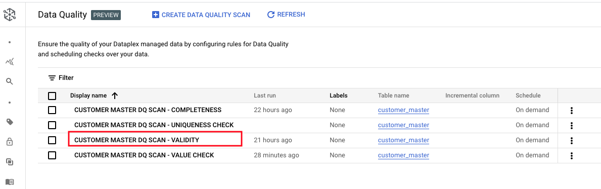
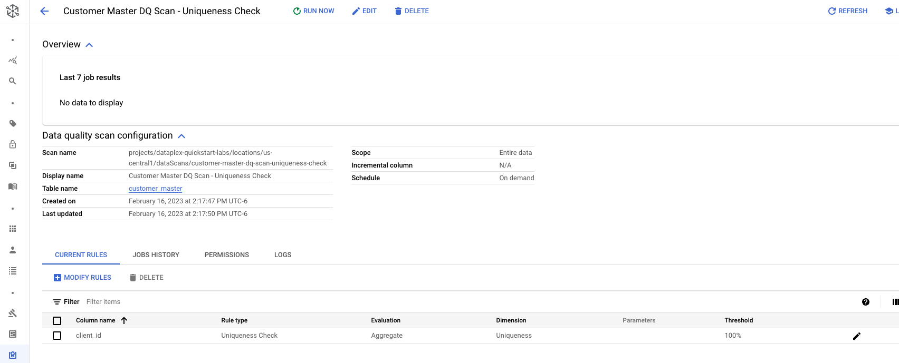
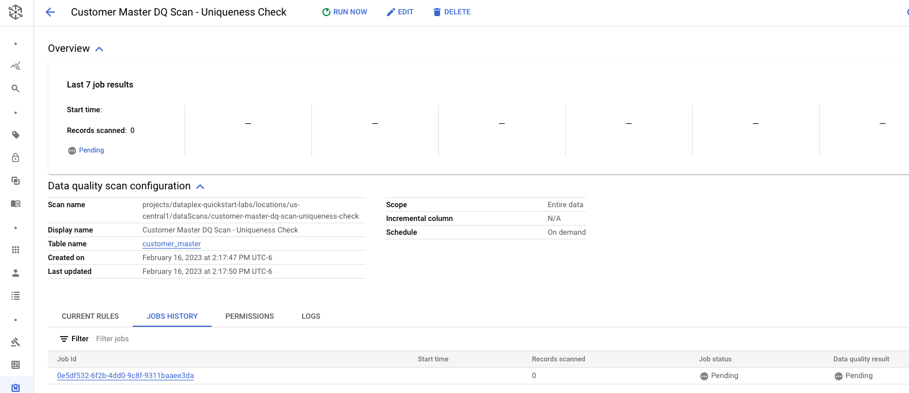
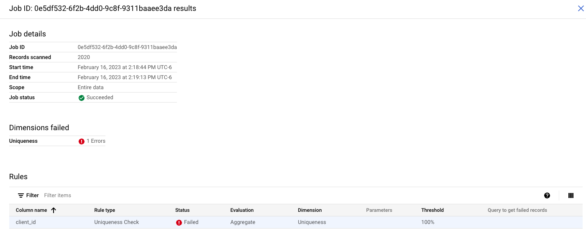
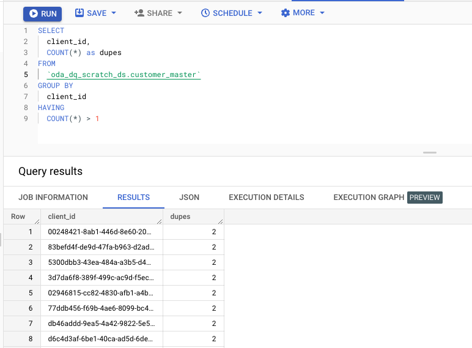

# M11-1c: Auto Data Quality - UNIQUENESS checks

The focus of this lab module is auto data quality - uniqueness checks, where you can specify column and have autoDQ check for duplicates.

### Prerequisites

Successful completion of prior modules

### Duration

5 minutes or less

### Documentation 

[Data Quality Overview](https://cloud.google.com/dataplex/docs/data-quality-overview)<br>
[About Auto Data Quality](https://cloud.google.com/dataplex/docs/auto-data-quality-overview)<br>
[Use Auto Data Quality](https://cloud.google.com/dataplex/docs/use-auto-data-quality)<br>


### Learning goals

1. Understand options for data quality in Dataplex
2. Practical knowledge of running Auto Data Quality - uniqueness checks feature


### Lab flow

   
<br><br>


<hr>

# LAB

<hr>
<hr>

## 1. Target data for Data Quality checks

We will use the same table as in the Data Profiling lab module.

   
<br><br>

Familiarize yourself with the table, from the BigQuery UI by running the SQL below-

```
SELECT * FROM oda_dq_scratch_ds.customer_master LIMIT 20

```

<hr>

## 2. Create a Data Quality scan with uniqueness checks on client_id column

### 2.1. Navigate to Auto Data Quality in Dataplex UI

   
<br><br>

### 2.2. Click on Create Data Quality Scan

   
<br><br>

   
<br><br>

### 2.3. Define Data Quality Rules - UNIQUENESS checks

Click on the scan and define rules. Lets start with recommendations from Data profiling results.

   
<br><br>

   
<br><br>

   
<br><br>

   
<br><br>

   
<br><br>


### 2.4. Run Data Quality Rules - UNIQUENESS checks

Lets check all the fields for quality scan and click on "run now".

   
<br><br>


   
<br><br>

### 2.5. Job for Data Quality Rules - UNIQUENESS checks gets submitted

   
<br><br>

### 2.6. Click on the DQ - UNIQUENESS job that completed & review the results

   
<br><br>


<hr>

This concludes the module. Proceed to the [next module](module-11-1e-auto-dq-sql-row.md).

<hr>


