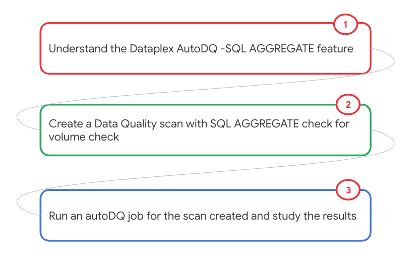
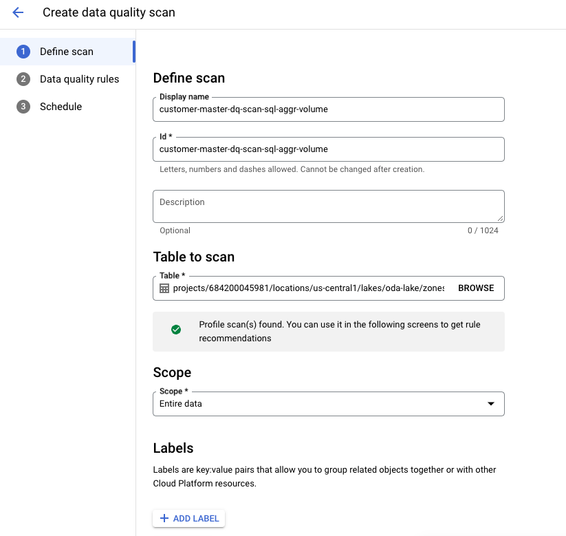
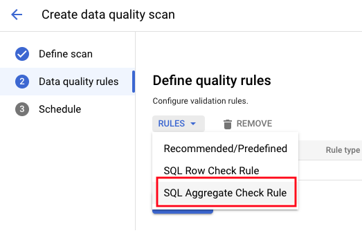
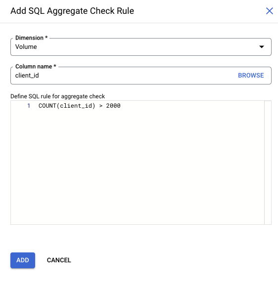
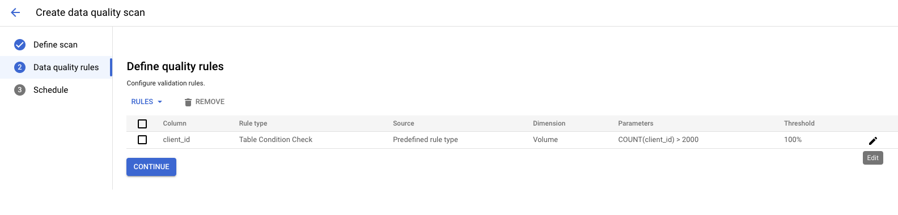
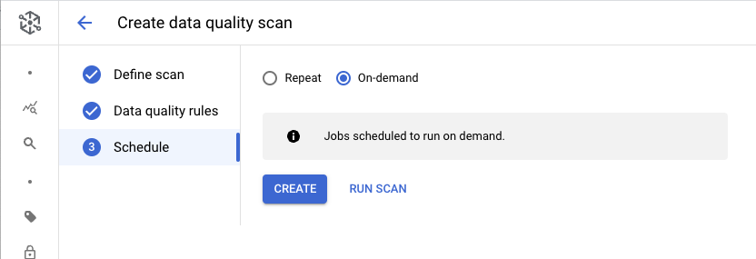
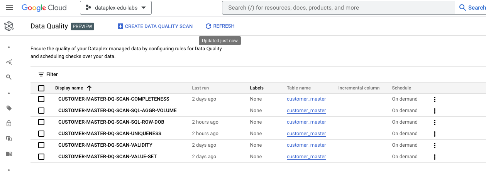
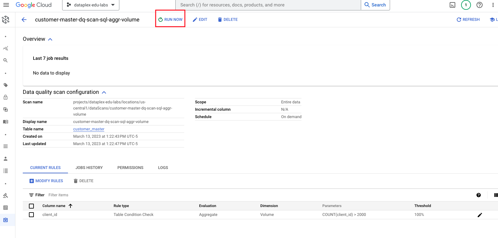
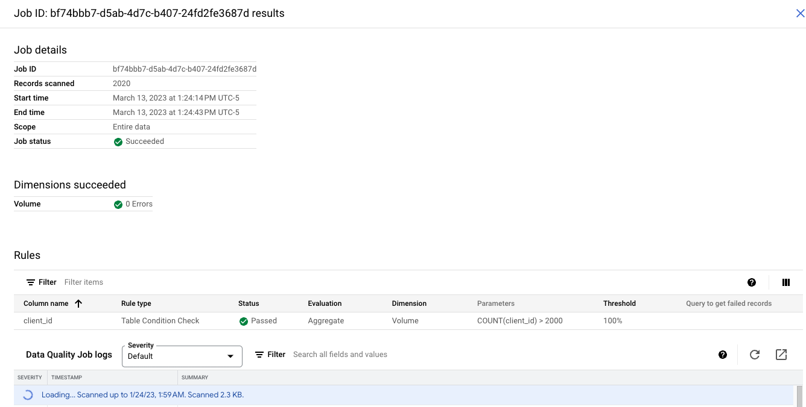

# M11-1e: Auto Data Quality - SQL AGGREGATE feature for volume checks

The focus of this lab module is auto data quality -  checks with BYO AGGREGATE SQL, where you can specify a rule - in the case of this lab, it will be for a volume check - do we have enough data for a given date.

### Prerequisites

Successful completion of prior modules

### Duration

5 minutes or less

### Documentation 

[Data Quality Overview](https://cloud.google.com/dataplex/docs/data-quality-overview)<br>
[About Auto Data Quality](https://cloud.google.com/dataplex/docs/auto-data-quality-overview)<br>
[Use Auto Data Quality](https://cloud.google.com/dataplex/docs/use-auto-data-quality)<br>


### Learning goals

1. Understand options for data quality in Dataplex
2. Practical knowledge of running Auto Data Quality - SQL AGGREGATE checks feature


### Lab flow

   
<br><br>


<hr>

# LAB

<hr>
<hr>

## 1. Target data for Data Quality checks & GMSA permissions granting

We will use the same table as in the Data Profiling lab module.

   
<br><br>

Familiarize yourself with the table, from the BigQuery UI by running the SQL below-

```
SELECT * FROM oda_dq_scratch_ds.customer_master LIMIT 20

```

We will need to grant permissions to the Dataplex Google Managed Service Account to run the aggregate query. Run this in the Cloud Console-
```
PROJECT_ID=`gcloud config list --format "value(core.project)" 2>/dev/null`
PROJECT_NBR=`gcloud projects describe $PROJECT_ID | grep projectNumber | cut -d':' -f2 |  tr -d "'" | xargs`
DATAPLEX_GMSA_FQN="service-${PROJECT_NBR}@gcp-sa-dataplex.iam.gserviceaccount.com"

gcloud projects add-iam-policy-binding $PROJECT_ID --member=serviceAccount:$DATAPLEX_GMSA_FQN \
--role="roles/dataplex.serviceAgent"

gcloud projects add-iam-policy-binding $PROJECT_ID --member=serviceAccount:$DATAPLEX_GMSA_FQN \
--role="roles/bigquery.user"

gcloud projects add-iam-policy-binding $PROJECT_ID --member=serviceAccount:$DATAPLEX_GMSA_FQN \
--role="roles/bigquery.jobUser"
```

<hr>

## 2. Create a Data Quality scan with SQL AGGREGATE check on client_id column

### 2.1. Navigate to Auto Data Quality in Dataplex UI

   
<br><br>

### 2.2. Click on Create Data Quality Scan

   
<br><br>


### 2.3. Define Data Quality Rules - SQL AGGREGATE checks to ensure the volume of data in the table is accurate

Click on the scan and define rules. Select SQL aggregate rule. Enter the rule -
```
COUNT(client_id) > 2000
```


   
<br><br>

   
<br><br>

   
<br><br>

   
<br><br>


### 2.4. Run the Data Quality scan

Lets check all the fields for quality scan and click on "run now".

   
<br><br>

### 2.5. Job for Data Quality Rule created


   
<br><br>

### 2.6. Click on the DQ job that completed & review the results

   
<br><br>

Play with the rule to fail the DQ check by increasing count to 5000.
```
COUNT(client_id) > 5000
```

<hr>

This concludes the module. Proceed to the [next module](module-11-1g-auto-dq-freshness-check.md).

<hr>


