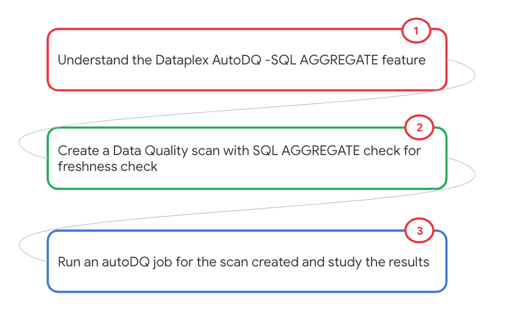
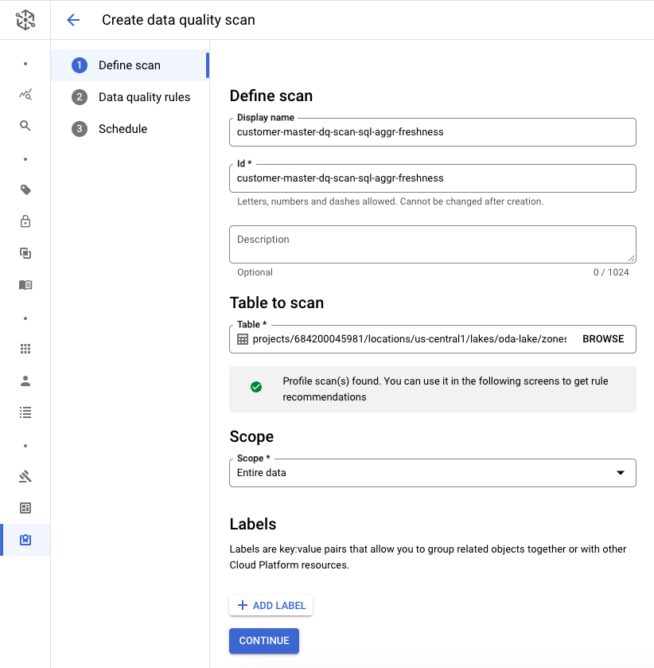
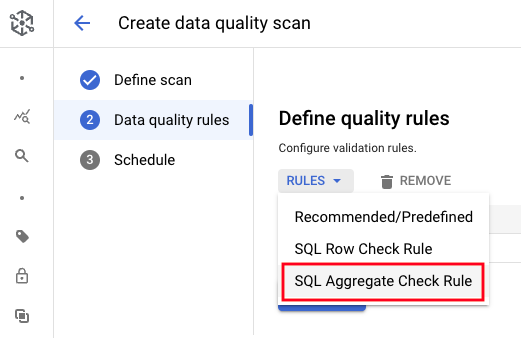
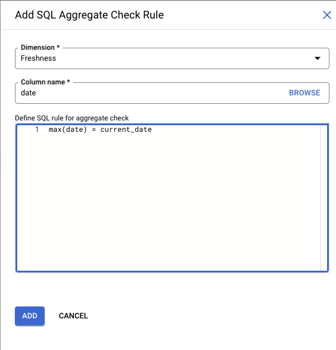
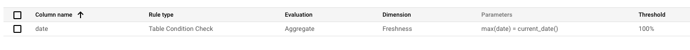
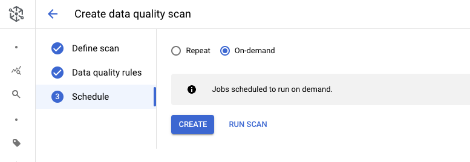
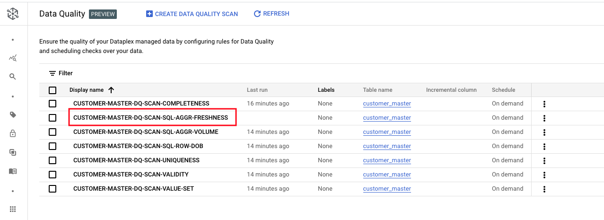
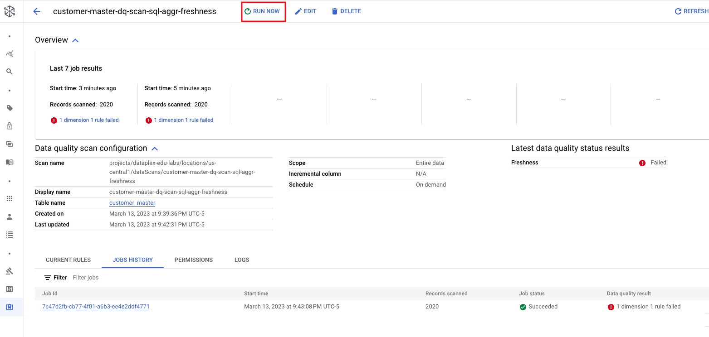
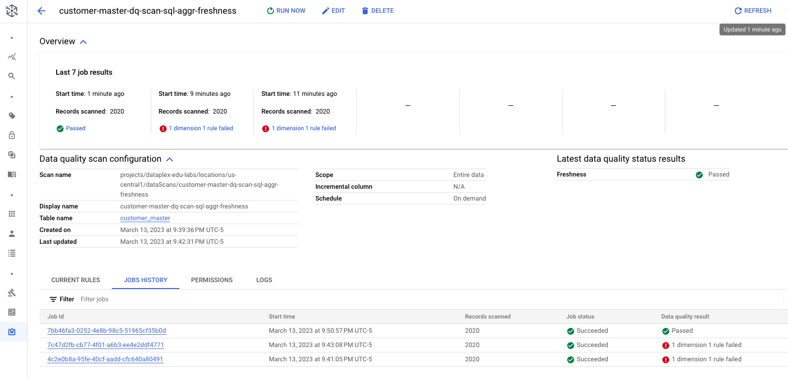

# M11-1e: Auto Data Quality - FRESHNESS checks

The focus of this lab module is auto data quality -  checks with BYO SQL, where you can specify column and have autoDQ check for specific criteria.

### Prerequisites

Successful completion of prior modules

### Duration

5 minutes or less

### Documentation 

[Data Quality Overview](https://cloud.google.com/dataplex/docs/data-quality-overview)<br>
[About Auto Data Quality](https://cloud.google.com/dataplex/docs/auto-data-quality-overview)<br>
[Use Auto Data Quality](https://cloud.google.com/dataplex/docs/use-auto-data-quality)<br>


### Learning goals

1. Understand options for data quality in Dataplex
2. Practical knowledge of running Auto Data Quality - FRESHNESS checks feature


### Lab flow

   
<br><br>


<hr>

# LAB

<hr>
<hr>

## 1. Target data for Data Quality checks

Familiarize yourself with the data if you have not already
We will use the same table as in the Data Profiling lab module.

   
<br><br>

Familiarize yourself with the table, from the BigQuery UI by running the SQL below-

```
SELECT * FROM oda_dq_scratch_ds.customer_master LIMIT 20
```

<hr>

## 2. Create a Data Quality scan with freshness checks based off of the date column

### 2.1. Navigate to Auto Data Quality in Dataplex UI

   
<br><br>

### 2.2. Click on Create Data Quality Scan

   
<br><br>


### 2.3. Define Data Quality Rules - FRESHNESS check to ensure there is data for today

Click on the scan and define rules. Select SQL aggregate rule. Enter the rule -
```
max(date) = current_date()
```


   
<br><br>

   
<br><br>

   
<br><br>

   
<br><br>

   
<br><br>


### 2.4. Run Data Quality Rule created

Lets check all the fields for quality scan and click on "run now".


### 2.5. Job for Data Quality Rules


   
<br><br>

### 2.6. Click on the DQ job that completed & review the results

   
<br><br>

If the rule fails, its because your table does not have data for today's date. If this is the case, lets add some data into the table to match today's date from the BQ UI and rerun the DQ scan to see it pass-
```
CREATE OR REPLACE TABLE oda_dq_scratch_ds.customer_master
PARTITION BY date AS
SELECT SELECT client_id, 
  ssn,
  first_name,
  last_name,
  gender,
  street,
  city,
  state,
  zip,
  latitude,
  longitude,
  city_pop,
  job,
  dob, 
  email, 
  phonenum,
  profile, current_date() as date
 FROM `oda_raw_sensitive_zone.customers` 
 WHERE date='2022-05-01'
```

Here is the author's result after loading data for the current date.

   
<br><br>

<hr>

This concludes the module. Proceed to the [next module](module-11-1h-auto-dq-challenge-lab.md).

<hr>


