# M12-1a: Data Quality Task - Primer 1

Dataplex provides the following two options for Data Quality:

1. Dataplex Auto Data Quality (Public Preview) provides an automated experience for getting quality insights about your data. Auto data quality automates and simplifies quality definition with recommendations and UI-driven workflows. It standardizes on insights with built-in reports and drives actions through alerting and troubleshooting.

2. Dataplex Data Quality Task (Generally Available) offers a customizable experience - a set of base Data Quality rules, manage your own rule repository,  customize execution and results, using Dataplex for managed / serverless execution. Dataplex data quality task uses an open source component, CloudDQ, that can also open up choices for customers who want to enhance the code to their needs (CloudDQ extensibility).

<br>

**The focus of this lab module is** Data Quality tasks. Here is what to expect to learn in the lab module series for Data Quality tasks-

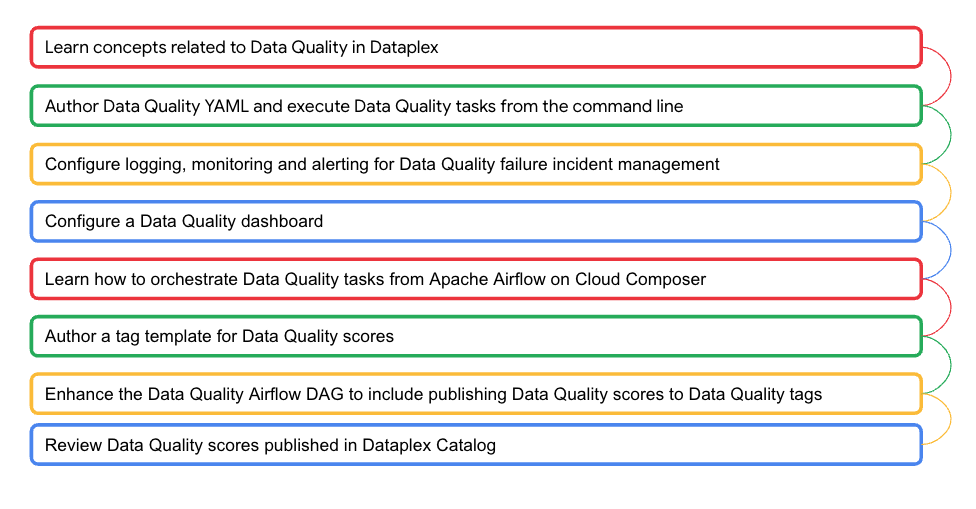   


<hr>


### Learning goals

1. Understand concepts related to Data Quality tasks in Dataplex
2. Practical knowledge of authoring and running Data Quality tasks from the command line


### Prerequisites

Successful completion of prior modules
<br>

### Duration

30-45 minutes or less for reasonable understanding; More if you want to explore CloudDQ rules further.
<br>

### Documentation 

[Dataplex Data Quality Feature Overview](https://cloud.google.com/dataplex/docs/data-quality-overview)<br>
[Dataplex Data Quality Tasks](https://cloud.google.com/dataplex/docs/check-data-quality)<br>
[CloudDQ User Manual](https://github.com/GoogleCloudPlatform/cloud-data-quality/blob/main/docs/examples/advanced_rules/USERMANUAL.md)
<br>

### Lab module flow

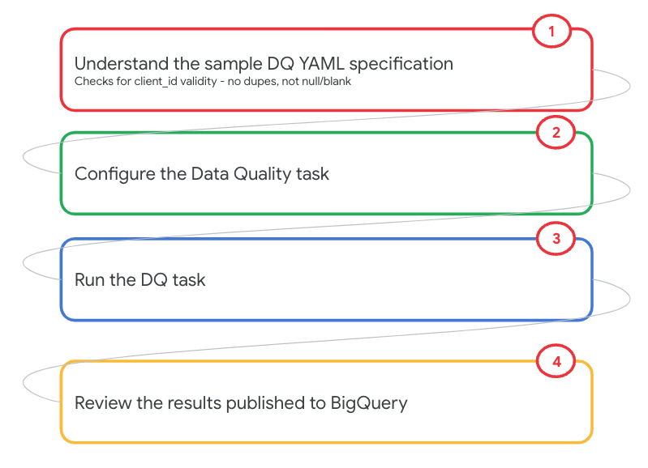   
<br>

In this module, we will author a minimal DQ rule YAML and then run it as a DQ task powered by Dataproc Serverless Spark. In subsequent modules, we will add additional data quality rule samples. Here is what we will impletement in this module-


|#| Dimension | Column | Rule | Current Module Scope | Next Module Scope |
| --| :-- | :--- | :--- | :--- | :--- |
|1| Completeness |  client_id | Not null | x | |
|2| Completeness |  client_id | Not blank | x | |
|3| Uniqueness |  client_id | No duplicates | x | |
|4| Conformance |  ssn | Valid format |  | x|
|5| Conformance |  email | Valid format |  | x |
|6| Integrity |  gender | Valid value |  | x |
|7| Correctness |  dob | Valid date in the past |  | x |
|8| Timeliness |  date | No irregular volume |  | DIY |
|9| Timeliness |  date | No delay in data arrival |  | x |

<hr>
<hr>

## Dataplex Data Quality Concepts

### C1: Data Quality Task at a glance

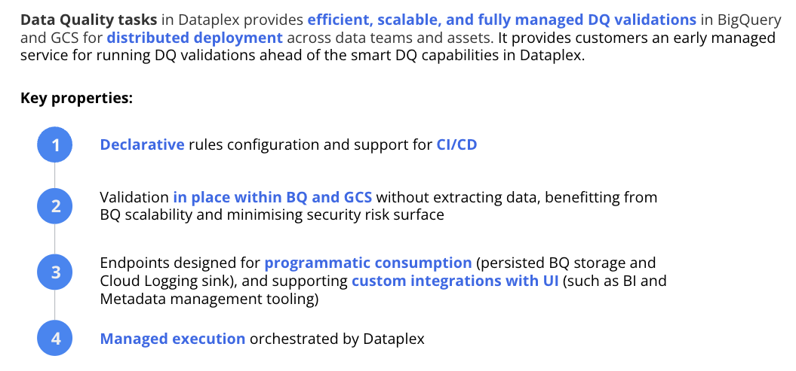   
<br><br>

Dataplex Data Quality Task feature has a few aspects to be understood-
1. The Data Quality Rules defintion YAML construct
2. Out of the box rules & extensibility
3. Executing the Data Quality task - the command contruct
4. The schema of results from Data Quality task

<hr>

### C2: Data Quality Tasks - What is supported?

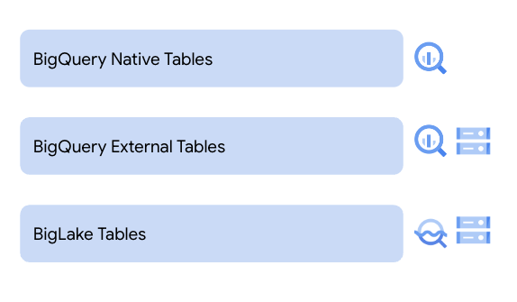   
<br><br>

<hr>

### C3: Data Quality Tasks - What is involved?

#### C3.1. Pictorial Overview

To run Dataplex DQ tasks, you need a BQ dataset to persist DQ results, you need to create. DQ YAML rules file and persist to Cloud Storage and then run the DQ tasks via CLI or Airflow on Cloud Composer. The task runs in a serverless mode and results are written to BigQuery, in the dataset and table passed as input to the DQ task.

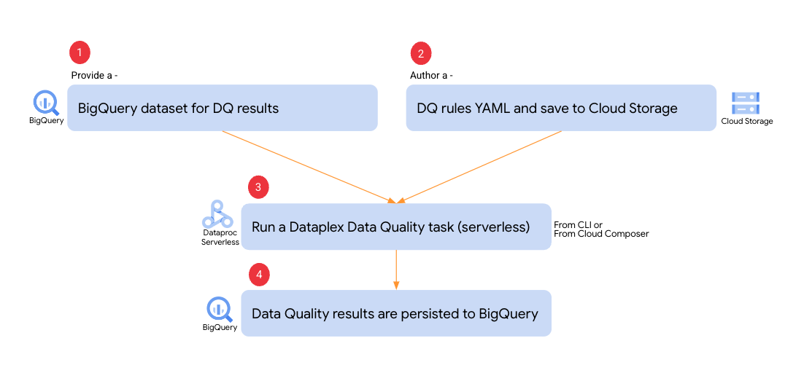   
<br><br>

<hr>

#### C3.2. Data Quality Task YAML construct

Dataplex Data Quality tasks requires a Data Quality Rules defintion YAML. The YAML specification file needs to have the following three sections:

**Rules** (defined under the top-level rules: YAML node): <br>
A list of rules to run. You can create these rules from predefined rule types, such as NOT_NULL and REGEX, or you can extend them with custom SQL statements such as CUSTOM_SQL_EXPR and CUSTOM_SQL_STATEMENT. The CUSTOM_SQL_EXPR statement flags any row that custom_sql_expr evaluated to False as a failure. The CUSTOM_SQL_STATEMENT statement flags any value returned by the whole statement as a failure.

**Row filters** (defined under the top-level row_filters: YAML node): <br>
SQL expressions returning a boolean value that define filters to fetch a subset of data from the underlying entity subject for validation.

**Rule bindings** (defined under the top-level rule_bindings: YAML node):<br> 
Defines rules and rule filters to apply to the tables.<br>

The following is the YAML construct-

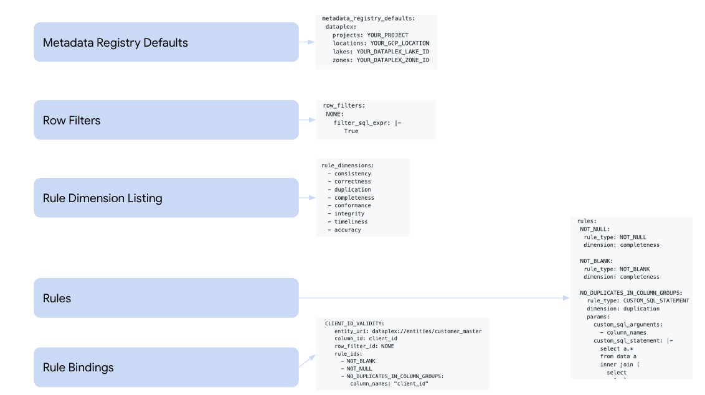   
<br><br>

The following is a sample YAML-

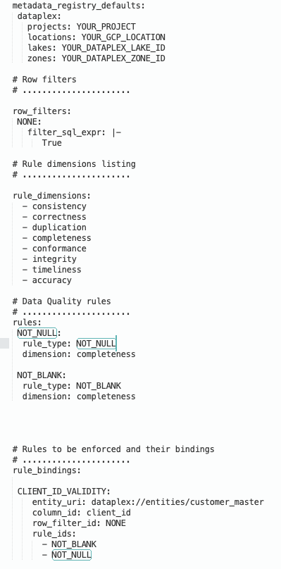   
<br><br>

The following is a link to the user manual for rules-
https://github.com/GoogleCloudPlatform/cloud-data-quality/blob/main/docs/examples/advanced_rules/USERMANUAL.md#validating-uniqueness

<hr>


#### C3.3: Executing Data Quality task 

The Data Quality task is powered by Dataproc Serverless Spark (no knowledge of Apache Spark is required).<br> 
More about the feature at -
[https://cloud.google.com/dataplex/docs/check-data-quality#gcloud](https://cloud.google.com/dataplex/docs/check-data-quality#schedule-a-data-quality-task)

The lab covers executing a Data Quality task, with command and screenshots.

<hr>

#### C3.4: Results in BigQuery 

There are multiple tables created by Data Quality task execution. It is recommended you create a separate BigQuery dataset for Data Quality results.
The following is the schema of the results table-


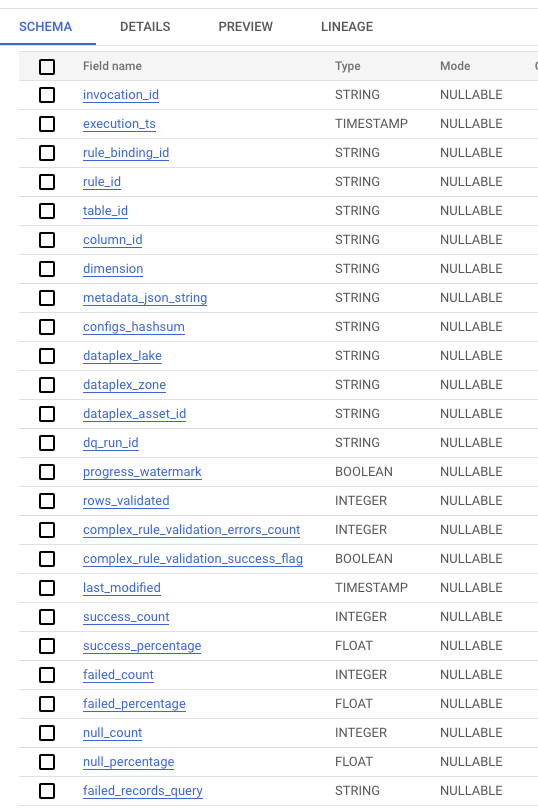   
<br><br>

<hr>

#### C3.5: Route Data Quality summary logs to Cloud Logging

By appending ```--summary_to_stdout``` flag to your data quality jobs, you can easily route the DQ summary logs to Cloud Logging. Make a note of this, and observe the Data Quality job construct. We will learn incident management in the next module.


<hr>


### C5: Operationalizing for Production - Reference Architecture

   
<br><br>

1. The data product owner defines/redefines the Data Quality rules for their data products, also provides the data schedule and dependency information 
2. The data steward approves the Data Quality rules for the critical elements of the data product
3. Approved rules are uploaded to a domain-specific GCS bucket 
4. The Dataplex Data Quality job is executed and orchestrated based on the schedule and dependency information from the data product owner
5. Cloud Logging and Monitoring are used for Data Quality failure incident management 
6. The Data Quality results are published to a BigQuery table for further analysis and reporting
7. One or more actionable dashboards are built to measure, track and visualize the Data Quality(sample dashboard covered in subsequent labs) 
8. The auto tagging workflow is executed to create a Data Quality tag in the catalog to enable search and discovery of high quality data products and this can be orchestrated by Apache Airflow on Cloud Composer as a downstream job.

<hr>


# LAB

<hr>
<hr>

## 1. Target data for Data Quality checks

Familiarize yourself with the data if you have not already
We will use the same table as in the Data Profiling lab module.

   
<br><br>

Familiarize yourself with the table, from the BigQuery UI by running the SQL below-

```
SELECT * FROM oda_dq_scratch_ds.customer_master LIMIT 20

```

<hr>

## 2. Create a Data Quality YAML for the target table with validity check on client_id

Lets check for nulls, blanks and duplicates in the client ID field with the sample YAML in this section.<br>

### 2.1. Delcare variables and create a local working directory in Cloud Shell

```
PROJECT_ID=`gcloud config list --format "value(core.project)" 2>/dev/null`
PROJECT_NBR=`gcloud projects describe $PROJECT_ID | grep projectNumber | cut -d':' -f2 |  tr -d "'" | xargs`
UMSA_FQN="lab-sa@${PROJECT_ID}.iam.gserviceaccount.com"
DATAPLEX_LOCATION="us-central1"
BQ_LOCATION="US"
LAKE_ID="oda-lake"
DATA_QUALITY_ZONE_ID="oda-dq-zone"
DQ_SCRIPTS_BUCKET="oda-dq-bucket-$PROJECT_NBR"

cd ~
mkdir -p tmp/dataplex-quickstart-labs/dq
cd ~/tmp/dataplex-quickstart-labs/dq
```

### 2.2. Copy the below onto your clipboard to paste into a file

```
cd ~/tmp/dataplex-quickstart-labs/dq
rm -rf customer_master_dq_task_i1.yaml

echo '
# Dataplex specification
# ......................

metadata_registry_defaults:
 dataplex:
   projects: YOUR_PROJECT
   locations: YOUR_DATAPLEX_LOCATION
   lakes: YOUR_DATAPLEX_LAKE_ID
   zones: YOUR_DATAPLEX_ZONE_ID

# Row filters
# ......................

row_filters:
 NONE:
   filter_sql_expr: |-
      True

# Rule dimensions listing
# ......................

rule_dimensions:
  - consistency
  - correctness
  - duplication
  - completeness
  - conformance
  - integrity
  - timeliness
  - accuracy

# Data Quality rules
# ......................
rules:
 NOT_NULL:
  rule_type: NOT_NULL
  dimension: completeness
  
 NOT_BLANK:
  rule_type: NOT_BLANK
  dimension: completeness

 NO_DUPLICATES_IN_COLUMN_GROUPS:
   rule_type: CUSTOM_SQL_STATEMENT
   dimension: duplication
   params:
     custom_sql_arguments:
       - column_names
     custom_sql_statement: |-
       select a.*
       from data a
       inner join (
         select
           $column_names
         from data
         group by $column_names
         having count(*) > 1
       ) duplicates
       using ($column_names)

                   
# Rules to be enforced and their bindings
# ......................            
rule_bindings:

 CLIENT_ID_VALIDITY:
    entity_uri: dataplex://entities/customer_master
    column_id: client_id
    row_filter_id: NONE
    rule_ids:
      - NOT_BLANK
      - NOT_NULL
      - NO_DUPLICATES_IN_COLUMN_GROUPS:
         column_names: "client_id"              
   
' >> customer_master_dq_task_i1.yaml
```

### 2.3. Configure with your project details 

```
cd ~/tmp/dataplex-quickstart-labs/dq
sed -i "s|YOUR_PROJECT|$PROJECT_ID|g" customer_master_dq_task_i1.yaml
sed -i "s|YOUR_DATAPLEX_LOCATION|$DATAPLEX_LOCATION|g" customer_master_dq_task_i1.yaml
sed -i "s|YOUR_DATAPLEX_LAKE_ID|$LAKE_ID|g" customer_master_dq_task_i1.yaml
sed -i "s|YOUR_DATAPLEX_ZONE_ID|$DATA_QUALITY_ZONE_ID|g" customer_master_dq_task_i1.yaml

```

### 2.4. Create a GCS bucket to store our Data Quality YAML & upload the YAML to it


#### 2.4.1. Create bucket
```
gcloud storage buckets create gs://$DQ_SCRIPTS_BUCKET --project=$PROJECT_ID --location=$DATAPLEX_LOCATION

```

#### 2.4.2. Upload the YAML to the bucket

```
cd ~/tmp/dataplex-quickstart-labs/dq

gsutil cp customer_master_dq_task_i1.yaml gs://$DQ_SCRIPTS_BUCKET/dq-yaml/
```

### 2.5. (one time) Grant permission to the User Managed Service Account to run the DQ task & to BQ

Tasks such as Data Quality are run by a User Managed Service Account in an automated fashion. Lets grant our UMSA permission to BQ where data exists and where the DQ results get stored.

#### 2.5.1. Run the below grant in Cloud Shell -
```
cd ~/tmp/dataplex-quickstart-labs/dq
export PROJECT_ID=$(gcloud config get-value project)

umsa_for_dq_grants_policy_json=""
export umsa_for_dq_grants_policy_json="{\"policy\":{
\"bindings\": [
{
\"role\": \"roles/dataplex.dataOwner\",
\"members\": [\"serviceAccount:lab-sa@${PROJECT_ID}.iam.gserviceaccount.com\"]}]}}"

echo $umsa_for_dq_grants_policy_json
```

#### 2.5.2. Implement the policy grant
```
curl -X POST -H "Authorization: Bearer $(gcloud auth print-access-token)" -H "Content-Type: application.json" https://dataplex.googleapis.com/v1/projects/${PROJECT_ID}/locations/$DATAPLEX_LOCATION/lakes/$LAKE_ID/zones/$DATA_QUALITY_ZONE_ID:setIamPolicy -d "${umsa_for_dq_grants_policy_json}"
```

#### 2.5.3. Validate the enforcement in the BQ UI

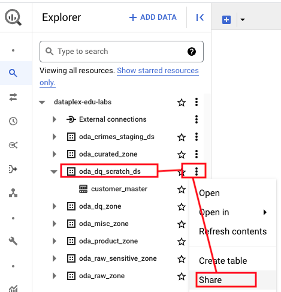   
<br><br>

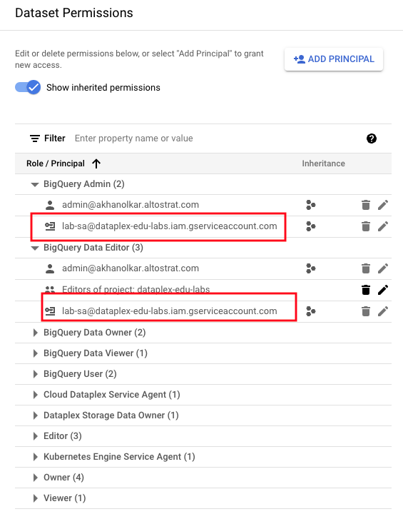   
<br><br>


### 2.6. Execute the DQ task

```

PROJECT_ID=`gcloud config list --format "value(core.project)" 2>/dev/null`
PROJECT_NBR=`gcloud projects describe $PROJECT_ID | grep projectNumber | cut -d':' -f2 |  tr -d "'" | xargs`
DATAPLEX_LOCATION="us-central1"
BQ_LOCATION="US"
DATA_QUALITY_ZONE_ID="oda-dq-zone"
DQ_SCRIPTS_BUCKET="oda-dq-bucket-$PROJECT_NBR"

# Public Cloud Storage bucket containing the prebuilt Dataplex data quality executable artifact.
# There is one bucket for each Google Cloud region. DO NOT ALTER THE CONSTRUCT BELOW
DATAPLEX_CLOUD_DQ_GCS_BUCKET_NAME="dataplex-clouddq-artifacts-${DATAPLEX_LOCATION}"

# Location of user defined DQ YAML Specifications file
DQ_YAML_CONFIG_GCS_PATH="gs://$DQ_SCRIPTS_BUCKET/dq-yaml/customer_master_dq_task_i1.yaml"

# The Dataplex lake
LAKE_ID="oda-lake"

# The BigQuery dataset where the final results of the data quality checks are stored.
TARGET_BQ_DATASET="oda_dq_scratch_ds"

# The BigQuery table where the final results of the data quality checks are stored.
TARGET_BQ_TABLE="${PROJECT_ID}.${TARGET_BQ_DATASET}.dq_results_iteration_1"

# The unique identifier for the DQ task.
DQ_TASK_ID="customer-dq"

# The User Managed Service Account the DQ task will run as 
USER_MANAGED_SERVICE_ACCOUNT_FQN="lab-sa@${PROJECT_ID}.iam.gserviceaccount.com"

gcloud dataplex tasks create \
    --location="${DATAPLEX_LOCATION}" \
    --lake="${LAKE_ID}" \
    --trigger-type=ON_DEMAND \
    --vpc-sub-network-name="lab-snet" \
    --execution-service-account="$USER_MANAGED_SERVICE_ACCOUNT_FQN" \
    --spark-python-script-file="gs://${DATAPLEX_CLOUD_DQ_GCS_BUCKET_NAME}/clouddq_pyspark_driver.py" \
    --spark-file-uris="gs://${DATAPLEX_CLOUD_DQ_GCS_BUCKET_NAME}/clouddq-executable.zip","gs://${DATAPLEX_CLOUD_DQ_GCS_BUCKET_NAME}/clouddq-executable.zip.hashsum","${DQ_YAML_CONFIG_GCS_PATH}" \
    --execution-args=^::^TASK_ARGS="clouddq-executable.zip, ALL, ${DQ_YAML_CONFIG_GCS_PATH}, --gcp_project_id=${PROJECT_ID}, --gcp_region_id='${BQ_LOCATION}', --gcp_bq_dataset_id='${TARGET_BQ_DATASET}', --target_bigquery_summary_table='${TARGET_BQ_TABLE}', --summary_to_stdout " \
    "$DQ_TASK_ID-$RANDOM"

```

Author's output-
```
THIS IS INFORMATIONAL
Create request issued for: [customer-dq-16565]
Waiting for operation [projects/dataplex-edu-labs/locations/us-central1/operations/operation-1678851618305-5f6e81a56f787-52e15edc-3ac3577b] to complete...done.   
Created task [customer-dq-16565].
```

#### 2.7. Navigate to the Dataplex DQ UI and view the task listing

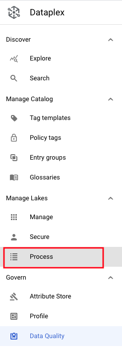   
<br><br>


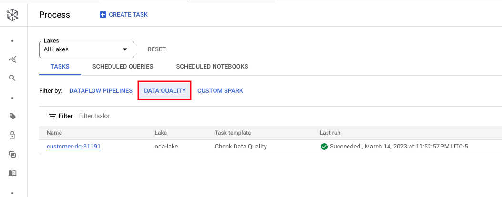   
<br><br>

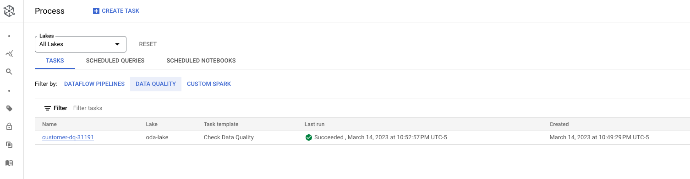   
<br><br>

<hr>


#### 2.8. Navigate to the Dataproc Batches UI and view the task execution

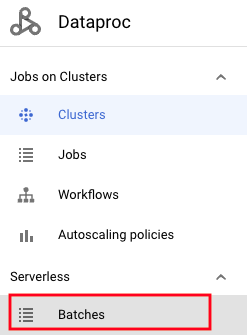   
<br><br>

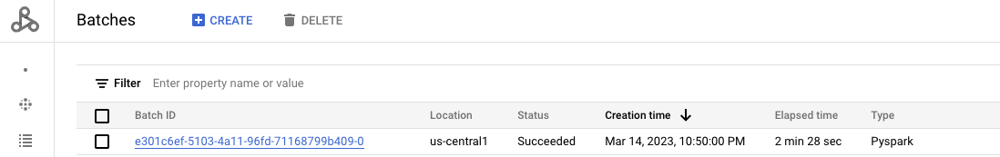   
<br><br>

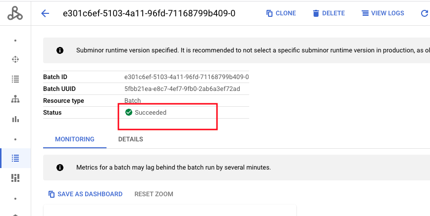   
<br><br>

<hr>

#### 2.9. Navigate to the BigQuery UI and view the DQ task results

The following is the results query; Run the same in the BQ UI-
```
SELECT
  rule_binding_id,
  rule_id,
  column_id,
  dimension,
  success_count,
  success_percentage,
  failed_count
FROM
  `oda_dq_scratch_ds.dq_results_iteration_1`
```

Author's output:

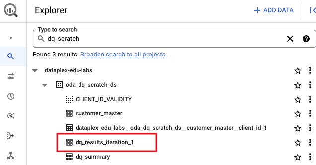   
<br><br>

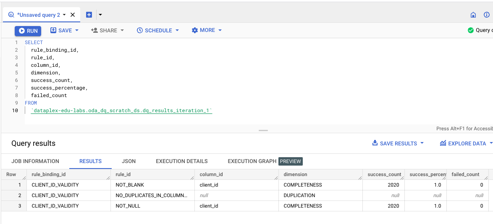   
<br><br>

<hr>

Note: There is a bug in the uniqueness rule that the product engineering is currently working on fixing.

<hr>

This concludes the module. Proceed to the [next module](module-12-1b-dq-task-rule-authoring-2.md).

<hr>


