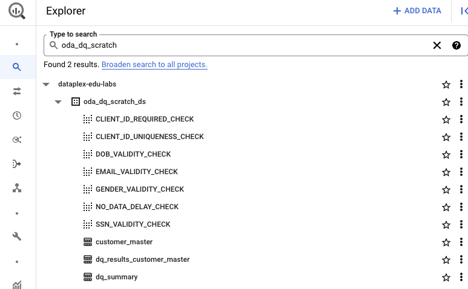

# M12-1b: Data Quality Task - Primer - Part 2

In the previous module we learned concepts about Dataplex Data Quality rules and implemented a Data Quality task. In this module, we will incrementally add a few more Data Quality rules beyond the basics we worked on in the previous module. 

|#| Dimension | Column | Rule | Previous Module Scope | Current Module Scope |
| --| :-- | :--- | :--- | :--- | :--- |
|1| Completeness |  client_id | Not null | x | |
|2| Completeness |  client_id | Not blank | x | |
|3| Uniqueness |  client_id | No duplicates | x | |
|4| Conformance |  ssn | Valid format |  | x|
|5| Conformance |  email | Valid format |  | x |
|6| Integrity |  gender | Valid value |  | x |
|7| Correctness |  dob | Valid date in the past |  | x |
|8| Timeliness |  date | No irregular volume |  | DIY challenge |
|9| Timeliness |  date | No delay in data arrival |  | x |

<hr>

### Concepts and Documentation 

See [prior module](module-12-1a-dq-task-rule-authoring-1.md).

<hr>


### Prerequisites

Successful completion of prior modules

### Duration

15 minutes or less

### Lab module flow

   
<br><br>

<hr>
<hr>

# LAB

<hr>

## 1. Target data for Data Quality checks

Familiarize yourself with the data if you have not already
We will use the same table as in the Data Profiling lab module.

   
<br><br>

Familiarize yourself with the table, from the BigQuery UI by running the SQL below-

```
SELECT * FROM oda_dq_scratch_ds.customer_master LIMIT 20

```

<hr>

## 2. Enhance the Data Quality YAML with additional rules

We will add the following rules-

|#| Dimension | Column | Rule | 
| --| :-- | :--- | :--- | 
|4| Conformance |  ssn | Valid format |
|5| Conformance |  email | Valid format | 
|6| Integrity |  gender | Valid value |
|7| Correctness |  dob | Valid date in the past |
|8| Timeliness |  date | No delay in data arrival |


### 2.1. Delcare variables and create a local working directory in Cloud Shell

```
PROJECT_ID=`gcloud config list --format "value(core.project)" 2>/dev/null`
PROJECT_NBR=`gcloud projects describe $PROJECT_ID | grep projectNumber | cut -d':' -f2 |  tr -d "'" | xargs`
UMSA_FQN="lab-sa@${PROJECT_ID}.iam.gserviceaccount.com"
DATAPLEX_LOCATION="us-central1"
BQ_LOCATION="US"
LAKE_ID="oda-lake"
DATA_QUALITY_ZONE_ID="oda-dq-zone"
DQ_SCRIPTS_BUCKET="oda-dq-bucket-$PROJECT_NBR"

cd ~
mkdir -p tmp/dataplex-quickstart-labs/dq
cd ~/tmp/dataplex-quickstart-labs/dq
```

### 2.2. Copy the below onto your clipboard to paste into a file

```

cd ~/tmp/dataplex-quickstart-labs/dq
rm -rf customer_master_dq.yaml

echo '
# Dataplex specification
# ......................

metadata_registry_defaults:
 dataplex:
   projects: YOUR_PROJECT_ID
   locations: YOUR_DATAPLEX_LOCATION
   lakes: YOUR_DATAPLEX_LAKE_ID
   zones: YOUR_DATAPLEX_ZONE_ID

# Row filters
# ......................

row_filters:
 NONE:
   filter_sql_expr: |-
      True

# Rule dimensions listing
# ......................

rule_dimensions:
  - consistency
  - correctness
  - duplication
  - completeness
  - conformance
  - integrity
  - timeliness
  - accuracy
  - uniqueness

# Data Quality rules
# ......................
rules:
 NOT_NULL_RULE:
  rule_type: NOT_NULL
  dimension: completeness
  
 NOT_BLANK_RULE:
  rule_type: NOT_BLANK
  dimension: completeness
  
 NO_DUPLICATES_IN_COLUMN_GROUPS_RULE:
    rule_type: CUSTOM_SQL_STATEMENT
    dimension: duplication
    params:
      custom_sql_arguments:
        - column_names
      custom_sql_statement: |-
        select a.*
        from data a
        inner join (
          select
            $column_names
          from data
          group by $column_names
          having count(*) > 1
        ) duplicates
        using ($column_names)
 
 VALID_SSN_RULE:
   rule_type: REGEX
   dimension: conformance
   params:
     pattern: |-
      ^[\\d]{3}-[\\d]{2}-[\\d]{4}$
 
 VALID_EMAIL_RULE:
   rule_type: REGEX
   dimension: conformance
   params:
     pattern: |-
      ^[^@]+[@]{1}[^@]+$
  
 VALID_GENDER_RULE:
   rule_type: CUSTOM_SQL_EXPR
   dimension: integrity
   params:
     custom_sql_expr: |-
      $column in ("'M'", "'F'")
  
 NO_DATA_DELAY_RULE:
   rule_type: CUSTOM_SQL_STATEMENT
   dimension: timeliness
   params:
     custom_sql_arguments:
       - ingestion_date_day
       - elapsed_time_days
     custom_sql_statement: |-
       select * from
       (select count(*) as n
         from data a
         where cast($ingestion_date_day as Date) >= date_sub(current_date(), interval $elapsed_time_days day) 
       )
       where n = 0

 VALID_DOB_RULE:
   rule_type: CUSTOM_SQL_EXPR
   dimension: correctness
   params:
     custom_sql_expr: |-
       cast($column as date) < current_date()

# Rules to be enforced and their bindings
# ......................            
rule_bindings:

 CLIENT_ID_REQUIRED_CHECK:
    entity_uri: dataplex://projects/YOUR_PROJECT_ID/locations/YOUR_DATAPLEX_LOCATION/lakes/YOUR_DATAPLEX_LAKE_ID/zones/YOUR_DATAPLEX_ZONE_ID/entities/customer_master
    column_id: client_id
    row_filter_id: NONE
    rule_ids:
      - NOT_BLANK_RULE
      - NOT_NULL_RULE

 EMAIL_VALIDITY_CHECK:
   entity_uri: dataplex://projects/YOUR_PROJECT_ID/locations/YOUR_DATAPLEX_LOCATION/lakes/YOUR_DATAPLEX_LAKE_ID/zones/YOUR_DATAPLEX_ZONE_ID/entities/customer_master
   column_id: email
   row_filter_id: NONE
   rule_ids:
     - VALID_EMAIL_RULE 
     
 SSN_VALIDITY_CHECK:
   entity_uri: dataplex://projects/YOUR_PROJECT_ID/locations/YOUR_DATAPLEX_LOCATION/lakes/YOUR_DATAPLEX_LAKE_ID/zones/YOUR_DATAPLEX_ZONE_ID/entities/customer_master
   column_id: ssn
   row_filter_id: NONE
   rule_ids:
     - VALID_SSN_RULE
     
 GENDER_VALIDITY_CHECK:
   entity_uri: dataplex://projects/YOUR_PROJECT_ID/locations/YOUR_DATAPLEX_LOCATION/lakes/YOUR_DATAPLEX_LAKE_ID/zones/YOUR_DATAPLEX_ZONE_ID/entities/customer_master
   column_id: gender
   row_filter_id: NONE
   rule_ids:
     - VALID_GENDER_RULE
      
 DOB_VALIDITY_CHECK:
   entity_uri: dataplex://projects/YOUR_PROJECT_ID/locations/YOUR_DATAPLEX_LOCATION/lakes/YOUR_DATAPLEX_LAKE_ID/zones/YOUR_DATAPLEX_ZONE_ID/entities/customer_master
   column_id: dob
   row_filter_id: NONE
   rule_ids:
     - VALID_DOB_RULE

 CLIENT_ID_UNIQUENESS_CHECK:
    entity_uri: bigquery://projects/YOUR_PROJECT_ID/datasets/oda_dq_scratch_ds/tables/customer_master
    column_id: client_id
    row_filter_id: NONE
    rule_ids:
      - NO_DUPLICATES_IN_COLUMN_GROUPS_RULE:
         column_names: client_id
         
 NO_DATA_DELAY_CHECK:
    entity_uri: bigquery://projects/YOUR_PROJECT_ID/datasets/oda_dq_scratch_ds/tables/customer_master
    column_id: client_id
    row_filter_id: NONE
    rule_ids:
      - NO_DATA_DELAY_RULE:
          ingestion_date_day: date
          elapsed_time_days: 1

' >> customer_master_dq.yaml
```

### 2.3. Substitute your project details in the YAML

```
cd ~/tmp/dataplex-quickstart-labs/dq
sed -i "s|YOUR_PROJECT_ID|$PROJECT_ID|g" customer_master_dq.yaml
sed -i "s|YOUR_DATAPLEX_LOCATION|$DATAPLEX_LOCATION|g" customer_master_dq.yaml
sed -i "s|YOUR_DATAPLEX_LAKE_ID|$LAKE_ID|g" customer_master_dq.yaml
sed -i "s|YOUR_DATAPLEX_ZONE_ID|$DATA_QUALITY_ZONE_ID|g" customer_master_dq.yaml

```

### 2.4. Upload the YAML to user DQ bucket

```
cd ~/tmp/dataplex-quickstart-labs/dq

gsutil cp customer_master_dq.yaml gs://$DQ_SCRIPTS_BUCKET/dq-yaml/
```

### 2.5. Execute the DQ task

```

PROJECT_ID=`gcloud config list --format "value(core.project)" 2>/dev/null`
PROJECT_NBR=`gcloud projects describe $PROJECT_ID | grep projectNumber | cut -d':' -f2 |  tr -d "'" | xargs`
DATAPLEX_LOCATION="us-central1"
BQ_LOCATION="US"
DATA_QUALITY_ZONE_ID="oda-dq-zone"
DQ_SCRIPTS_BUCKET="oda-dq-bucket-$PROJECT_NBR"

# Public Cloud Storage bucket containing the prebuilt Dataplex data quality executable artifact.
# There is one bucket for each Google Cloud region. DO NOT ALTER THE CONSTRUCT BELOW
DATAPLEX_CLOUD_DQ_GCS_BUCKET_NAME="dataplex-clouddq-artifacts-${DATAPLEX_LOCATION}"

# Location of user defined DQ YAML Specifications file
DQ_YAML_CONFIG_GCS_PATH="gs://$DQ_SCRIPTS_BUCKET/dq-yaml/customer_master_dq.yaml"

# The Dataplex lake
LAKE_ID="oda-lake"

# The BigQuery dataset where the final results of the data quality checks are stored.
TARGET_BQ_DATASET="oda_dq_scratch_ds"

# The BigQuery table where the final results of the data quality checks are stored.
TARGET_BQ_TABLE="${PROJECT_ID}.${TARGET_BQ_DATASET}.dq_results_customer_master"

# The unique identifier for the DQ task.
DQ_TASK_ID="customer-dq"

# The User Managed Service Account the DQ task will run as 
USER_MANAGED_SERVICE_ACCOUNT_FQN="lab-sa@${PROJECT_ID}.iam.gserviceaccount.com"

gcloud dataplex tasks create \
    --location="${DATAPLEX_LOCATION}" \
    --lake="${LAKE_ID}" \
    --trigger-type=ON_DEMAND \
    --vpc-sub-network-name="lab-snet" \
    --execution-service-account="$USER_MANAGED_SERVICE_ACCOUNT_FQN" \
    --spark-python-script-file="gs://${DATAPLEX_CLOUD_DQ_GCS_BUCKET_NAME}/clouddq_pyspark_driver.py" \
    --spark-file-uris="gs://${DATAPLEX_CLOUD_DQ_GCS_BUCKET_NAME}/clouddq-executable.zip","gs://${DATAPLEX_CLOUD_DQ_GCS_BUCKET_NAME}/clouddq-executable.zip.hashsum","${DQ_YAML_CONFIG_GCS_PATH}" \
    --execution-args=^::^TASK_ARGS="clouddq-executable.zip, ALL, ${DQ_YAML_CONFIG_GCS_PATH}, --gcp_project_id=${PROJECT_ID}, --gcp_region_id='${BQ_LOCATION}', --gcp_bq_dataset_id='${TARGET_BQ_DATASET}', --target_bigquery_summary_table='${TARGET_BQ_TABLE}', --summary_to_stdout " \
    "$DQ_TASK_ID-$RANDOM"

```

Author's output-
```
THIS IS INFORMATIONAL
Create request issued for: [customer-dq-16565]
Waiting for operation [projects/dataplex-edu-labs/locations/us-central1/operations/operation-1678851618305-5f6e81a56f787-52e15edc-3ac3577b] to complete...done.   
Created task [customer-dq-16565].
```

#### 2.7. Navigate to the Dataplex DQ UI and view the task listing

   
<br><br>


   
<br><br>

   
<br><br>

<hr>


#### 2.8. Navigate to the Dataproc Batches UI and view the task execution

   
<br><br>

   
<br><br>

   
<br><br>

<hr>

#### 2.9. Navigate to the BigQuery UI and view the DQ task results

The following is the results query; Run the same in the BQ UI-
```
SELECT
  rule_binding_id,
  rule_id,
  column_id,
  dimension,
  rows_validated,
  success_count,
  success_percentage,
  failed_count,
  failed_percentage,
  progress_watermark
FROM
  `oda_dq_scratch_ds.dq_results_customer_master`
```

Author's output:

   
<br><br>

   
<br><br>

<hr>

This concludes the module. Proceed to the [next module](module-12-1c-dq-incident-mgmt.md).

<hr>


