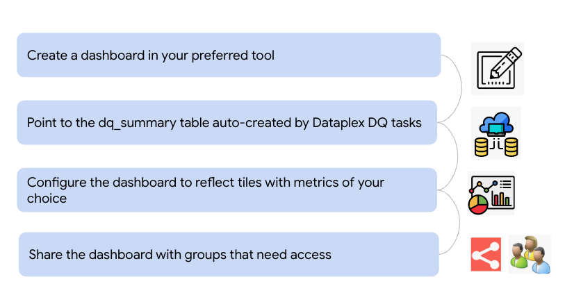
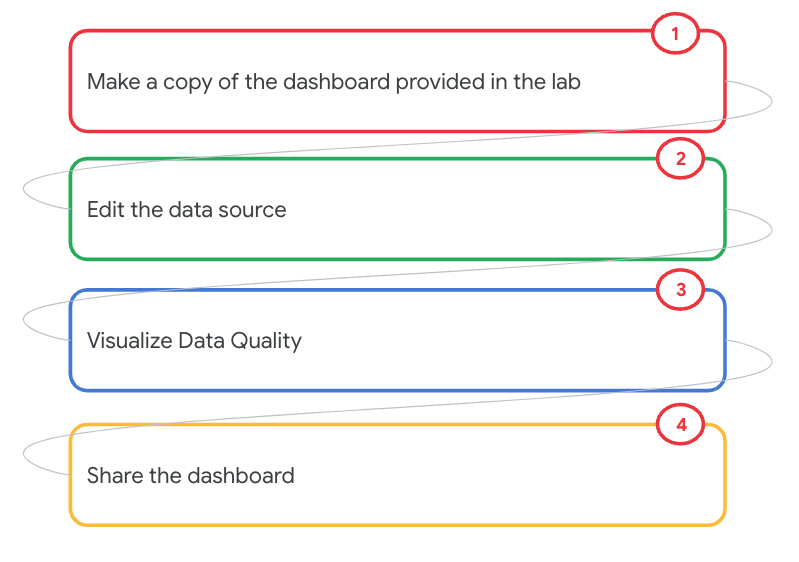
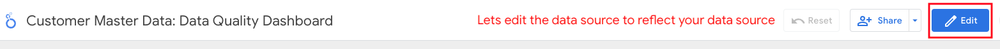
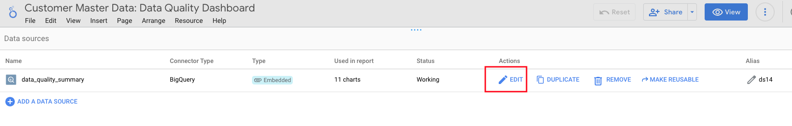
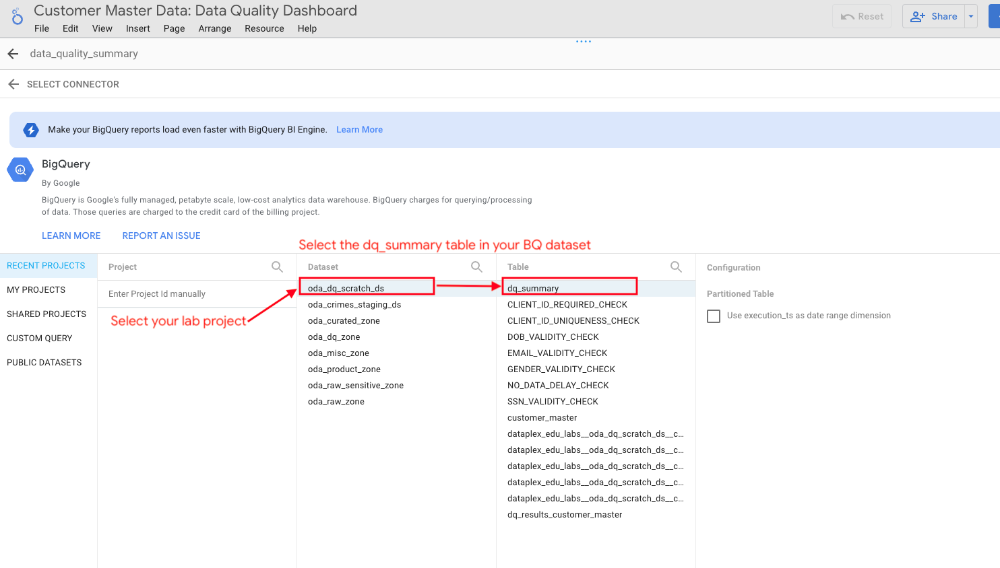
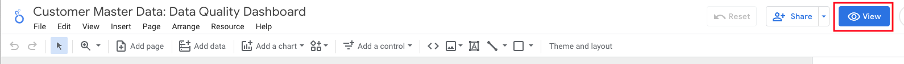
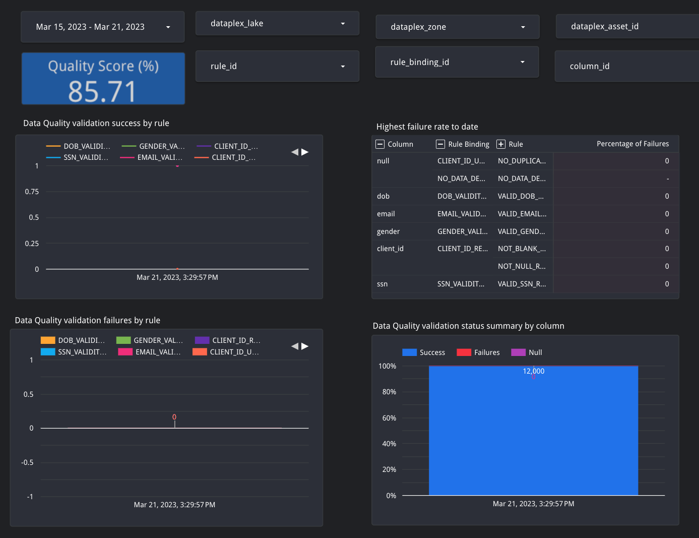
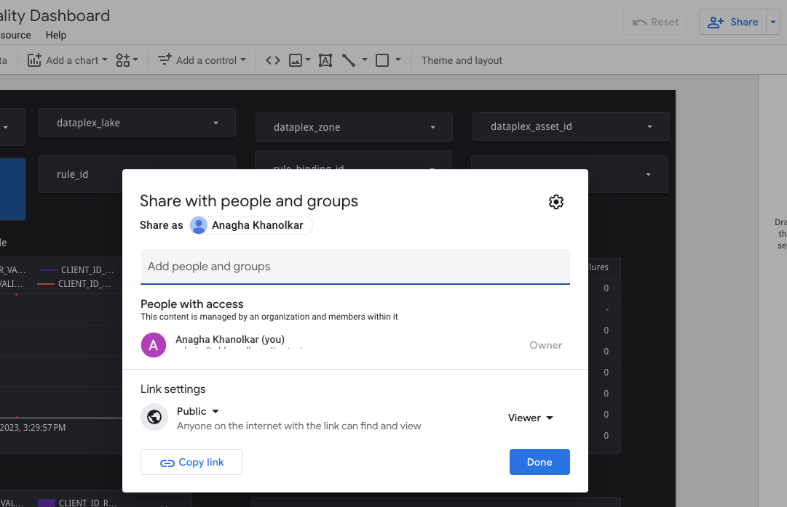

# M12-1d: Data Quality Dashboard 

In the previous module we implemented a Data Quality failure incident management. In this module, we will learn to configure a Data Quality dashboard that can be shared. We will use the Looker Studio product.

### Data Quality Dashboard - what's involved

   
<br><br>

<hr>

### Lab module prerequisites

Successful completion of prior modules

### Lab module duration

10 minutes or less, unless you want to customize the dashboard

### Lab module flow

   
<br><br>

<hr>
<hr>

# LAB

## 1. Make a copy of the Looker Studio dashboard

In the browser paste this link-
```
https://lookerstudio.google.com/u/0/reporting/6b5178ad-dbea-41d2-bc5d-50abc79faca4/page/x16FC
```

<hr>

## 2. Edit the Looker Studio dashboard data source 

Follow the steps below to edit the dashboard to refect your data source, the DQ summary table in BigQuery.


### 2.1. Click on edit dashboard
   
<br><br>

### 2.2. Click on resource->"manage added data sources"

Menu items appear when you edit the dashboard. Click on resource->"manage added data sources"-

   
<br><br>

### 2.3. Click on edit in the data source listing 

The data source listing already has dq_summary table, we need to make it point to our summary table (versus the lab author's).

   
<br><br>

### 2.4. Modify to reflect your dq_summary table

   
<br><br>

<hr>

## 3. View the Data Quality dashboard

Follow the pictorial instructions below-

   
<br><br>

   
<br><br>

<hr>

## 4. Share the Data Quality dashboard

Share the dashboard within your organization.

   
<br><br>

<hr>
<hr>

This concludes the lab module. Proceed to the [next module](module-12-1e-dq-task-dq-tags.md).

<hr>
