# M12-1e: Data Quality Tags

In the previous module we implemented a Data Quality dashboard. In this module, we will learn to create a Data Quality tag template for the Customer master data in Dataplex Catalog, and populate the tags based on data Quality results from our recent execution of Data Quality checks on the Customer master data.

### Data Quality Tags - what's involved

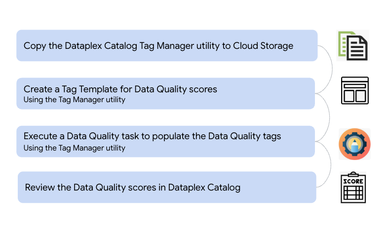   
<br><br>

<hr>

### Lab module prerequisites

Successful completion of prior modules

### Lab module duration

10 minutes or less, unless you want to customize.

### Lab module flow

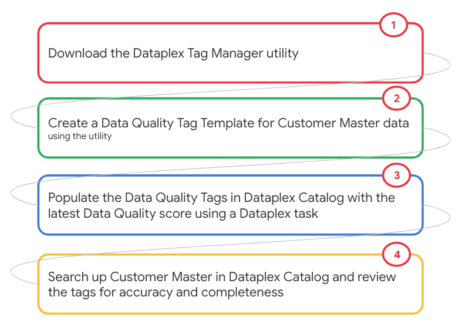   
<br><br>

<hr>
<hr>

# LAB

### [FYI] Data Quality Tag creation

You can create Data Quality tags using gcloud commands as shown in below.
```
gcloud data-catalog tag-templates create YOUR_TAG_TEMPLATE_NAME --field=id=ID1,display-name=DISPLAY1,type=string --field=id=ID2,display-name=DISPLAY2,type='enum(A|B)',required=TRUE
```

In this lab, we will use a Java utitlity with a pre-defined tag template instead of the gcloud command.

<hr>

## 1. [Lab] Download the Tag Manager utility and persist to Cloud Storage

### 1.1. Declare variables

Paste in cloud shell-
```
PROJECT_ID=`gcloud config list --format "value(core.project)" 2>/dev/null`
PROJECT_NBR=`gcloud projects describe $PROJECT_ID | grep projectNumber | cut -d':' -f2 |  tr -d "'" | xargs`
UMSA_FQN="lab-sa@${PROJECT_ID}.iam.gserviceaccount.com"
DATAPLEX_LOCATION="us-central1"
LAKE_ID="oda-lake"
DATA_QUALITY_ZONE_ID="oda-dq-zone"
DQ_BQ_SCRATCH_DATASET="oda_dq_scratch_ds"
DQ_MISC_BUCKET="oda-dq-bucket-$PROJECT_NBR"

cd ~
mkdir -p tmp/dataplex-quickstart-labs/dq
cd ~/tmp/dataplex-quickstart-labs/dq
```

### 1.1. [One time activity] Download the Tag Manager utility jar local

```
cd ~/tmp/dataplex-quickstart-labs/dq
rm -rf tagmanager-1.0-SNAPSHOT.jar
wget https://github.com/mansim07/dataplex-labs/raw/main/setup/resources/code_artifacts/libs/tagmanager-1.0-SNAPSHOT.jar
```

### 1.2. [One time activity] Upload the utility to a Cloud Storage bucket
We will use Dataplex tasks to populate tags with Data Quality scores and this feature requires the utility to be available in a Cloud Storage bucket.

```
cd ~/tmp/dataplex-quickstart-labs/dq
TAG_MANAGER_UTIL_JAR_FQP=gs://$DQ_MISC_BUCKET/dq-utils/tagmanager-1.0-SNAPSHOT.jar
gsutil cp tagmanager-1.0-SNAPSHOT.jar $TAG_MANAGER_UTIL_JAR_FQP
```

<hr>

## 2. Create a tag template for Data Quality Scores

### 2.1. [One time activity] Create a tag template for Data Quality Scores

The command below will create a pre-defined tag template for Data Quality Scores in Dataplex Catalog in the project and location specified-
```
cd ~/tmp/dataplex-quickstart-labs/dq
java -cp tagmanager-1.0-SNAPSHOT.jar  com.google.cloud.dataplex.setup.CreateTagTemplates $PROJECT_ID $DATAPLEX_LOCATION data_product_quality
```

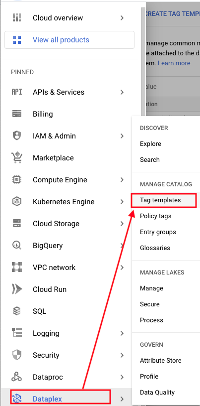   
<br><br>

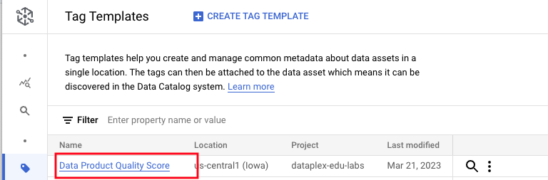   
<br><br>

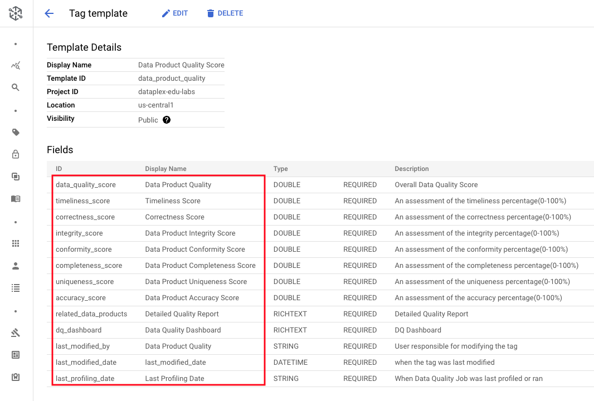   
<br><br>


<hr>

## 3. Create a Data Quality tag YAML 

### 3.1. Create a Data Quality Tag YAML & subtitute with your project information
```
cd ~/tmp/dataplex-quickstart-labs/dq
rm -rf data-quality-scores-tag.yaml

cat <<EOF >>data-quality-scores-tag.yaml
dq_report_config:
  project_id: YOUR_PROJECT_ID
  dataset_id: "YOUR_DATASET_ID"
  table_id: "dq_results_customer_master"
quality_score: derived
dq_dashboard: "<a href=\"https://lookerstudio.google.com/u/0/reporting/6b5178ad-dbea-41d2-bc5d-50abc79faca4/page/x16FC\">Link to Data Quality Dashboard</a>"
timeliness_score : derived
correctness_score : derived
integrity_score : derived
conformity_score : derived
completeness_score : derived
uniqueness_score : derived
accuracy_score : derived
last_modified_by : derived
last_modified_date : derived
related_data_product : derived
last_profiling_date: derived
EOF

sed -i s/YOUR_PROJECT_ID/${PROJECT_ID}/g data-quality-scores-tag.yaml
sed -i s/YOUR_DATASET_ID/${DQ_BQ_SCRATCH_DATASET}/g data-quality-scores-tag.yaml

```

Review the file-
```
cat data-quality-scores-tag.yaml
```


### 3.2. Upload to the Data Quality Cloud Storage bucket from previous modules

```
TAG_POPULATION_YAML_FILE_FQP=gs://$DQ_MISC_BUCKET/dq-tag-population-yaml/data-quality-scores-tag.yaml
gsutil cp data-quality-scores-tag.yaml $TAG_POPULATION_YAML_FILE_FQP
```

<hr>

## 4. Execute a Dataplex task to populate the Data Quality tags with the latest scores

```
gcloud dataplex tasks create \
--location="${DATAPLEX_LOCATION}" \
--lake="${LAKE_ID}" \
--trigger-type=ON_DEMAND \
--vpc-sub-network-name="lab-snet" \
--execution-service-account=$UMSA_FQN \
--spark-main-class="com.google.cloud.dataplex.templates.dataquality.DataProductQuality" \
--spark-file-uris="$TAG_POPULATION_YAML_FILE_FQP" \
--container-image-java-jars="$TAG_MANAGER_UTIL_JAR_FQP" \
--execution-args=^::^TASK_ARGS="--tag_template_id=projects/${PROJECT_ID}/locations/${DATAPLEX_LOCATION}/tagTemplates/data_product_quality, --project_id=${PROJECT_ID},--location=${DATAPLEX_LOCATION},--lake_id=$LAKE_ID,--zone_id=$DATA_QUALITY_ZONE_ID,--entity_id=customer_master,--input_file=data-quality-scores-tag.yaml" \
"customer-master-populate-tags-$RANDOM"
```

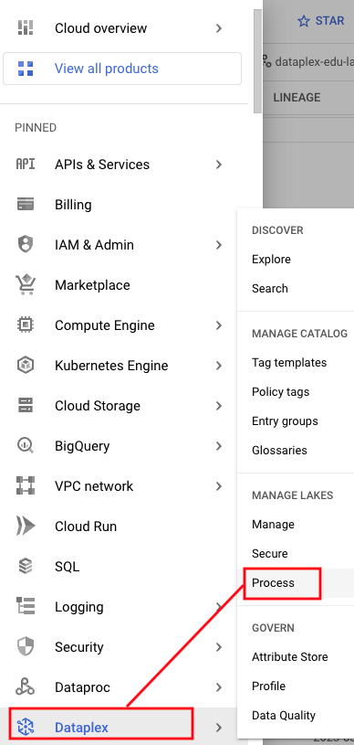   
<br><br>

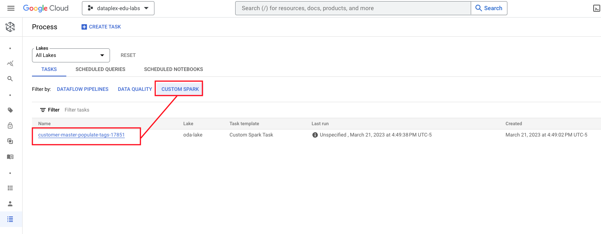   
<br><br>

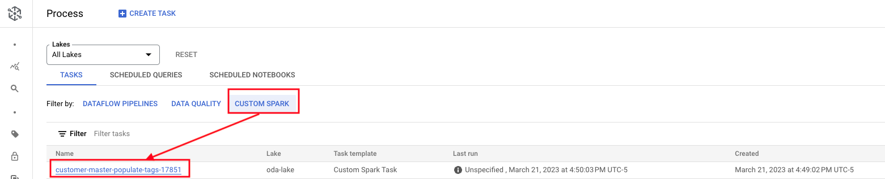   
<br><br>

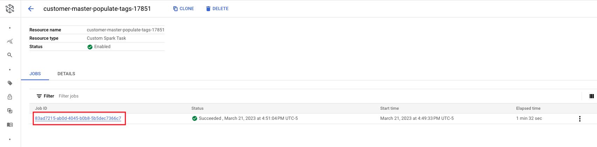   
<br><br>

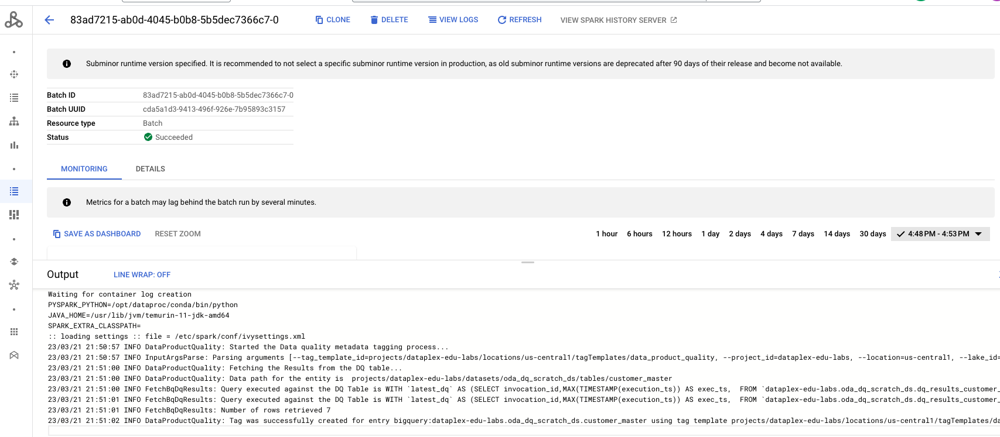   
<br><br>


## 5. Visualize Customer Master Data Quality scores in Dataplex Catalog 

Search for ```tag:data_product_quality``` and review the scores.

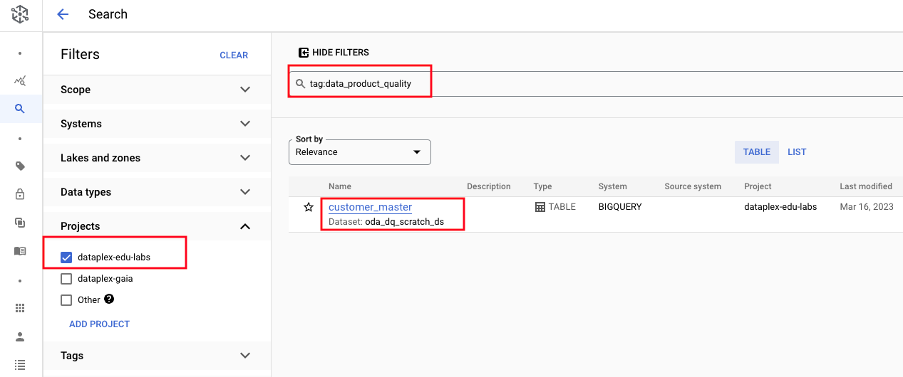   
<br><br>

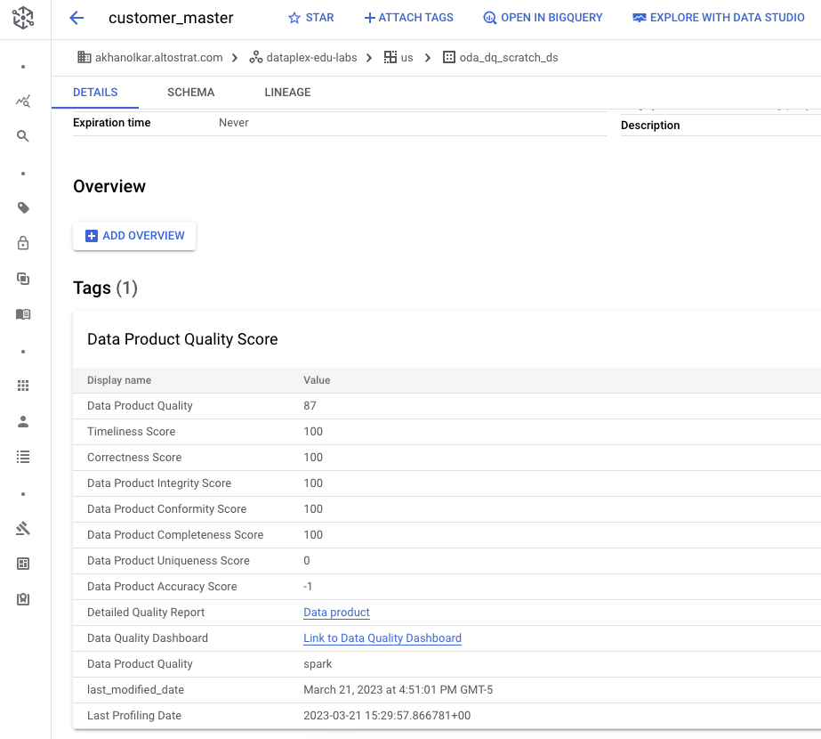   
<br><br>

<hr>
<hr>

This concludes the lab module. Proceed to the [next lab module](module-12-1f-dq-automation.md).

<hr>
