# M12-1f: Data Quality Task Automation 

In this lab module, we will learn to automate the process of Data Quality validation followed by Data Quality Scores tagging. Both these elements were completed individually in prior modules. In this module, we will orchestrate the sequential execution.

### Prerequisites

Successful completion of prior modules

### Duration

15 minutes or less

### Documentation 

[Data Quality Task orchestration with Airflow](https://github.com/GoogleCloudPlatform/cloud-data-quality/blob/main/scripts/dataproc-workflow-composer/clouddq_composer_dataplex_task_job.py)<br>

### Learning goals

Userstand how to automate Data Quality tasks with Apache Airflow on Cloud Composer. This includes polling for completion of async Dataplex tasks.


### Lab flow

   
<br><br>

<hr>
<hr>

## LAB

<hr>

## 1. Update Cloud Composer environment

We need to import "requests_oauth2" Python package. Let us update the Cloud Composer environment to add the package. We will first create a requirements.txt file and then update the Cloud Composer environment with it.

```
# Variables
PROJECT_ID=`gcloud config list --format "value(core.project)" 2>/dev/null`
PROJECT_NBR=`gcloud projects describe $PROJECT_ID | grep projectNumber | cut -d':' -f2 |  tr -d "'" | xargs`
UMSA_FQN="lab-sa@${PROJECT_ID}.iam.gserviceaccount.com"
LOCATION="us-central1"
COMPOSER_ENVIRONMENT_NAME="oda-$PROJECT_NBR-cc2"

# Create requirements.txt with desired package to be installed
cd ~/tmp/dataplex-quickstart-labs/dq
rm -rf requirements.txt

cat <<EOF >>requirements.txt
requests_oauth2
EOF


# Update environment to install package from PyPi GCS mirror
gcloud composer environments update $COMPOSER_ENVIRONMENT_NAME \
    --location $LOCATION \
    --update-pypi-packages-from-file requirements.txt

```
This takes ~10 minutes.

<hr>

## 2. The Airflow DAG for Data Quality

This is the DAG we will use in the lab-

   
<br><br>

<hr>

## 3. Review the DAG code

The DAG code is available in your cloud shell already and is called customer_master_dq_automation_primer.py

```
cat ~/dataplex-quickstart-labs/00-resources/scripts/airflow/data-quality/customer_master_dq_automation_primer.py
```

Study the code and understand the construct - for the task submission as well as polling.

<hr>

## 4. Upload the Airflow DAG for Data Quality

Lets upload the DAG to the Cloud Composer DAG bucket. 

```
PROJECT_ID=`gcloud config list --format "value(core.project)" 2>/dev/null`
PROJECT_NBR=`gcloud projects describe $PROJECT_ID | grep projectNumber | cut -d':' -f2 |  tr -d "'" | xargs`
LOCATION="us-central1"

# DAG bucket to upload to
DAG_BUCKET=`gcloud composer environments describe oda-$PROJECT_NBR-cc2 --location $LOCATION | grep dagGcsPrefix: | cut -d' ' -f4`

# Upload the DAG
gsutil cp ~/dataplex-quickstart-labs/00-resources/scripts/airflow/data-quality/customer_master_dq_automation_primer.py $DAG_BUCKET/data-quality/
```

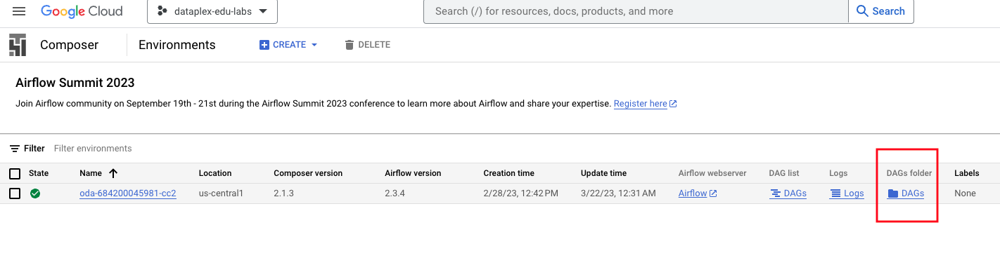   
<br><br>

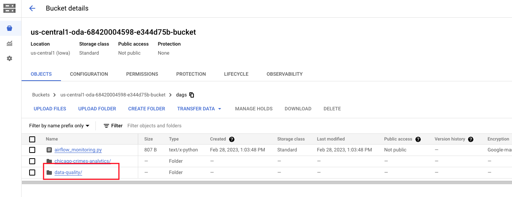   
<br><br>

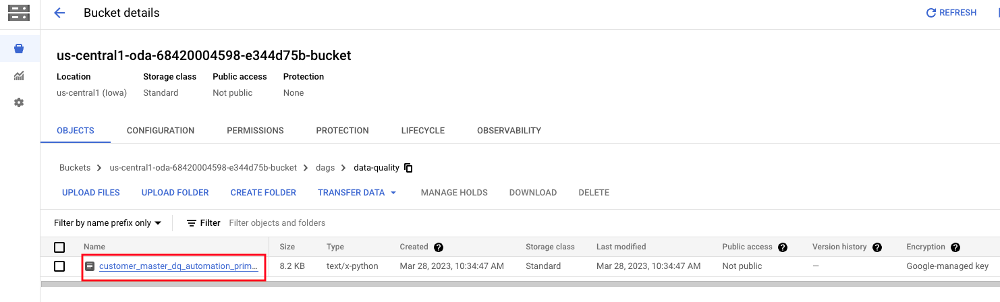   
<br><br>


<hr>

## 5. Run the Data Quality Task from Airflow on Cloud Composer

Follow the screenshots to run the DAG-

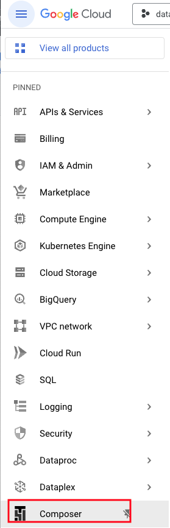   
<br><br>


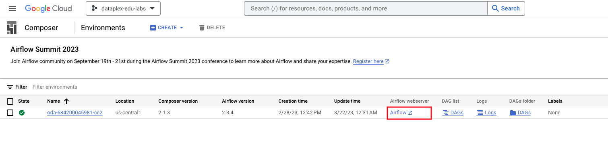   
<br><br>


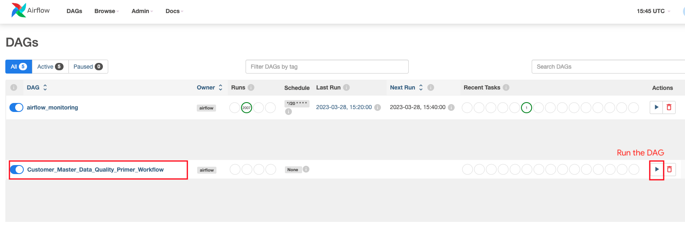   
<br><br>


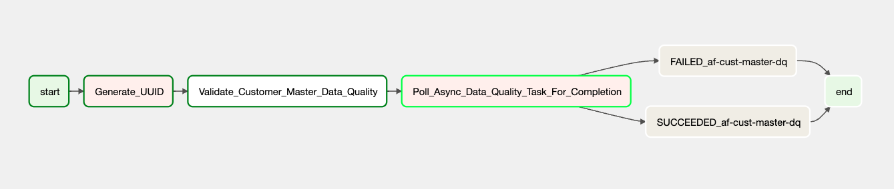   
<br><br>


<hr>

## 6. Follow the Data Quality Task execution process trail

### 6.1. In Dataplex -> Process -> Data Quality tab

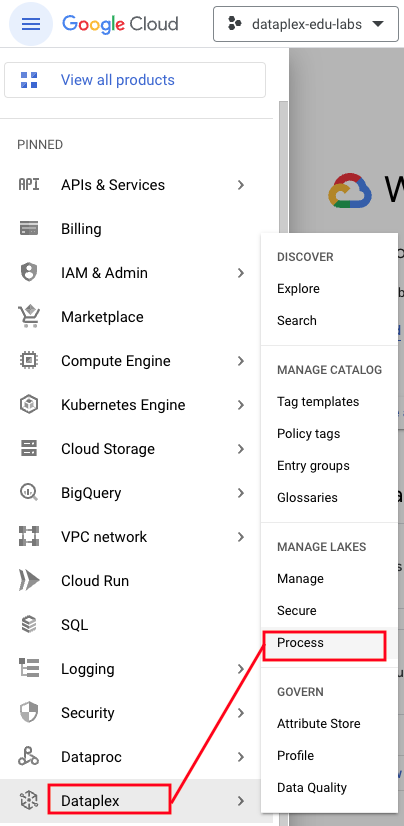   
<br><br>

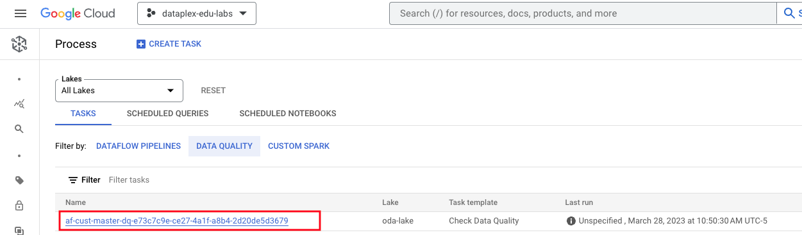   
<br><br>

Click on the task link to see the execution in Dataproc Serverless batches.

### 6.2. In Dataproc -> Serverless -> Batches

This takes about 2.5 minutes to complete.

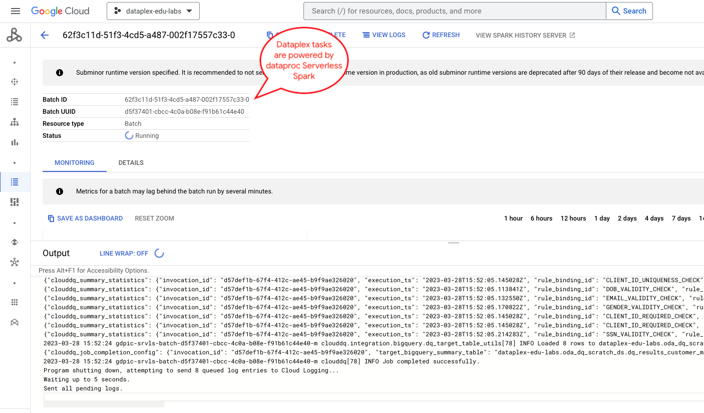   
<br><br>

### 6.3. In Dataplex -> Process -> Data Quality tab

This takes about 2.5 minutes to complete.

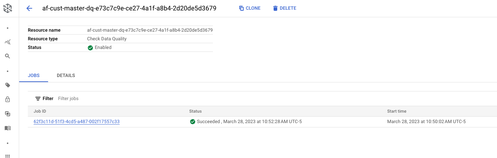   
<br><br>

### 6.4. In Airflow UI on Cloud Composer

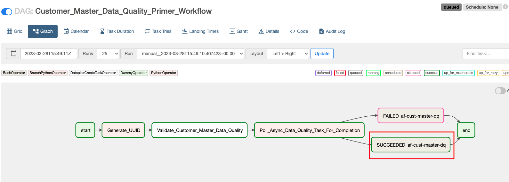   
<br><br>


<hr>

## 7. Review the results


Run the below in BigQuery-
```
SELECT * FROM `oda_dq_scratch_ds.dq_results_iteration_1`  
```

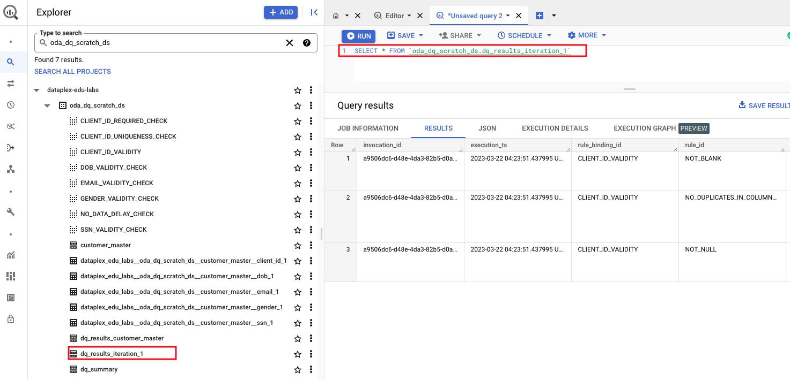   
<br><br>

<hr>

This concludes the lab module. Proceed to the [next module](module-12-1g-dq-complete-automation.md).
