# M13-1: BigLake basics

In this lab module, we will learn how to upgrade a Dataplex external table based off of objects in Cloud Storage to BigLake, enable query acceleration and compare the performance. In the next module, we will learn how to use Dataplex for attribute based access control.

<hr>

## Concepts

### C1: About external tables

External tables are similar to standard BigQuery tables, in that these tables store their metadata and schema in BigQuery storage. However, their data resides in an external source.

External tables are contained inside a dataset, and you manage them in the same way that you manage a standard BigQuery table. For example, you can view the table's properties, set access controls, and so forth. You can query these tables and in most cases you can join them with other tables.

There are three kinds of external tables:

1. BigLake tables
2. Non-BigLake external tables
3. Object tables

We will only focus on #1 and #2 in this module.

### C2: BigLake tables

BigLake tables let you query structured data in external data stores with access delegation. Access delegation decouples access to the BigLake table from access to the underlying data store. An external connection associated with a service account is used to connect to the data store. Because the service account handles retrieving data from the data store, you only have to grant users access to the BigLake table. This lets you enforce fine-grained security at the table level, including row-level and column-level security. For BigLake tables based on Cloud Storage, you can also use dynamic data masking. To learn more about multi-cloud analytic solutions using BigLake tables with Amazon S3 or Blob Storage data, see BigQuery Omni.

For more information, see Introduction to BigLake tables.

### C3: Dataplex and BigLake

Dataplex allows upgrading an external table in a lake to a BigLake table and then allows you to define attribute based entitlements.

<hr>

## Lab overview

### Prerequisites
Completion of prior modules

### Approximate duration
30 minutes or less

### Pictorial overview of work to be completed in the lab module

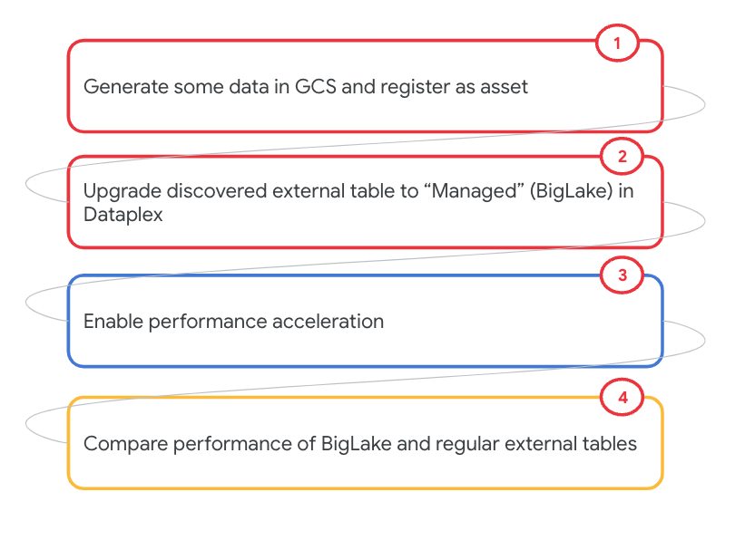   
<br><br>

<hr>

## LAB

<hr>


## 1. Create a bucket for the data

From Cloud Shell create a bucket-
```
PROJECT_ID=`gcloud config list --format "value(core.project)" 2>/dev/null`
PROJECT_NBR=`gcloud projects describe $PROJECT_ID | grep projectNumber | cut -d':' -f2 |  tr -d "'" | xargs`
DATAPLEX_LOCATION="us-central1"
BQ_LOCATION_MULTI="us"
BQ_DATASET_ID="oda_raw_zone"
LAKE_NM="oda-lake"
UMSA_FQN="lab-sa@$PROJECT_ID.iam.gserviceaccount.com"
TARGET_BUCKET_GCS_URI="gs://nyc-taxi-data-$PROJECT_NBR"
BIGLAKE_PERSISTENCE_ZONE_NM="oda-curated-zone"

gsutil mb -l $BQ_LOCATION_MULTI $TARGET_BUCKET_GCS_URI
```


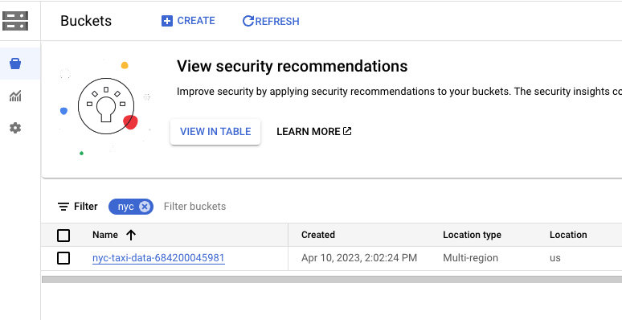   
<br><br>

<hr>


## 2. Create a BigQuery managed table with the data we need

The SQL below will create a managed table in BigQuery called nyc_taxi_trips_yellow in the dataset oda_raw_zone. Run this in the BigQuery UI-

```
DROP TABLE IF EXISTS oda_raw_zone.nyc_yellow_taxi_trips_raw;
CREATE TABLE oda_raw_zone.nyc_yellow_taxi_trips_raw (trip_year INT64,
    trip_month INT64,
    trip_day INT64,
    taxi_type STRING,
    vendor_id STRING,
    pickup_datetime TIMESTAMP,
    dropoff_datetime TIMESTAMP,
    passenger_count INT64,
    trip_distance NUMERIC,
    rate_code STRING,
    store_and_fwd_flag STRING,
    payment_type STRING,
    fare_amount NUMERIC,
    extra NUMERIC,
    mta_tax NUMERIC,
    tip_amount NUMERIC,
    tolls_amount NUMERIC,
    imp_surcharge NUMERIC,
    airport_fee NUMERIC,
    total_amount NUMERIC,
    pickup_location_id STRING,
    dropoff_location_id STRING)
  PARTITION BY RANGE_BUCKET(trip_year,  GENERATE_ARRAY(2020,2022,1))
   AS (
  SELECT
    CAST(EXTRACT(YEAR
      FROM
        pickup_datetime) AS INT) AS trip_year,
    EXTRACT(MONTH
    FROM
      pickup_datetime) AS trip_month,
    EXTRACT(DAY
    FROM
      pickup_datetime) AS trip_day,
    "YELLOW" AS taxi_type,
    vendor_id,
    pickup_datetime,
    dropoff_datetime,
    passenger_count,
    trip_distance,
    rate_code,
    store_and_fwd_flag,
    payment_type,
    fare_amount,
    extra,
    mta_tax,
    tip_amount,
    tolls_amount,
    imp_surcharge,
    airport_fee,
    total_amount,
    pickup_location_id,
    dropoff_location_id
  FROM
    `bigquery-public-data.new_york_taxi_trips.tlc_yellow_trips_2020`
  UNION ALL
  SELECT
    CAST(EXTRACT(YEAR
      FROM
        pickup_datetime) AS INT) AS trip_year,
    EXTRACT(MONTH
    FROM
      pickup_datetime) AS trip_month,
    EXTRACT(DAY
    FROM
      pickup_datetime) AS trip_day,
    "YELLOW" AS taxi_type,
    vendor_id,
    pickup_datetime,
    dropoff_datetime,
    passenger_count,
    trip_distance,
    rate_code,
    store_and_fwd_flag,
    payment_type,
    fare_amount,
    extra,
    mta_tax,
    tip_amount,
    tolls_amount,
    imp_surcharge,
    airport_fee,
    total_amount,
    pickup_location_id,
    dropoff_location_id
  FROM
    `bigquery-public-data.new_york_taxi_trips.tlc_yellow_trips_2021`
  UNION ALL
  SELECT
    CAST(EXTRACT(YEAR
      FROM
        pickup_datetime) AS INT) AS trip_year,
    EXTRACT(MONTH
    FROM
      pickup_datetime) AS trip_month,
    EXTRACT(DAY
    FROM
      pickup_datetime) AS trip_day,
    "YELLOW" AS taxi_type,
    vendor_id,
    pickup_datetime,
    dropoff_datetime,
    passenger_count,
    trip_distance,
    rate_code,
    store_and_fwd_flag,
    payment_type,
    fare_amount,
    extra,
    mta_tax,
    tip_amount,
    tolls_amount,
    imp_surcharge,
    airport_fee,
    total_amount,
    pickup_location_id,
    dropoff_location_id
  FROM
    `bigquery-public-data.new_york_taxi_trips.tlc_yellow_trips_2022` );

DELETE FROM oda_raw_zone.nyc_yellow_taxi_trips_raw where trip_year NOT IN (2020,2021,2022);
```

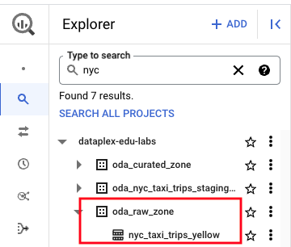   
<br><br>

<hr>

## 3. Run a Spark job that reads the data in BigQuery and persists to Cloud Storage

### 3.1. (Optional) Review the code

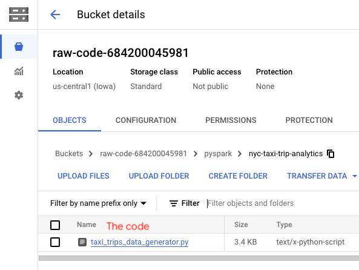   
<br><br>

### 3.2. Run a Spark job that creates the NYC taxi trip data

Paste this and run in the Cloud Shell-
```
PROJECT_ID=`gcloud config list --format "value(core.project)" 2>/dev/null`
PROJECT_NBR=`gcloud projects describe $PROJECT_ID | grep projectNumber | cut -d':' -f2 |  tr -d "'" | xargs`
LOCATION="us-central1"
SUBNET_URI="projects/$PROJECT_ID/regions/$LOCATION/subnetworks/lab-snet"
UMSA_FQN="lab-sa@$PROJECT_ID.iam.gserviceaccount.com"
TARGET_BUCKET_GCS_URI="gs://nyc-taxi-data-${PROJECT_NBR}/"
S8S_BATCH_ID=$RANDOM
BIGLAKE_PERSISTENCE_ZONE_NM="oda_curated_zone"
TABLE_FQN="oda_raw_zone.nyc_yellow_taxi_trips_raw"
PYSPARK_CODE_BUCKET="gs://raw-code-${PROJECT_NBR}/pyspark"

# Delete any existing content in the bucket
gsutil rm -r ${TARGET_BUCKET_GCS_URI}nyc_yellow_taxi_trips/*

# Persist NYC Yellow Taxi trips to Cloud Storage
gcloud dataproc batches submit pyspark $PYSPARK_CODE_BUCKET/nyc-taxi-trip-analytics/taxi_trips_data_generator.py \
--project $PROJECT_ID \
--region $LOCATION  \
--batch generate-nyc-yellow-taxi-trips-$S8S_BATCH_ID \
--subnet $SUBNET_URI \
--service-account $UMSA_FQN \
--version=1.1 \
-- --projectID=$PROJECT_ID --tableFQN=$TABLE_FQN --peristencePath="$TARGET_BUCKET_GCS_URI/nyc_yellow_taxi_trips" 

```

It takes ~16 minutes to complete.

### 3.3. Review Spark job execution in the Dataproc UI on the Cloud Console

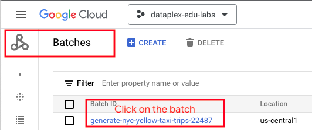   
<br><br>


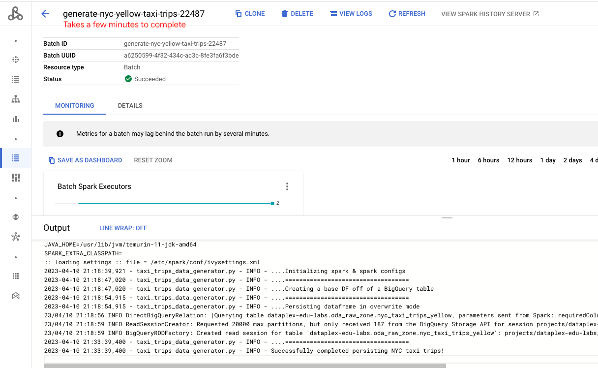   
<br><br>


### 3.4. Review the creation of data in Cloud Storage


   
<br><br>

Lets review the file listing-
```
gsutil ls -r $TARGET_BUCKET_GCS_URI
```
You should see a number of parquet files listed. Understand the partition scheme.


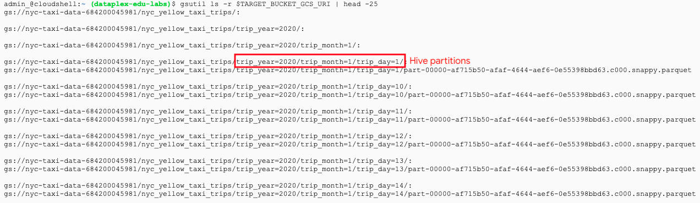   
<br><br>

<hr>


## 5. Add the bucket to the raw zone in the Dataplex lake oda-lake

Paste the below in Cloud Shell-

```
gcloud dataplex assets create nyc-taxi-trips \
--location=$DATAPLEX_LOCATION \
--lake=$LAKE_NM \
--zone=$BIGLAKE_PERSISTENCE_ZONE_NM \
--resource-type=STORAGE_BUCKET \
--resource-name=projects/$PROJECT_ID/buckets/nyc-taxi-data-$PROJECT_NBR \
--discovery-enabled \
--discovery-schedule="0 * * * *" \
--display-name 'NYC Taxi Dataset'
```

Discovery will start immediately after adding the bucket as an asset to the raw zone. Allow 5 minutes for discovery to complete and till the entity "nyc-taxi-trips" gets displayed in the Dataplex UI.


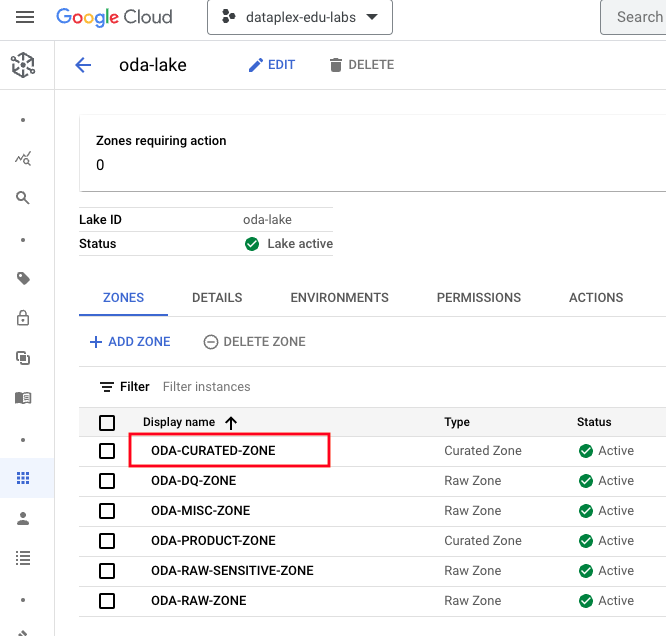   
<br><br>


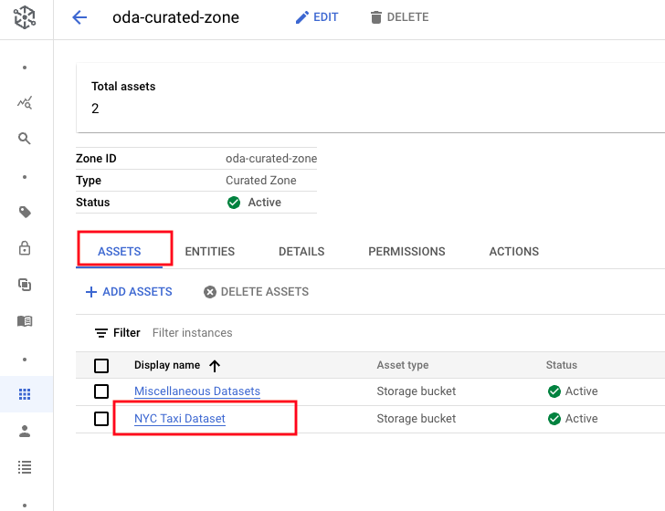   
<br><br>


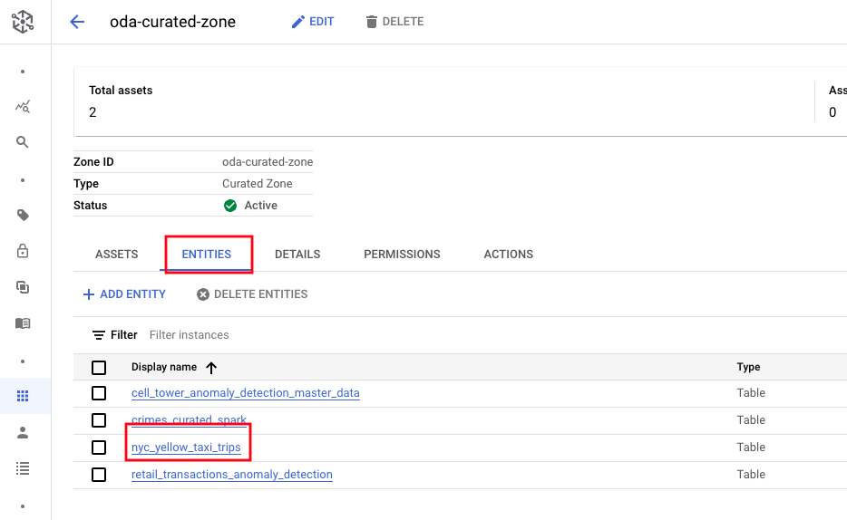   
<br><br>


<hr>

## 6. Validate external table creation in BigQuery

Run the below in the BigQuery UI, to ensure you see non-zero trip counts.
```
SELECT
  trip_month,
  COUNT(*) AS trip_count
FROM
  `oda_curated_zone.nyc_yellow_taxi_trips`
WHERE
  trip_year='2020'
GROUP BY
  trip_month
ORDER BY
  CAST(trip_month AS int64)
```


   
<br><br>


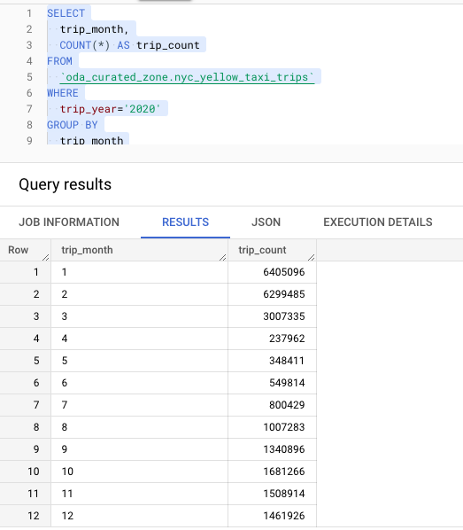   
<br><br>


<hr>

## 7. Upgrade the external table in Dataplex to BigLake

### 7.1. Enable the BigQuery connections API

```
gcloud services enable bigqueryconnection.googleapis.com
```

### 7.2. Upgrade the external table to managed BigLake table

1. In the Dataplex UI, bavigate to -> Manage -> ODA-LAKE -> ODA-CURATED-ZONE -> Assets

2. Click on the NYC Taxi Dataset

3. Click on "Upgrade to Managed"


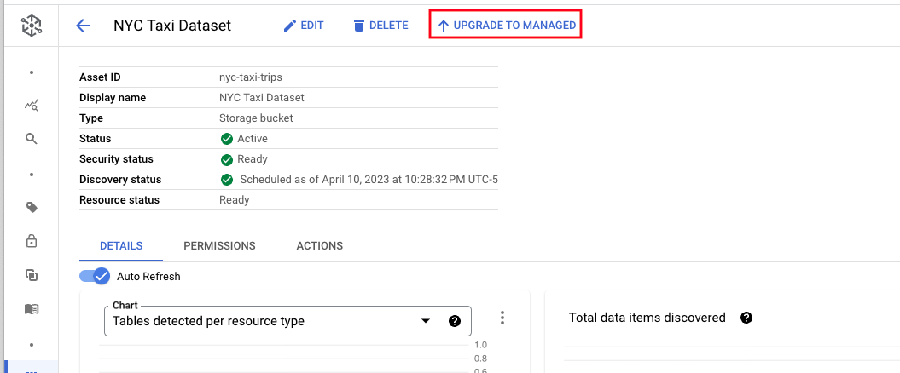   
<br><br>


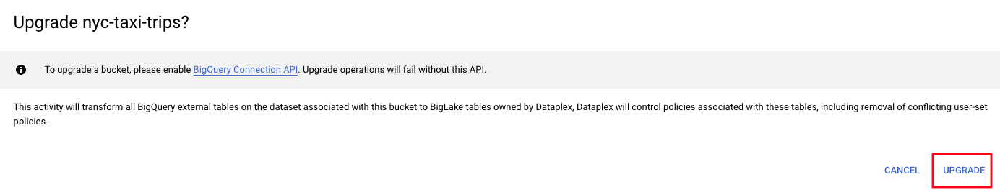   
<br><br>


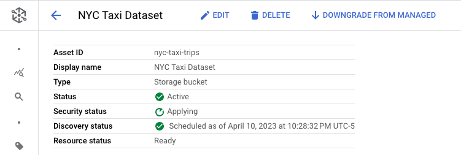   
<br><br>


### 7.3. Search up the table in BigQuery UI in oda_curated_zone and notice how it shows as a "BigLake" table


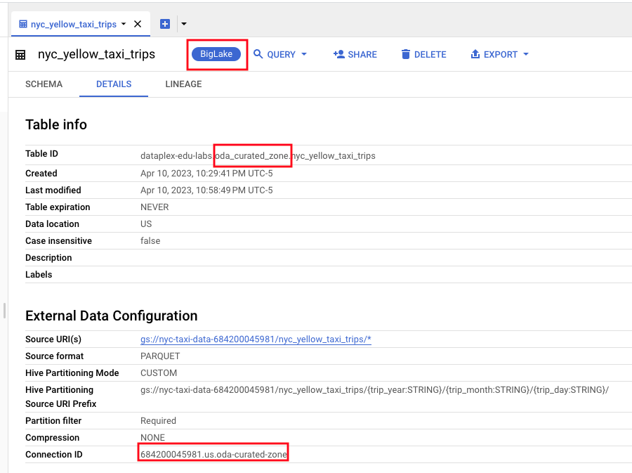   
<br><br>


### 7.4. Review the schema of the table in information schema

Run in BigQuery UI-
```
SELECT ddl FROM oda_curated_zone.INFORMATION_SCHEMA.TABLES WHERE table_name='nyc_yellow_taxi_trips';
```

The author's output:
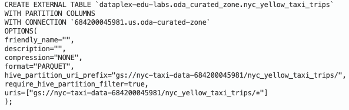   
<br><br>


<hr>


## 8. Visualize lineage automatically captured by Dataplex

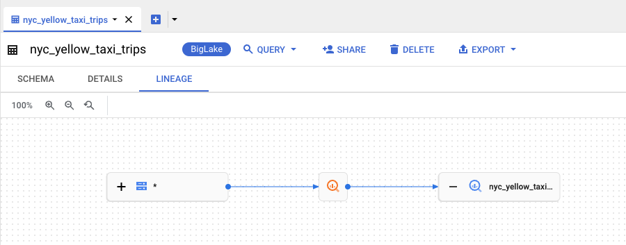   
<br><br>


<hr>

## 9. Query acceleration with BigLake

### 9.1. Create a BigQuery dataset that is not a Dataplex asset

Paste in Cloud Shell-
```
NYC_TAXI_STAGE_DS="oda_nyc_taxi_trips_staging_ds"

bq --location=$BQ_LOCATION_MULTI mk \
    --dataset \
    $PROJECT_ID:$NYC_TAXI_STAGE_DS
```

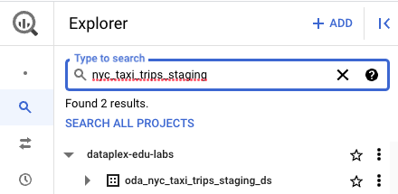   
<br><br>

### 9.2. Create a regular external BigQuery table on the curated NYC taxi trips

Paste the below in the BigQuery UI-
```
echo "
CREATE EXTERNAL TABLE IF NOT EXISTS oda_nyc_taxi_trips_staging_ds.nyc_yellow_taxi_trips_regular
WITH PARTITION COLUMNS (
  trip_year  INTEGER,
  trip_month INTEGER,
  trip_day INTEGER
)
OPTIONS(
hive_partition_uri_prefix =\"$TARGET_BUCKET_GCS_URI\",
uris=[\"${TARGET_BUCKET_GCS_URI}nyc_yellow_taxi_trips/*.parquet\"],
format=\"PARQUET\");"

```

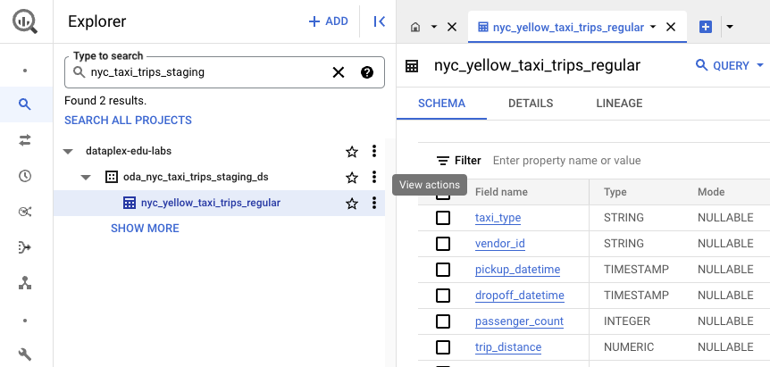   
<br><br>


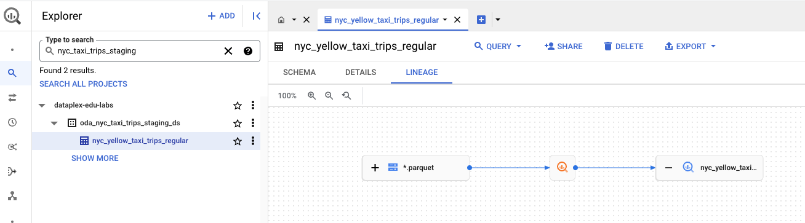   
<br><br>

### 9.4. Update the schema of the Biglake table for the datatype of the partition columns

9.4.1. Run the below DDL generator in the Cloud Shell-

```
PROJECT_ID=`gcloud config list --format "value(core.project)" 2>/dev/null`
PROJECT_NBR=`gcloud projects describe $PROJECT_ID | grep projectNumber | cut -d':' -f2 |  tr -d "'" | xargs`
TARGET_BUCKET_GCS_URI="gs://nyc-taxi-data-${PROJECT_NBR}/"
BQ_LOCATION_MULTI="US"
BQ_CONNECTION=`bq ls --connection --project_id=$PROJECT_ID --location=$BQ_LOCATION_MULTI | tail -1 | cut -d ' ' -f3`


echo "CREATE OR REPLACE EXTERNAL TABLE \`$PROJECT_ID.oda_curated_zone.nyc_yellow_taxi_trips\`
WITH PARTITION COLUMNS (trip_year INT64,trip_month INT64,trip_day INT64)
WITH CONNECTION \`$BQ_CONNECTION\`
OPTIONS(
format=\"PARQUET\",
hive_partition_uri_prefix=\"gs://nyc-taxi-data-$PROJECT_NBR/nyc_yellow_taxi_trips/\",
require_hive_partition_filter=true,
uris=[\"gs://nyc-taxi-data-$PROJECT_NBR/nyc_yellow_taxi_trips/*\"]
);"

echo ""
echo ""
echo ""

```

9.4.2. Grab the output "CREATE OR REPLACE" statement and run it in the BigQuery UI.


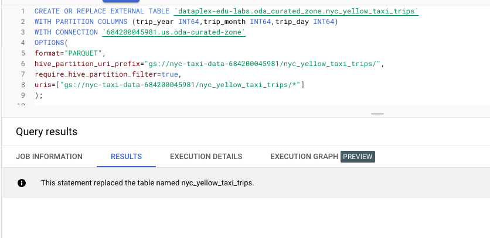   
<br><br>


### 9.3. Run a query on the regular external table without BigQuery results caching


Run in the BigQuery UI-
```
SELECT *
FROM `oda_nyc_taxi_trips_staging_ds.nyc_yellow_taxi_trips_regular`
WHERE
trip_year = 2021 and trip_month = 3 and
trip_distance < 30
AND fare_amount BETWEEN 0 AND  1000
```

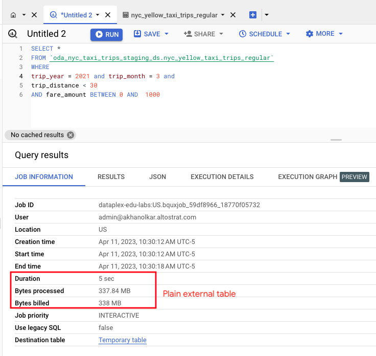   
<br><br>


### 9.4. Run a query on the BigLake table without performance acceleration without BigQuery results caching

Run in the BigQuery UI-
```
SELECT *
FROM `oda_curated_zone.nyc_yellow_taxi_trips`
WHERE
trip_year = 2021 and trip_month = 3 and
trip_distance < 30
AND fare_amount BETWEEN 0 AND  1000
```

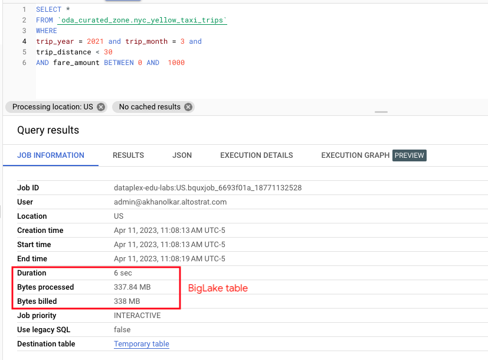   
<br><br>

### 9.5. Enable performance acceleration on the BigLake table

9.5.1. Run the below DDL generator in the Cloud Shell-

```
PROJECT_ID=`gcloud config list --format "value(core.project)" 2>/dev/null`
PROJECT_NBR=`gcloud projects describe $PROJECT_ID | grep projectNumber | cut -d':' -f2 |  tr -d "'" | xargs`
TARGET_BUCKET_GCS_URI="gs://nyc-taxi-data-${PROJECT_NBR}/"
BQ_LOCATION_MULTI="US"
BQ_CONNECTION=`bq ls --connection --project_id=$PROJECT_ID --location=$BQ_LOCATION_MULTI | tail -1 | cut -d ' ' -f3`


echo "CREATE OR REPLACE EXTERNAL TABLE \`$PROJECT_ID.oda_curated_zone.nyc_yellow_taxi_trips\`
WITH PARTITION COLUMNS (trip_year INT64,trip_month INT64,trip_day INT64)
WITH CONNECTION \`$BQ_CONNECTION\`
OPTIONS(
format=\"PARQUET\",
metadata_cache_mode=\"AUTOMATIC\",
max_staleness=INTERVAL '1' DAY,
hive_partition_uri_prefix=\"gs://nyc-taxi-data-$PROJECT_NBR/nyc_yellow_taxi_trips/\",
require_hive_partition_filter=true,
uris=[\"gs://nyc-taxi-data-$PROJECT_NBR/nyc_yellow_taxi_trips/*\"]
);"

echo ""
echo ""
echo ""

```

9.5.2. Grab the output "CREATE OR REPLACE" statement and run it in the BigQuery UI.


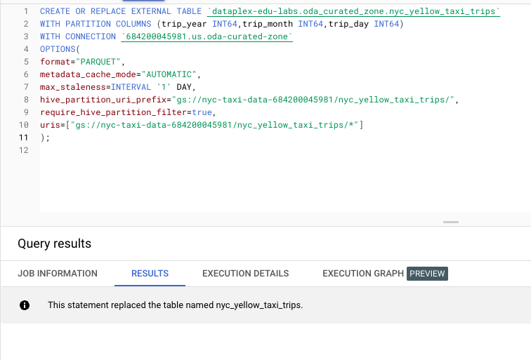   
<br><br>


### 9.6. Run the query on the BigLake table to observe the improvement without BigQuery results caching 


Run in the BigQuery UI-
```
SELECT *
FROM `oda_curated_zone.nyc_yellow_taxi_trips`
WHERE
trip_year = 2021 and trip_month = 3 and
trip_distance < 30
AND fare_amount BETWEEN 0 AND  1000
```


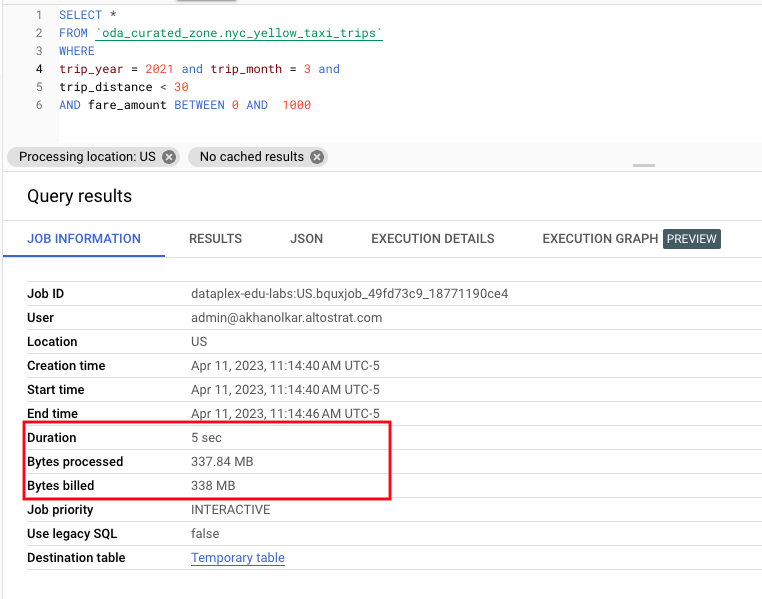   
<br><br>

## 10. In summary

We did not see significant improvement in the performance with query acceleration enabled due to the fact that there is an overhead to BigLake and performance gains can be observed at scale just like with all Big Data solutions.

## 11. TODO for the lab author

Add green taxi data into section 2 to demonstrate BigLake query acceleration more effectively.


<hr>

This concludes the module. Proceed to the next module.

<hr>
